# 网络协议栈

## TCP/IP 协议栈


- 应用层（application layer）
- 传输层（transport layer）
  - 使用端口号用于区分应用
- 网络层（internet layer）
- 链路层（link layer）

## OSI（Open System Interconnection Reference Model）概念模型

仅仅只是提供标准**参考**的协议栈，不是强制标准。但日常交流的时候我们通常使用 OSI 模型，用四层、七层等术语。


1. 第一层：物理层，网络的物理形式，例如电缆、光纤、网卡、集线器等等；
2. 第二层：数据链路层，它基本相当于 TCP/IP 的链接层；
3. 第三层：网络层，相当于 TCP/IP 里的网际层；
4. 第四层：传输层，相当于 TCP/IP 里的传输层；
5. 第五层：会话层，维护网络中的连接状态，即保持会话和同步；
6. 第六层：表示层，把数据转换为合适、可理解的语法和语义；
7. 第七层：应用层，面向具体的应用传输数据。


## 理解网络协议的工作模式

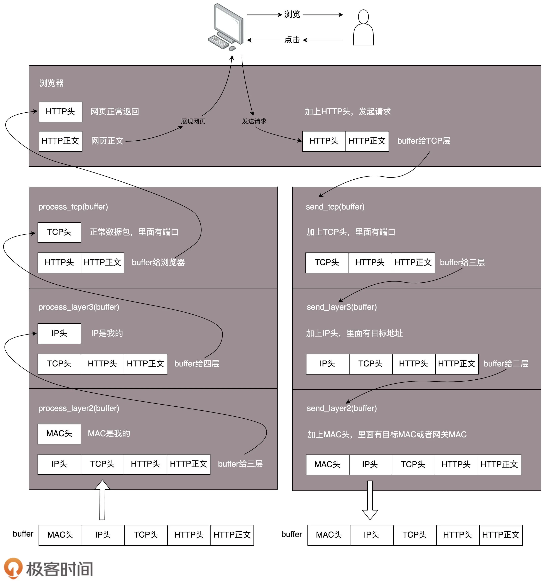 

- 数据发送时向底层协议程序传递，并且被层层包装


- 应用层
- 传输层
- 网络层
  - [IP 协议](#ip-协议)：解决跨网络通信问题
    - IP 分片：IP 协议要传输数据，就要将数据**分片**转换成为链路层的分组，然后才可以在链路层传输。
      - IP 协议要根据 MTU 拆分封包
        - **MTU**：Maximun Transmission Unit，最大传输单元，意思是链路层网络允许的最大传输数据分组的大小；
        - 不同网络 MTU 是不同的，链路层分组大小受限于链路层的网络设备、线路以及使用了链路层协议的设计
      - 将上层数据拆分，为每个片段（Fragment）增加一个 IP 头（Header），组成一个IP 封包（Datagram）
        - 不切片：IP 协议提供了一个能力就是把封包标记为不切片，当底层网络看到不切片的封包，又没有能力传输的时候，就会丢弃这个封包。网络环境中往往存在多条路径，一条路径断了，说不定其他路径可以连通
      - 用底层的局域网（数据链路层）传送数据
      - IP 协议通过路由寻址的能力最终把封包送达目的地    
    - IP 封包
    - IP 寻址
      - 路由：本质是网络路径的选择
        - 网络是由多个子网组成的，不同子网之间的通信需要通过网关
        - 操作系统会首先**通过子网掩码判断是否同一子网**
          - 如果源 IP 与目的 IP 处于一个子网，直接将包通过交换机发出去
          - 如果源 IP 与目的 IP 不处于一个子网，**需要通过 IP 协议让路由器转发**  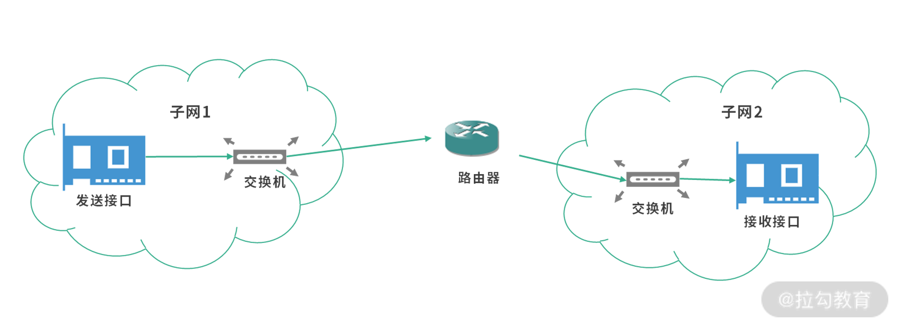
        - **路由器**
          - 作为网关，一台独立的拥有 MAC 地址的设备，可以帮我们把数据包做一次转发
          - **路由表**记录其他网关的地址
            - 路由表是网关之间通过**路由协议**获取的
              - 本地网络间
                - RIP
                - OSPF
              - 公网间
                - BGP
      - 寻址：找到 IP 地址对应的设备
        - 网络是一个树状模型，寻址过程是一个**逐级查找**过程  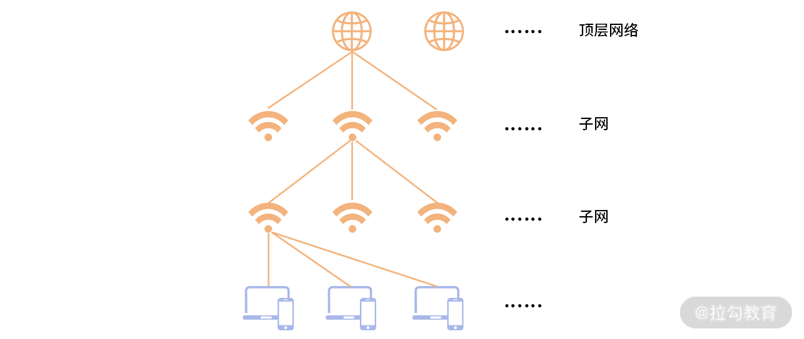
        - 通过与子网掩码做位与运算得到网络号以及相应的子网位置
  - 公内网中，如何寻址内网 IP 地址？
    - [NAT：网络地址转换协议](#nat网络地址转换协议)  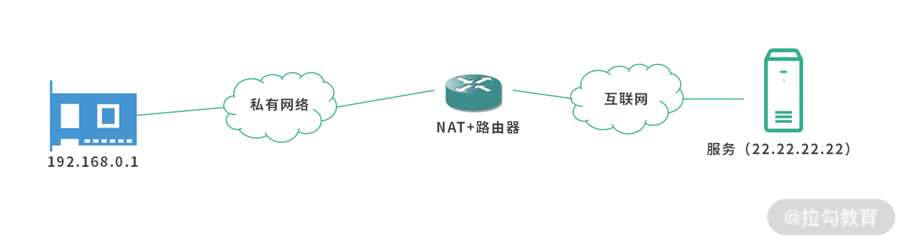  
- 链路层/MAC 层
  - 封装链路层帧
  - MAC 寻址
  - 局域网数据交换：局域网内如何发送数据包给其他主机？
    - 设备间通信的本质其实是设备拥有的网络接口（网卡）间的通信
      - **MAC 地址**：为了区别每个网络接口，互联网工程任务组（IETF）要求每个设备拥有一个唯一的编号
      - 局域网中数据交互通常要通过**交换机**，因为局域网内通常不止一台设备，两个网卡间没有直接连线
    - 过程
      - 数据的发送方，将自己的 MAC 地址、目的地 MAC 地址，以及数据作为一个分组（Packet），也称作 Frame 或者封包，发送给交换机。交换机再根据目的地 MAC 地址，将数据转发到目的地的网络接口（网卡）
    - **数据通信需要知道 MAC 地址**，那么对于一个 IP 地址，它如何能知道目标接口的 MAC 地址呢？
      - **ARP**：动态地址解析协议
        - 电脑或路由器、交换机里都有一个 ARP 缓存表，里面是 IP 地址与 MAC地址的映射关系
        - 动态地址解析：广播
          - 发送接口先查询本地的 ARP 表
          - 否则，通过广播询问的方式 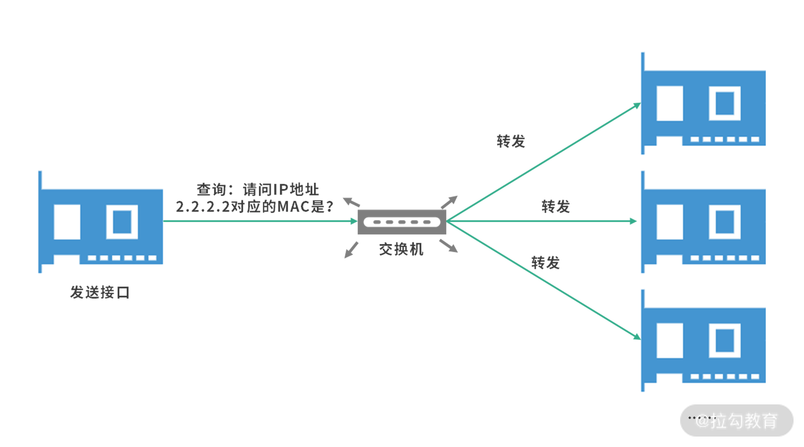  
          - 响应并缓存各自 ARP 表  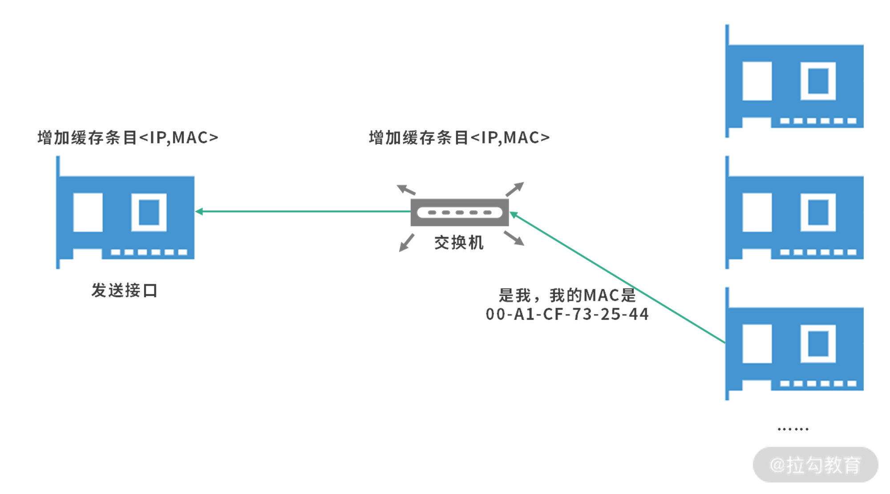 
  - RARP
  - ARP 欺骗 
- 物理层
- Q&A
  - 有了 IP 地址，为什么还要用 MAC 地址？
    - IP 是网络层使用的，而 MAC 是链路层使用的，IP 包最终还是要通过链路层的 MAC 地址和物理链接进行传输
  - 路由器、交换机都有数据交换功能，那么有什么真正区别？

- 多播：广播、组播


- 链路层
  - 以太网协议
    - 信号分组（帧）
      - 每一帧分成两个部分：标头（Head）和数据（Data）
    - 网卡与 Mac 地址
      - 数据包必须是从一块网卡，传送到另一块网卡
      - 网卡的地址，就是数据包的发送地址和接收地址，这叫做MAC地址
  - 一块网卡怎么会知道另一块网卡的MAC地址？
    - 广播
    - ARP 协议：一种机制能够从IP地址得到MAC地址
      - 如果两台主机不在同一个子网络，那么事实上没有办法得到对方的MAC地址，只能把数据包传送到两个子网络连接处的"网关"（gateway），让网关去处理
      - 如果两台主机在同一个子网络，那么我们可以用ARP协议，得到对方的MAC地址。ARP协议也是发出一个数据包（包含在以太网数据包中），其中包含它所要查询主机的IP地址，在对方的MAC地址这一栏，填的是FF:FF:FF:FF:FF:FF，表示这是一个"广播"地址。它所在子网络的每一台主机，都会收到这个数据包，从中取出IP地址，与自身的IP地址进行比较。如果两者相同，都做出回复，向对方报告自己的MAC地址，否则就丢弃这个包
- 网络层
  - 它的作用是引进一套新的地址，使得我们能够区分不同的计算机是否属于同一个子网络。这套地址就叫做"网络地址"，简称"网址"
  - 网络地址帮助我们确定计算机所在的子网络，MAC地址则将数据包送到该子网络中的目标网卡
  - 
  - IP数据包的"标头"部分的长度为20到60字节，整个数据包的总长度最大为65,535字节。因此，理论上，一个IP数据包的"数据"部分，最长为65,515字节。前面说过，以太网数据包的"数据"部分，最长只有1500字节。因此，如果IP数据包超过了1500字节，它就需要分割成几个以太网数据包，分开发送了。
- 传输层
  - 端口协议：区分程序网络
  - "传输层"的功能，就是建立"端口到端口"的通信。相比之下，"网络层"的功能是建立"主机到主机"的通信。只要确定主机和端口，我们就能实现程序之间的交流。因此，Unix系统就把主机+端口，叫做"套接字"（socket）。有了它，就可以进行网络应用程序开发了。
  - UDP协议
  - TCP协议
- 应用层
  - "应用层"的作用，就是规定应用程序的数据格式


## IP 协议

- IP 协议
  - IPv4
    - 4 个 8 位，用点分十进制表示，从 0.0.0.0 一直到 255.255.255.255
  - IPv6
    - 8 个 16 位，用:分割
      - 十六进制表示：`0123:4567:0000:0000:0123:4567:0000:cdef`
      - 用 `::` 省略 `0000`：`0123:4567::0123:4567:0000:cdef`
        - 为了防止对省略的 `0000` 的位置产生歧义，`::` 只能出现一次
  - IP 地址结构：网络号 + 主机号
  - IP 地址分类
    - 网络号类型划分
      - 缺乏层次分类结构
      - 3 类地址数量太少，无法与现实需求匹配
    - **CIDR(Classless Inter-Domain Routing)**：无分类地址
      - 表示方法：如 `10.100.122.2/24`, 24 的意思是前 24 位是网络号，后 8 位是主机号
      - 子网掩码：多级网络划分
        - 形式上等同于IP地址，也是一个32位二进制数字，它的网络部分全部为1，主机部分全部为0。比如，IP地址172.16.254.1，如果已知网络部分是前24位，主机部分是后8位，那么子网络掩码就是11111111.11111111.11111111.00000000，写成十进制就是255.255.255.0
        - 将两个IP地址与子网掩码分别进行AND运算（两个数位都为1，运算结果为1，否则为0），然后比较结果是否相同，如果是的话，就表明它们在同一个子网络中，否则就不是
    - 广播地址
      - 主机标识段 host ID 为全 1 的 IP 地址为广播地址
      - 当发出一个目的地址为广播地址，它将被分发给该网段上的所有计算机
  - 私有 IP：允许自行分配，并且可重复  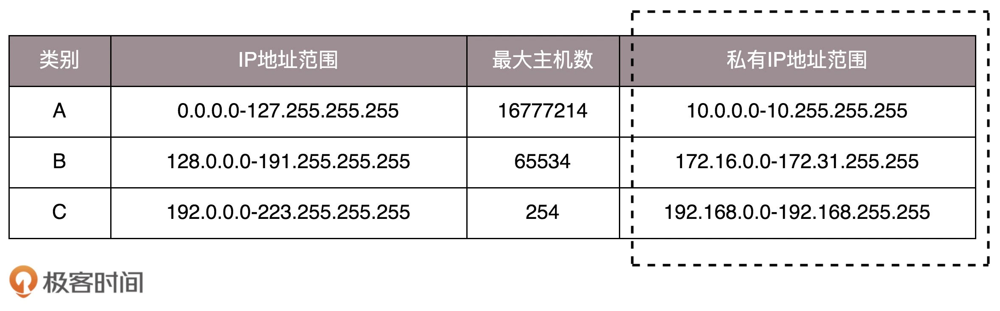  
  - 特殊地址
    - `127.0.0.1`
      - 本地回环地址（loopback），发送到 loopback 的数据会被 IP 层获取转发回到本地应用
      - 所有网络号为 127 的地址都被称之为回环地址
    - `localhost`
      - 指代的是本地计算机，用于访问绑定在 loopback 上的服务。通常绑定在  IPv4 的本地回环地址(`127.0.0.1`)，也可以指向 IPv6 的本地回环地址 [::1]
    - `0.0.0.0`
      - 表示主机上的所有 IP 地址（多网卡）
      - 是一个特殊目的 IP 地址，称作不可路由 IP 地址，它的用途会被特殊规定
      - 通常情况下，当我们把一个服务绑定到 `0.0.0.0`，相当于把服务绑定到任意的 IP 地址。比如一台服务器上有多个网卡，不同网卡连接不同的网络，如果服务绑定到 0.0.0.0 就可以保证服务在多个 IP 地址上都可以用
    - 网络号全为 1 ：表示某个网络号下的所有主机，用于广播
    - `255.255.255.255`：表示所有主机

ifconfig 网卡信息查询：

```
lo0: flags=8049<UP,LOOPBACK,RUNNING,MULTICAST> mtu 16384
        options=1203<RXCSUM,TXCSUM,TXSTATUS,SW_TIMESTAMP>
        inet 127.0.0.1 netmask 0xff000000 
        inet6 ::1 prefixlen 128 
        inet6 fe80::1%lo0 prefixlen 64 scopeid 0x1 
        nd6 options=201<PERFORMNUD,DAD>
en0: flags=8863<UP,BROADCAST,SMART,RUNNING,SIMPLEX,MULTICAST> mtu 1500
        options=6463<RXCSUM,TXCSUM,TSO4,TSO6,CHANNEL_IO,PARTIAL_CSUM,ZEROINVERT_CSUM>
        ether 3c:22:fb:b5:c4:e9 
        inet6 fe80::1861:bb1:814d:376d%en0 prefixlen 64 secured scopeid 0x6 
        inet 192.168.3.12 netmask 0xffffff00 broadcast 192.168.3.255
        nd6 options=201<PERFORMNUD,DAD>
        media: autoselect
        status: active
```

- lo0: 环路接口，往往会被分配到 127.0.0.1 这个地址。这个地址用于本机通信，经过内核处理后直接返回，不会在任何网络中出现
- en0: wifi 以太网
- `flags=xxx<net_device flags>`: 网络设备的状态标识
  - UP 表示网卡处于启动的状态；
  - BROADCAST 表示这个网卡有广播地址，可以发送广播包；
  - MULTICAST 表示网卡可以发送多播包；
- `mtu 1500`：链路层最大传输单元大小，以太网规定正文部分不允许超过 1500 个字节
- `ether`：后面附带的 6 个字节序列表示 MAC 地址

## IP 封包

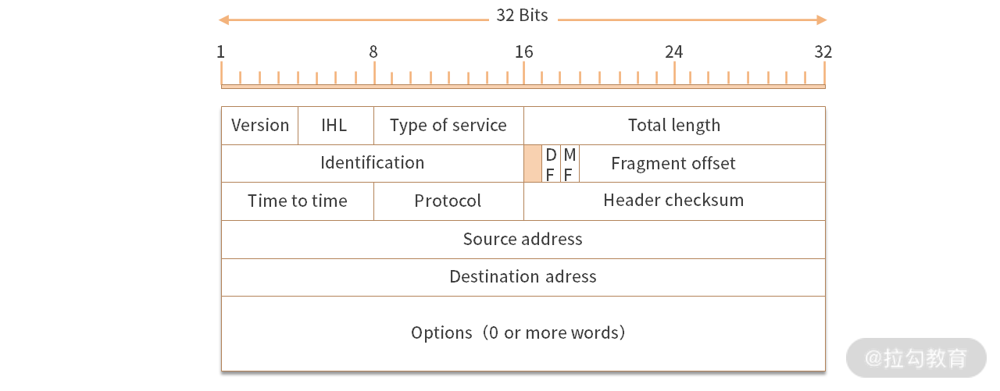  

- Type Of Service 服务的类型
  - 低延迟
  - 高吞吐量
  - 低丢包率
  - 低成本
- IHL（Internet Header Length）用来描述 IP 协议头的大小。所以 IP 协议头的大小是可变的。IHL 只有 4 位，最大值 1111 = 15。最大是 15 个双字（15*4 字节 = 60 字节）。
- Total Length 定义报文（封包 Datagram）的长度
- Identification（报文的 ID），发送方分配，代表顺序
- Fragment offset 描述要不要分包（拆分），以及如何拆分
- Time To Live 描述封包存活的时间
- Protocol 是描述上层的协议，比如 TCP = 6，UDP = 17
- Options 代表可选项
- Checksum 用来检验封包的正确性
  - 如果 Checksum 对不上，就需要选择丢弃这个封包
- Source Address 源 IP
- Destination Address 目标 IP

## DHCP

- DHCP：动态主机配置协议（Dynamic Host Configuration Protocol）
  - 解析 DHCP 的工作方式
    - DHCP Discover

## NAT：网络地址转换协议

- NAT：网络地址转换协议
  - 作用
    - 解决 IPv4 地址不够用的问题，让多台主机共用一个公网 IP 地址，在内部使用内网 IP 进行通信
    - 解决安全问题：隐藏内网的拓扑结构、隐藏主机
  - 原理
    - 发送的时候，NAT 替换源 IP 地址（也就是将内网 IP 替换为出口 IP）
    - 接收的时候，NAT 替换目标 IP 地址（也就是将出口 IP 替换回内网 IP 地址）
    - NAT 需要缓存内网 IP 地址和出口 **IP 地址 + 端口**的对应关系
  - 类型
    - 完全锥型 NAT  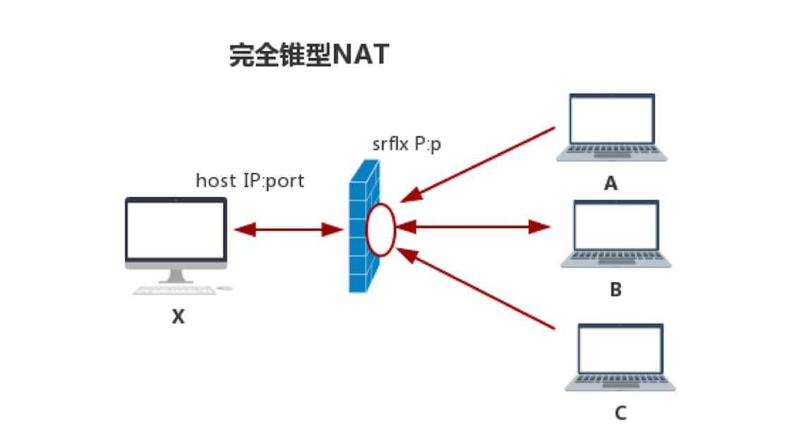  
      - 只要打洞成功，任何发向这个“洞”的数据都会被转发到主机
      - 所谓的“打洞”就是在 NAT 上建立一个内外网的IP、端口映射表
    - IP 限制型 NAT 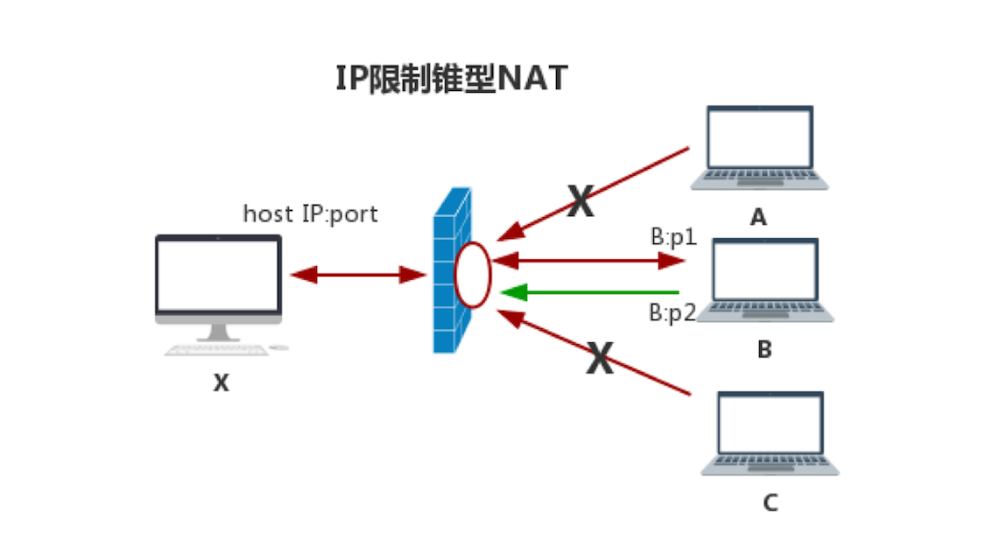  
      - 限制只有访问的 IP 才能穿越 NAT
    - 端口限制型 NAT  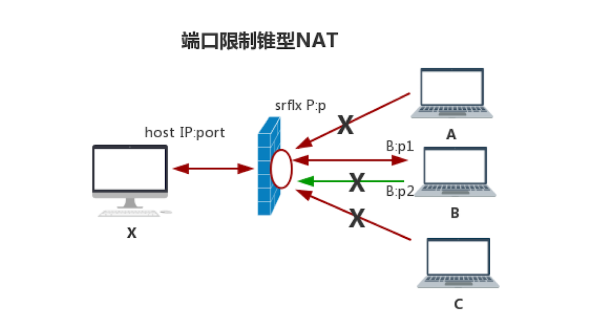  
      - 限制只有访问的 IP 及端口才能穿越 NAT
    - 对称型 NAT  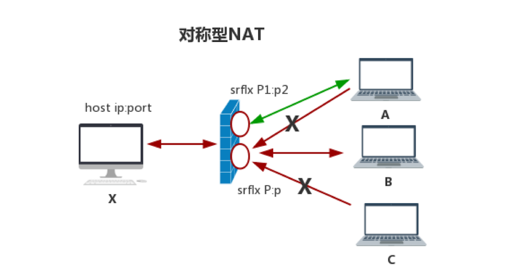  
      - 对称型 NAT 是所有 NAT 类型中最严格的一种类型
      - 对称型 NAT 对每个连接都使用不同的映射端口

## 参考

- [互联网协议入门（一）](https://www.ruanyifeng.com/blog/2012/05/internet_protocol_suite_part_i.html)
- [有了 IP 地址，为什么还要用 MAC 地址？ - 闪客sun的回答 - 知乎](https://www.zhihu.com/question/21546408/answer/2303205686)
