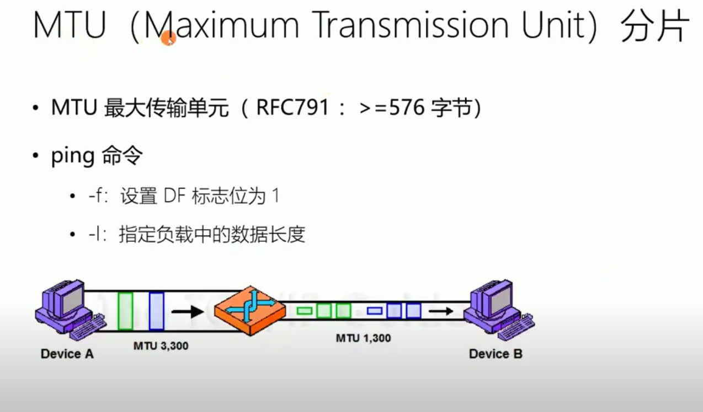
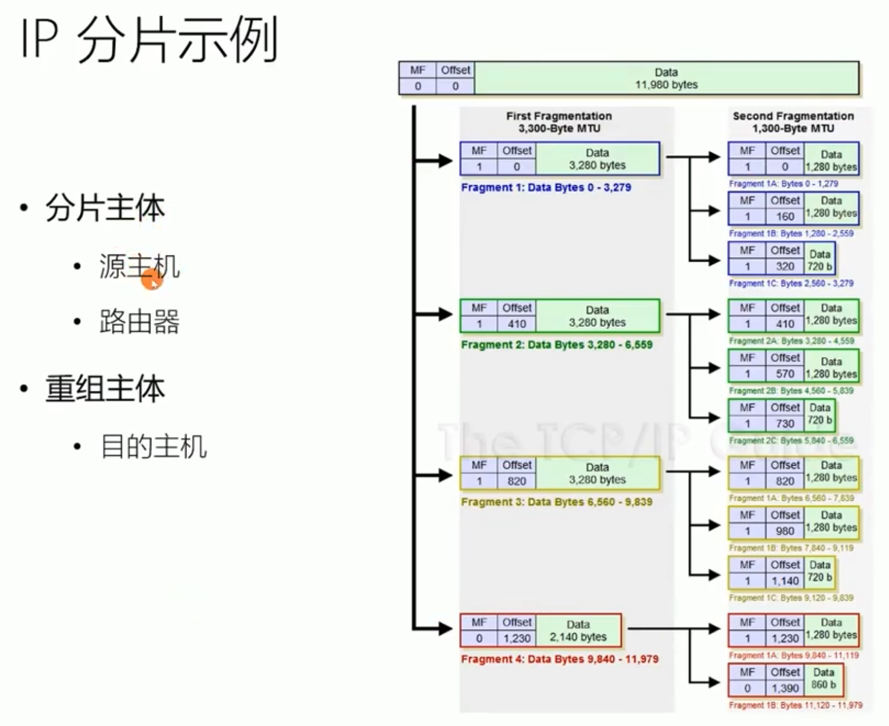
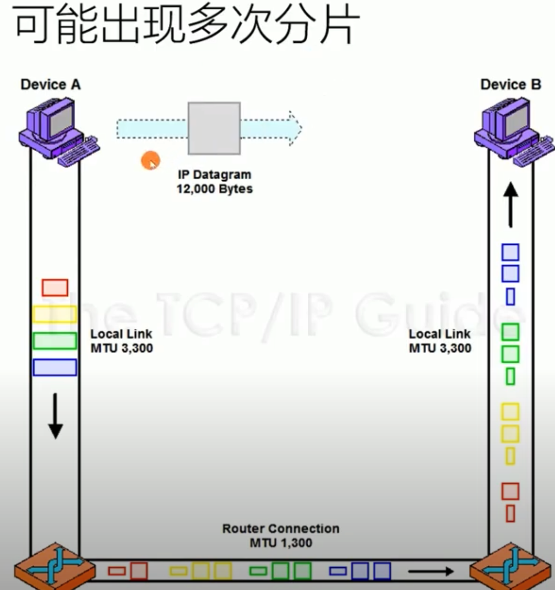
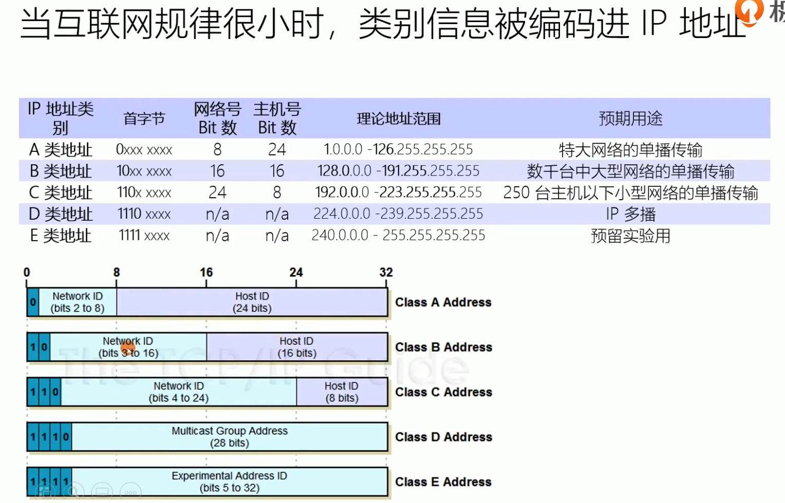

# 网络协议栈

OSI（Open System Interconnection Reference Model）概念模型

仅仅只是提供标准**参考**的协议栈，不是强制标准。但日常交流的时候我们通常使用 OSI 模型，用四层、七层等术语。


- 第七层：应用层，面向具体的应用传输数据
- 第六层：表示层，把数据转换为合适、可理解的语法和语义；
- 第五层：会话层，维护网络中的连接状态，即保持会话和同步；
- 第四层：传输层，相当于 TCP/IP 里的传输层；
- 第三层：网络层，相当于 TCP/IP 里的网际层；
- 第二层：数据链路层，它基本相当于 TCP/IP 的链接层；
- 第一层：物理层，网络的物理形式，例如电缆、光纤、网卡、集线器等等；


## 理解网络协议的工作模式

 

- 数据发送时向底层协议程序传递，并且被层层包装


- 应用层
  - 规定应用程序的数据格式
- 传输层
  - 端口协议：区分程序网络。"传输层"的功能，就是建立"端口到端口"的通信。相比之下，"网络层"的功能是建立"主机到主机"的通信。只要确定主机和端口，我们就能实现程序之间的交流。因此，Unix系统就把主机+端口，叫做"套接字"（socket）。有了它，就可以进行网络应用程序开发了
- 网络层
  - [IP 协议](#ip-协议)
    - 划分网络区域、规定网络层级关系
      - 交换机已经无法记录庞大的 MAC 映射关系，通过 IP 网段划分网络区域减少缓存记录
    - IP 分片：IP 层需要通过链路层才能传输数据，因此需要适配底层传输网络的传输能力，将上游数据拆成一个个的封包（Datagram），每个分组不能超过 **MTU**，然后才可以在链路层传输
      - **MTU(Maximun Transmission Unit)**：，最大传输单元，意思是链路层网络允许的最大传输数据分组的大小；不同网络 MTU 是不同的，链路层分组大小受限于链路层的网络设备、线路以及使用了链路层协议的设计
          
        
        
      - 不切片：IP 协议提供了一个能力就是把封包标记为不切片，当底层网络看到不切片的封包，又没有能力传输的时候，就会丢弃这个封包。网络环境中往往存在多条路径，一条路径断了，说不定其他路径可以连通
    - [IP 封包](#ip-封包结构)：将上层数据拆分，为每个片段（Fragment）增加一个 IP 头（Header），组成一个 IP 封包（Datagram）
  - [IP 寻址：报文是如何 IP 地址寻找对应的设备？](#ip-寻址)
  - [NAT：公内网中如何寻址内网 IP 地址？](#nat网络地址转换协议)    
- 链路层/MAC 层
  - 以太网协议
    - 信号分组（帧）：每一帧分成两个部分：标头（Head）和数据（Data）
    - 网卡通信
      - 数据包必须是从一块网卡，传送到另一块网卡
      - 网卡的地址，就是数据包的发送地址和接收地址，这叫做 MAC 地址
      - **MAC 地址**：为了区别每个网络接口，互联网工程任务组（IETF）要求每个网卡设备拥有一个唯一的编号
  - 局域网数据交换：局域网内如何发送数据包给其他主机？
    - 封装链路层帧：数据的发送方，将自己的 MAC 地址、目的地 MAC 地址，以及数据作为一个分组（Packet），也称作 Frame 或者封包，发送给交换机。局域网中，数据不可能从一个终端直达另一个终端，而是必须经过交换机交换。交换机再根据目的地 MAC 地址，将数据转发到目的地的网络接口（网卡）
    - 广播
    - 链路层的数据通信需要知道 MAC 地址，通过 [ARP](#arp) 获取目标 MAC 地址
- 物理层
- Q&A
  - 有了 IP 地址，为什么还要用 MAC 地址？
    - IP 是网络层使用的，而 MAC 是链路层使用的，IP 包最终还是要通过链路层的 MAC 地址和物理链接进行传输
  - 路由器、交换机都有数据交换功能，那么有什么真正区别？

## IP 协议

- IP 协议
  - IPv4
    - 4 个 8 位，用点分十进制表示，从 0.0.0.0 一直到 255.255.255.255
  - IPv6
    - 8 个 16 位，用:分割
      - 十六进制表示：`0123:4567:0000:0000:0123:4567:0000:cdef`
      - 用 `::` 省略 `0000`：`0123:4567::0123:4567:0000:cdef`
        - 为了防止对省略的 `0000` 的位置产生歧义，`::` 只能出现一次
  - IP 地址结构：网络号 + 主机号
  - IP 地址分类
    - IPv4 分类地址   
      - 缺点
        - 同一网络下没有层次结构分类
        - 3 类地址数量太少，无法与现实需求匹配
    - **CIDR(Classless Inter-Domain Routing)**：无分类地址
      - 表示方法：如 `10.100.122.2/24`, 24 的意思是前 24 位是网络号，后 8 位是主机号（灵活 :+1:）
      - 子网掩码：多级网络划分
        - 形式上等同于IP地址，也是一个32位二进制数字，它的网络部分全部为 1，主机部分全部为 0。比如，IP地址 172.16.254.1，如果已知网络部分是前 24位，主机部分是后 8 位，那么子网络掩码就是 11111111.11111111.11111111.00000000，写成十进制就是 255.255.255.0
        - 将两个 IP 地址与子网掩码分别进行AND运算（两个数位都为1，运算结果为1，否则为0），然后比较结果是否相同，如果是的话，就表明它们在同一个子网络中，否则就不是
    - 特殊 IP 地址
      - `127.0.0.1`
        - 本地回环地址（loopback），发送到 loopback 的数据会被 IP 层获取转发回到本地应用
        - 所有网络号为 127 的地址都被称之为回环地址
      - `localhost`
        - 指代的是本地计算机，用于访问绑定在 loopback 上的服务。通常绑定在  IPv4 的本地回环地址(`127.0.0.1`)，也可以指向 IPv6 的本地回环地址 [::1]
      - 主机号全为 0：路由器地址
      - 主机号全为 1：广播地址，表示某个网络号下的所有主机，用于广播
      - 网络号全为 0：指定当前所属网络下的某台主机
      - `0.0.0.0`：代指向主机的所有 IP 地址（多网卡）
        - 通常情况下，当我们把一个服务绑定到 `0.0.0.0`，相当于把服务绑定到任意的 IP 地址。比如一台服务器上有多个网卡，不同网卡连接不同的网络，如果服务绑定到 0.0.0.0 就可以保证服务在多个 IP 地址上都可以用
      - `255.255.255.255`：表示所有主机
      - 私有 IP：允许自行分配，并且可重复    

ifconfig 网卡信息查询：

```
lo0: flags=8049<UP,LOOPBACK,RUNNING,MULTICAST> mtu 16384
        options=1203<RXCSUM,TXCSUM,TXSTATUS,SW_TIMESTAMP>
        inet 127.0.0.1 netmask 0xff000000 
        inet6 ::1 prefixlen 128 
        inet6 fe80::1%lo0 prefixlen 64 scopeid 0x1 
        nd6 options=201<PERFORMNUD,DAD>
en0: flags=8863<UP,BROADCAST,SMART,RUNNING,SIMPLEX,MULTICAST> mtu 1500
        options=6463<RXCSUM,TXCSUM,TSO4,TSO6,CHANNEL_IO,PARTIAL_CSUM,ZEROINVERT_CSUM>
        ether 3c:22:fb:b5:c4:e9 
        inet6 fe80::1861:bb1:814d:376d%en0 prefixlen 64 secured scopeid 0x6 
        inet 192.168.3.12 netmask 0xffffff00 broadcast 192.168.3.255
        nd6 options=201<PERFORMNUD,DAD>
        media: autoselect
        status: active
```

- lo0: 环路接口，往往会被分配到 127.0.0.1 这个地址。这个地址用于本机通信，经过内核处理后直接返回，不会在任何网络中出现
- en0: wifi 以太网
- `flags=xxx<net_device flags>`: 网络设备的状态标识
  - UP 表示网卡处于启动的状态；
  - BROADCAST 表示这个网卡有广播地址，可以发送广播包；
  - MULTICAST 表示网卡可以发送多播包；
- `mtu 1500`：链路层最大传输单元大小，以太网规定正文部分不允许超过 1500 个字节
- `ether`：后面附带的 6 个字节序列表示 MAC 地址

## IP 封包结构

  

- Type Of Service 服务的类型
  - 低延迟
  - 高吞吐量
  - 低丢包率
  - 低成本
- IHL（Internet Header Length）用来描述 IP 协议头的大小。所以 IP 协议头的大小是可变的。IHL 只有 4 位，最大值 1111 = 15。最大是 15 个双字（15*4 字节 = 60 字节）。
- Total Length 定义报文（封包 Datagram）的长度
- 分片
  - Identification 分片标识
  - DF 为 1，不能分片
  - MF 为 1，中间分片
  - Fragment offset 分片内偏移，单位 8 个字节
- Time To Live 路由器跳数生存期，每经历一次路由器减 1，如果归零则丢包
- Protocol 是描述上层的协议，比如 TCP = 6，UDP = 17
- Options 代表可选项
- Checksum 用来检验封包的正确性
  - 如果 Checksum 对不上，就需要选择丢弃这个封包
- Source Address 源 IP
- Destination Address 目标 IP

## DHCP

- DHCP：动态主机配置协议（Dynamic Host Configuration Protocol）
  - 解析 DHCP 的工作方式
    - DHCP Discover

## IP 寻址

- 网络是由多个子网组成的，是个树状模型，寻址过程是一个**逐级查找**过程  
- 操作系统首先会**通过 CIDR 和子网掩码判断是否同一子网**，跨网之间的通信需要通过网关
  - 如果源 IP 与目的 IP 处于一个子网，直接将包发送经由交换机
  - 如果源 IP 与目的 IP 不处于一个子网，**则需要通过网关（路由器）转发**  
- 路由器：工作在 IP 层，作为网关角色划分网络区域，一台拥有多个网卡接口的设备，每个接口对应不同的局域网，数据从某个接口进入根据路由算法转向某个接口输出
  - 路由的本质是网络路径的选择，**路由表**记录其他网关的地址
    - [路由表至少会存有下面的信息：网络ID + 子网掩码 + 下一跳地址/接口](https://zh.wikipedia.org/wiki/%E6%9C%80%E9%95%BF%E5%89%8D%E7%BC%80%E5%8C%B9%E9%85%8D)
      - 工作原理
        - 目的 IP 地址和路由表项中的 Mask 掩码做与运算，结果和网络号按最长前缀匹配，然后转发到匹配结果的接口
        - 匹配不到，则按默认路进行转发；若没有默认路由，弃帧
    - 路由表是网关之间通过**路由协议**获取的
      - 本地网络间
        - RIP
        - OSPFip
      - 公网间
        - BGP
  - 转发分类
    - 不改变 IP 地址的网关，我们称为转发网关
    - 改变 IP 地址的网关，我们称为 [NAT 网关](#nat)

## NAT

- NAT(IP Network Address  Translator)：网络地址转换协议
  - 作用
    - 解决 IPv4 地址不够用的问题，让多台主机共用一个公网 IP 地址，在内部使用内网 IP 进行通信
    - 解决安全问题：隐藏内网的拓扑结构、隐藏主机
  - 原理
    - 内网中存在拥有公网 IP 地址的路由器
    - 发送的时候，NAT 替换源 IP 地址（也就是将内网 IP 替换为出口 IP）
    - 接收的时候，NAT 替换目标 IP 地址（也就是将出口 IP 替换回内网 IP 地址）
    - NAT 通常需要缓存内外网 **IP 地址 + 端口** 的对应关系
  - 类型
    - 完全锥型 NAT：共享一个映射端口    
    - IP 限制型 NAT：限制只有访问的 IP 才能穿越 NAT  
    - 端口限制型 NAT：限制只有访问的 IP 及端口才能穿越 NAT    
    - 对称型 NAT    
      - 对称型 NAT 是所有 NAT 类型中最严格的一种类型
      - 对称型 NAT 对每个连接都使用不同的映射端口

## ICMP

- ICMP（Internet Control Message Protocol）互联网控制报文协议

## ARP

- ARP(Address Resolution Protocol)：动态地址解析协议
  - 电脑或路由器、交换机里都有一个 ARP 缓存表，里面是 IP 地址与 MAC 地址的映射关系
  - 动态地址解析：广播形式
    - 检查本地 ARP 表缓存
    - 否则，通过广播形式询问   
    - 单播形式应答并缓存各自 ARP 表   

## 参考

- [互联网协议入门（一）](https://www.ruanyifeng.com/blog/2012/05/internet_protocol_suite_part_i.html)
- [如果让你来设计网络](https://mp.weixin.qq.com/s/jiPMUk6zUdOY6eKxAjNDbQ)
