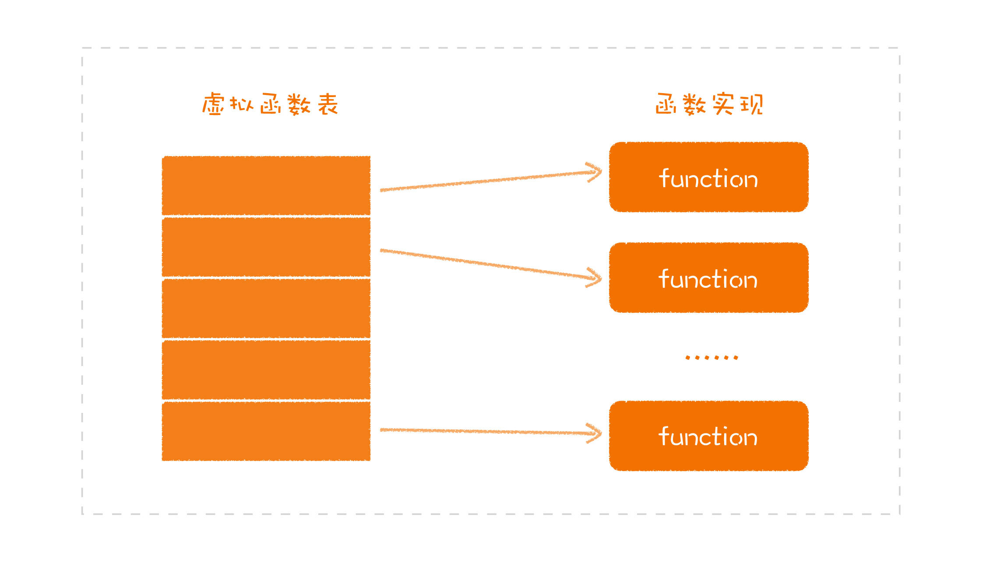

# 面向对象编程  

- 面向对象编程
  - 面向对象
    - 面向对象的核心概念就是**对象**，用面向对象风格写出的程序，本质上就是一堆独立对象之间的交互（扁平结构）
    - 面向对象面向的是“对象”，而不是类（切勿语言固化），对象本身就是一个独立的个体
  - 面向对象编程特征（面向对象编程中，更重要的是**封装和多态**）
    - 封装
      - 面向对象不仅仅是对数据与函数的组合，更重要的是**在于隐藏内部数据及实现细节，而对外提供了哪些行为接口**
        - 因为数据是实现，是**易变的**，应该隐藏起来，不能对外暴露，导致内部遭到破坏，代码难以预测、维护
          - **访问器**
      - 封装是面向对象的根基。相比较于结构化编程下的结构化程序组织方式，面向对象编程在则要设计出一个一个可以组合，可以复用的单元。然后，**组合**这些单元完成不同的功能。
      - 如何封装：**基于行为进行封装，不要暴露实现（数据）细节，最小化接口暴露**
    - [继承](#继承)
      - **继承不是一种好的代码复用，组合优于继承**
      - **面向组合编程**：将不同的关注点分离出来，每一个关注点成为一个模块，在需要的时候组装起来
    - [多态：一个接口多种形态](#多态一个接口多种形态)
      - **面向接口编程：将变的部分和不变的部分隔离开来**
      - **要实现多态，需要找出不同事物的共同点，建立起抽象**
  - 优点
    - **面向对象编程，会限制使用函数指针，它是对程序控制权的间接转移施加了约束**：[多态实现](#多态实现)
  - 面向对象设计原则：S.O.L.I.D
    - 单一职责（Single Responsibility），类或者对象最好是只有单一职责，在程序设计中如果发现某个类承担着多种义务，可以考虑进行拆分
    - 开关原则（Open-Close, Open for extension, close for modification），设计要对扩展开放，对修改关闭。换句话说，程序设计应保证平滑的扩展性，尽量避免因为新增同类功能而修改已有实现，这样可以少产出些回归（regression）问题。
    - 里氏替换（Liskov Substitution），这是面向对象的基本要素之一，进行继承关系抽象时，凡是可以用父类或者基类的地方，都可以用子类替换。
    - 接口分离（Interface Segregation），我们在进行类和接口设计时，如果在一个接口里定义了太多方法，其子类很可能面临两难，就是只有部分方法对它是有意义的，这就破坏了程序的内聚性。对于这种情况，可以通过拆分成功能单一的多个接口，将行为进行解耦。在未来维护中，如果某个接口设计有变，不会对使用其他接口的子类构成影响。
    - 依赖反转（Dependency Inversion），实体应该依赖于抽象而不是实现。也就是说高层次模块，不应该依赖于低层次模块，而是应该基于抽象。实践这一原则是保证产品代码之间适当耦合度的法宝。
  - 编程模型
    - Class
    - 原型

## 继承

继承分为两种，**实现继承（extends）**和**接口继承（implements）**。实现继承是站在子类的视角看问题，从父类实现中继承代码复用；接口继承则是站在父类的视角，接口继承更多是与多态相关。

从实现继承来看父类：父类是干什么用的呢？就是把一些公共代码放进去，之后在实现其他子类时，可以少写一些代码。讲程序库的时候，我们说过，设计的职责之一就是消除重复，代码复用。所以，在很多人的印象中，继承就是一种代码复用的方式。但：

- 把实现继承当作一种代码复用的方式，并不是一种值得鼓励的做法
- 实现继承通常也是一种受程序设计语言局限的思维方式

实现继承带来的问题：

- 多重继承可能带来冲突或者单继承带来的限制
- 代码耦合：所继承的基类方法与属性都是不可控的（违反依赖倒置原则）

## 多态：一个接口多种形态

多态：**一个接口，多种形态**。多态基于接口概念，**接口将变的部分和不变的部分隔离开来**，在二者之间建立起一个边界。不变的部分就是接口的约定，而变的部分就是外部各自的实现。在软件开发中，对系统影响最大的就是变化。

### 多态实现

在面向对象多态编程中，会限制使用函数指针，将函数指针赋值的操作下沉到了运行时去实现：

一个类在编译时，会给其中的接口实现的函数在虚拟函数表中找到一个位置，把函数指针地址写进去，不同的子类对应不同的虚拟表。当我们用接口去调用对应的函数时，实际上完成的就是在对应的虚拟函数表的一个偏移，不管现在面对的是哪个子类，都可以找到相应的实现函数：

通过分开普通函数和在虚拟列表记录接口函数，隔离了继承重写方法带来的破坏

  

当多态成了一种语法，函数指针的使用就得到了限制，犯错误的几率就大大降低了，程序行为的可预期性就大大提高了。

### 面向接口编程

面向接口编程的价值就根植于多态，也正是因为有了多态，这是很多设计原则的基础：一些设计原则，比如，开闭原则、接口隔离原则才得以成立，相应地，设计模式才有了立足之本。

- 面向接口编程最主要的是**将变的部分和不变的部分隔离开来**
- **要实现多态，需要找出不同事物的共同点，建立起抽象**，这也是很多程序员更好地运用多态的阻碍。而我们找出共同点，前提是要分离关注点
- 在语言实践发展过程中，**多态并不一定要依赖于继承**（多态依赖于继承，这只是某些程序设计语言自身的特点），只要能够遵循相同的接口，就可以表现出来多态，如在动态语言中，有一个常见的说法，叫 **Duck Typing**，就是说，如果走起来像鸭子，叫起来像鸭子，那它就是鸭子：

```js
let duck = {
  call() {
    console.log("鸭叫")
  }
}

let chicken = {
  call() {
    console.log("鸡叫")
  }
}

function make_call(animal) {
  animal.call()
}
make_call(duck)
make_call(chicken)
```