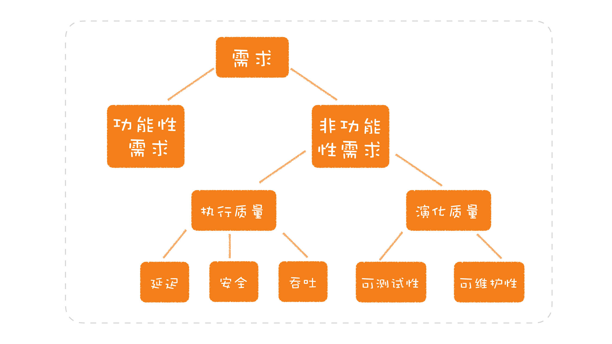

# 软件工程

- 软件工程 = 过程 + 方法 + 工具
  - 软件工程的核心就是围绕软件开发过程，产生的方法学和工具。
  - 目的：高效构建高质量的软件
  - 软件生命周期（过程）
  - 工具

## 软件生命周期（过程）

1. 项目规划
2. 需求分析
   - 可行性分析
   - 需求包括两大类，第一类是功能性需求，也就是要完成怎样的业务功能；第二类是非功能性需求，是业务功能之外的一些需求    
   - 功能需求结构化分解：软件开发要解决的是需求问题。最常见的解决问题思路是分而治之，其中至关重要的是第一步：**分解**   
3. 软件设计
4. 软件开发（编码）
5. 软件测试
   - 单元测试
   - 端对端测试
6. 运行维护