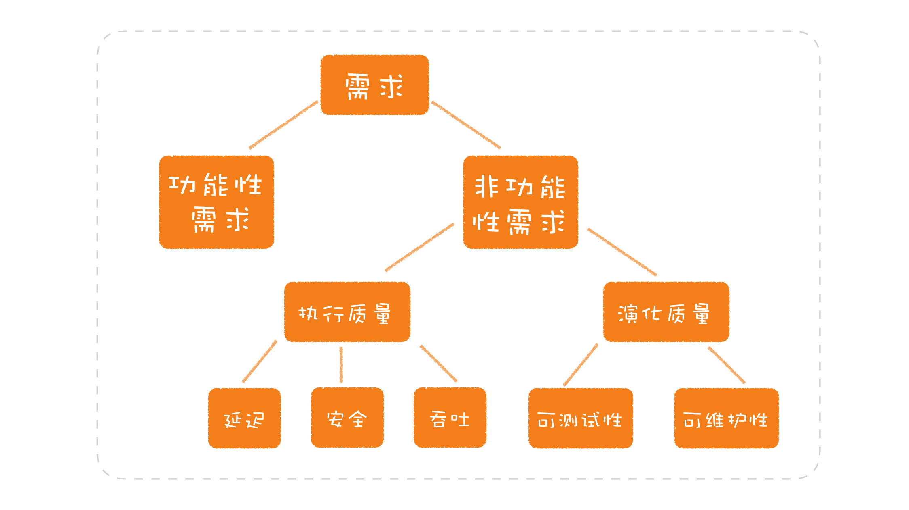

- 软件设计
  - 背景
    - 软件开发是为了解决需求问题
    - 算法对抗的是数据的规模，而**软件设计对抗的是需求的规模**，是需求和解决方案之间架设一个桥梁：在软件开发过程中就需要建立起一个统一的结构，以便于所有人都能有一个共同的理解。这就如同建筑中的图纸，懂建筑的人看了之后，就会产生一个统一的认识。而在软件的开发过程中，这种统一的结构就是模型，而**软件设计就是要构建出一套模型**。
  - 模型
    - 模型，不仅包括用来描述业务的各种实体，也包括完成业务功能的各种组件，或者抽象概念
    - 模型是一个软件的核心
      - 模型的粒度可大可小
      - 好的模型应该**高内聚、低耦合**
      - 模型可以**分层**，由底层的模型提供接口，构建出上层的模型
  - 规范：限定了什么样的需求应该以怎样的方式去完成
    - 比如模型可以反映到代码实现，但有时需要加以规范限制，比如 React Hooks 的限制性。
  - **软件设计 = 模型建立 + 规范设计**
  - 模型与规范，二者相辅相成：模型的实现需要规范限制，而规范的制定也有赖于模型
- 软件设计的方法，即如何建立模型
  - **分离关注点**：将一个模块的不同纬度分开
    - 分离关注点，越多越好，粒度越小越好，模块就越内聚
  - 可测试性：衡量设计优劣的一个重要标准
- 如何了解一个软件的设计?
  1. 分层（模型是可分层的）
  2. 模型：理解一个模型的关键在于，要了解这个模型设计的来龙去脉，知道它是如何解决相应的问题
  3. 接口
     - 任何软件接口的数量都不是一个小数目，所以要学会找主要接口
     - 找主要接口方法：**找主线，看风格(学习其设计风格)**
     - 找主线看文档：找到项目主线的一个方法就是从起步走文档开始，因为它会把项目最基本的用法展现给你，你可以轻松地找到主线
  4. 实现
     - 理解一个实现，是以对模型和接口的理解为前提的
     - 每个软件的实现都有非常多的细节，如果想了解一个软件的实现。我们**从软件的结构和关键的技术入手，要带着自己的问题进行寻思**，问题的出发点就是我们对模型和接口的理解
     - 想要了解一个软件的实现，就要把分层的模型展开，看下一层的模型，即了解软件的结构（回到步骤1）
- 程序设计语言：从模型分层套娃来看，程序设计语言本身也是一个软件，它也包含模型、接口和实现
  - 模型：编程模型
    - 学习程序设计语言其实就是要**学习语言提供的编程模型**。语言的发展就是一个互相学习和借鉴的过程：每一种模型的提出的最大的动力是为了解决某个问题，新的语言新的语法通常是在既有的结构上不断添加出来的，为的是简化代码的编写。学习新语言，其实只是在做增量的学习，重点在差异化学习
    - 理解语言提供的编程模型后，要懂得**一切语法都是语法糖**，打开语法糖去了解其底层运行设计原理，即实现原理
  - 接口
    - 语法
    - 程序库：程序库也是程序设计语言的”接口”
      - 程序库最初只是为了消除重复，有一些程序库实在是太常用了，它们就会随着语言一起发布，成为**标准库**
      - 第三方程序库：第三方库、语言生态的兴起，怎样管理第三方库就成了一个问题，于是就有了**包管理器**
    - **“语言设计就是程序库设计”和“程序库设计就是语言设计”**
      - 语法和程序库是在解决同一个问题，二者之间是相互促进的关系。通常是先有程序库，再有语法；如果语法不够好，新的程序库就会出现，新一轮的编程模型就开始孵化，一个经过验证的模式最终变成了语言的一部分，而它的起点只是一个常见的用法：一个程序库
      - 学习一种程序设计语言提供的模型时，不仅仅要看语法本身有什么，还要了解有语言特性的一些程序库。一方面，我们可以锻炼自己从日常工作中寻找重复；另一方面，我们可以更好地理解程序设计语言提供的能力
      - **提升软件设计能力，可以从编写程序库入手**
  - 实现：即支撑程序运行的部分：运行时，也有人称之为运行时系统，或运行时环境，它主要是**为了实现程序设计语言的执行模型**
    - **运行时，是我们做软件设计的地基**：一些比较基础的设计，仅仅了解到语言这个层面是不够的。做设计真正的地基，并不是程序设计语言，而是运行时，有了对于运行时的理解，我们甚至可以做出语言本身不支持的设计
    - 学习运行时
      - 了解程序如何运行：带着“程序如何运行”这个问题去理解就好了
      - 运行时的编程接口
        - 语言层面的运行时编程接口
        - 通过了解指令的执行方式：开发者就可以利用这个指令改善自己的运行时实现
- [编程范式](#编程范式)
- 如何设计一个软件？
- 软件设计
  - 原型设计
    - 设计方法
      - DDD
  - 架构设计
  - 程序设计
    - 程序设计语言
    - 设计原则
    - 设计模式

## 编程范式

编程语言的发展就是一个逐步远离计算机硬件，向着待解决的领域问题靠近的过程。从结构化编程到面向对象编程，再到函数式编程，离图灵机模型越来越远，但抽象程度越来越高，与领域问题的距离越来越近。

编程范式，是编程世界里程序员们造物的世界观与方法论、是编程语言代码的编写模式或者风格，同时也代表了这门语言的思想及设计方向。

- 编程范式：指的是程序的编写模式，意味着主要使用的是什么样的代码结构
  - 编程范式：**编程范式的本质主要是对程序员的能力施加了约束**
  - 分类
    - 从宏观上，编程语言可以大致分为两类，一类是命令式，一类是声明式：
      - 命令式：通过一系列顺序指令来告诉计算机怎么做
      - 声明式：只需要说明实现的目标，总而言之就是它是定义结果而不是定义步骤
    - 结构化编程，也称作过程式编程，或面向过程编程
      - 通过一些结构化的控制结构进行程序的构建，如顺序结构、选择结构 if/match 和循环结构 for/while
      - 限制使用 goto 语句，它是对**程序控制权的直接**转移施加了约束
      - 结构化编程不能有效地隔离变化，需要与其他编程范式配合使用
    - [面向对象编程](./%E9%9D%A2%E5%90%91%E5%AF%B9%E8%B1%A1%E7%BC%96%E7%A8%8B.md)
      - 用对象模拟现实世界生活，使用一堆对象之间的交互
      - 限制使用函数指针，它是对**程序控制权的间接转移**施加了约束
    - [函数式编程](./%E5%87%BD%E6%95%B0%E5%BC%8F%E7%BC%96%E7%A8%8B.md)
  - 具体实践
    - 采用面向对象来组织程序中的各个模块
    - 采用函数式编程的风格指导类的接口设计
    - 接口具体的实现中使用结构化编程提供的控制结构

## 其他

软件开发要解决的问题是从需求而来。需求包括两大类，第一类是功能性需求，也就是要完成怎样的业务功能；第二类是非功能性需求，是业务功能之外的一些需求。

  

- 

- 业务和技术混合：代码分层
  - 业务层   
  - 基础层
    - 框架层
- 不同的数据变动方向：读写分离、动静分离
- 那种典型的把设计和实现混在一起的图 设计 实现混合

- 
- 要保证每个小模块的正确性，就要保证每个模块是可以测试的，保证每个模块在开发阶段能够测试，比如单元测试。
- 如何在设计中考虑可测试性呢？其实就是要在设计时想一下，这个函数 / 模块 / 系统要怎么测。

- 在实际工作中，很多公司为了做集成测试，要把所有的子系统全部都搭建出来，也就是一套完整的环境。这种环境要占用大量的资源，一般来说，公司不会准备很多套。这样造成的结果就是各个团队对于环境的竞争，再叠加上各个系统配合的问题，测试的效率还会进一步降低
- 我们在设计一个函数 / 模块 / 系统时，必须将可测试性纳入考量，以便于能够完成不同层次的测试，减少对集成环境的依赖。

- 尽可能地给每个模块更多的测试
- 设计一个函数 / 模块 / 系统时，必须将可测试性纳入考量，以便于能够完成不同层次的测试，减少对集成环境的依赖 以保证 单元测试、本地测试
- TDD：在软件开发过程中考虑测试，实际上是思考软件的质量问题，而把质量的思考前移到开发，甚至是设计阶段，是软件开发从传统进入到现代的重要一步。

- 面向对象系统设计，对需求进行分析从而产生概念模型
- 模型
  - 业务层面：概念模型
  - 实现层面：设计模型
- UML 工具
- 面向对象思想：抽象、继承、封装
- 业务需求层面，原型
- 实现层面，模型

- 编程模型
- 我以 Spring 的 DI 容器为例给你讲解了如何理解模型。DI 容器的引入有效地解决了对象的创建和组装的问题，让程序员们拥有了一个新的编程模型。
- DI
  - 分离依赖
  - 可测试性

