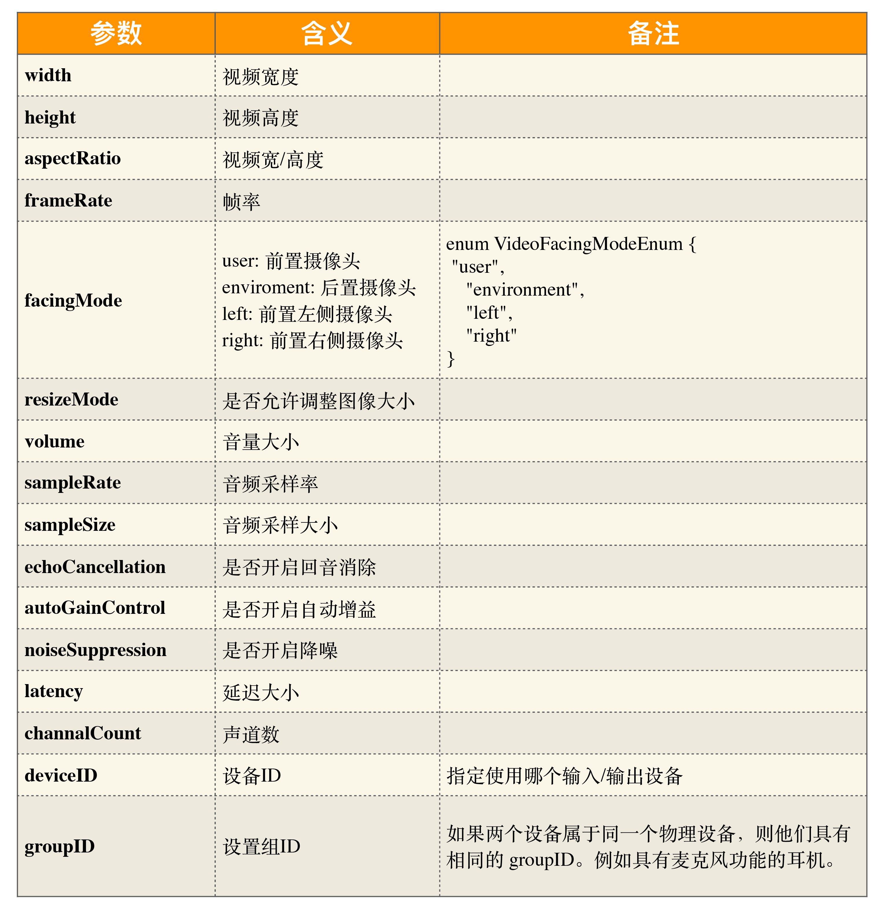

# 音视频

- 音视频
  - 媒体设备
    - 音频设备
      - 采样率
      - 采样大小
    - 视频设备
      - 通过光学传感器将光转换成数字信号，即 RGB（Red、Green、Blue）数据（每一种颜色由 8 位组成，所以一个像素就需要用 24 位表示）
      - 图像数据还要进行压缩、传输，而编码器一般使用的输入格式为 YUV I420，所以在摄像头内部还有一个专门的模块用于将 RGB 图像转为 YUV 格式的图像
        - 通过编码器（如 H264/H265、VP8/VP9）压缩后的帧称为编码帧
          - 经过 H264 编码的帧包括以下三种类型
            - I  帧：关键帧。压缩率低，可以单独解码成一幅完整的图像
            - P 帧：参考帧。压缩率较高，解码时依赖于前面已解码的数据
            - B 帧：前后参考帧。压缩率最高，解码时不光依赖前面已经解码的帧，而且还依赖它后面的 P 帧。换句话说就是，B 帧后面的 P 帧要优先于它进行解码，然后才能将 B 帧解码
  - WebAPI
    - HTMLVideoElement
    - [MediaDevices：提供访问媒体设备的接口](https://developer.mozilla.org/zh-CN/docs/Web/API/MediaDevices)
      - `navigator.mediaDevices`
      - [getUserMedia](https://developer.mozilla.org/en-US/docs/Web/API/MediaDevices/getUserMedia)、[getDisplayMedia](https://developer.mozilla.org/en-US/docs/Web/API/MediaDevices/getDisplayMedia)
        - 限制
          - HTTPS
          - localhost
        - [MediaStream](https://developer.mozilla.org/en-US/docs/Web/API/Media_Capture_and_Streams_API)
          - 一个媒体流包含多个轨
          - [MediaStreamTrack](https://developer.mozilla.org/en-US/docs/Web/API/MediaStreamTrack)
            - “轨”在多媒体中表达的就是每条轨数据都是独立的，不会与其他轨相交
            - MediaTrackConstraints   
    - MediaRecorder：媒体录制
    - [WebRTC](https://developer.mozilla.org/zh-CN/docs/Web/API/WebRTC_API) 
      - SDP（Session Description Protocal）：用文本描述的各端支持的音频编解码器以及参数、传输协议、音视频媒体等

## 实战

- 音视频录制
  - Q&A
    - 录制端
      - 服务端录制
      - 客户端录制
        - 优点高清
        - 编码耗性能
    - 多媒体文件格式
      - 原始数据、自定义格式、可做私有播放
      - flv
        - 支持流式，可边录制边播放
        - 缺点，单视频模式
      - mp4
        - 多媒体格式
    - 录制行为
      - 边录边看
      - 录制完立即回放
      - 录完后过一段时间可观看
    - 录制多人互动场景
      - 录制桌面流 + 多路音频
  - TODO
    - 将多路音视频录制到同一个多媒体文件中（如 MP4）？这样的 MP4 在播放时会有什么问题吗？
- 共享桌面
  - 原理
    - 抓屏
    - 压缩编码
    - 传输
    - 解码
    - 显示
    - 控制
    - 远程控制端
  - 协议
    - 内容
      - 桌面数据
      - 信令控制
    - 协议
      - RDP（Remote Desktop Protocal）协议
      - **VNC（Virtual Network Console）**
- 流媒体传输协议
  - RTP 协议
  - RTCP 协议
    - RR（Reciever Report）
    - SR(Sender Report)

函数式 + 响应式

错误处理

options，可选项，指定视频格式、编解码器、码率等相关信息，如 mimeType: 'video/webm;codecs=vp8'。

工厂函数

- 网络问题
  - 丢包
  - 乱序
  - 阻塞