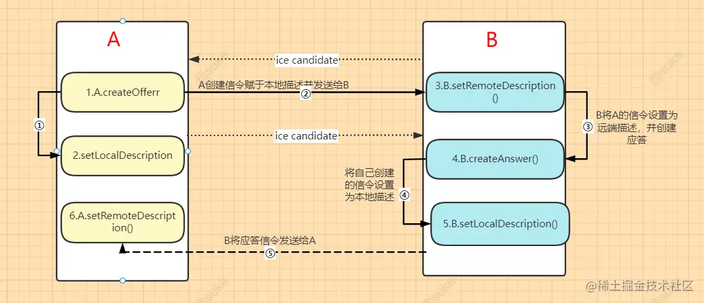

# 音视频

- 音视频
  - 媒体设备
    - 音频设备
      - 采样率
      - 采样大小
    - 视频设备
      - 通过光学传感器将光转换成数字信号，即 RGB（Red、Green、Blue）数据（每一种颜色由 8 位组成，所以一个像素就需要用 24 位表示）
      - 从摄像头里采集的帧或通过解码器解码后的帧都是非编码帧。非编码帧的格式一般是 YUV 格式或是 RGB 格式
      - 图像数据还要进行压缩、传输，而编码器一般使用的输入格式为 YUV I420，所以在摄像头内部还有一个专门的模块用于将 RGB 图像转为 YUV 格式的图像
      - 通过编码器（如 H264/H265、VP8/VP9）压缩后的帧称为编码帧
        - 经过 H264 编码的帧包括以下三种类型
          - I  帧：关键帧。压缩率低，可以单独解码成一幅完整的图像
          - P 帧：参考帧。压缩率较高，解码时依赖于前面已解码的数据
          - B 帧：前后参考帧。压缩率最高，解码时不光依赖前面已经解码的帧，而且还依赖它后面的 P 帧。换句话说就是，B 帧后面的 P 帧要优先于它进行解码，然后才能将 B 帧解码
  - WebAPI
    - HTMLVideoElement
    - [MediaDevices](https://developer.mozilla.org/zh-CN/docs/Web/API/MediaDevices)
      - `navigator.mediaDevices`
        - [getUserMedia](https://developer.mozilla.org/en-US/docs/Web/API/MediaDevices/getUserMedia)
        - [getDisplayMedia](https://developer.mozilla.org/en-US/docs/Web/API/MediaDevices/getDisplayMedia)
        - 安全源限制
          - HTTPS
          - 回路地址：localhost、127.0.0.1、::1
          - `file://` 文件协议
    - [MediaStream](https://developer.mozilla.org/en-US/docs/Web/API/Media_Capture_and_Streams_API)
      - 一个媒体流包含多个轨
      - [MediaStreamTrack](https://developer.mozilla.org/en-US/docs/Web/API/MediaStreamTrack)
        - “轨”在多媒体中表达的就是每条轨数据都是独立的，不会与其他轨相交
        - MediaTrackConstraints   
    - MediaRecorder：媒体录制
    - [WebRTC](https://developer.mozilla.org/zh-CN/docs/Web/API/WebRTC_API) 
      - SDP（Session Description Protocal）：用文本描述的各端支持的音频编解码器以及参数、传输协议、音视频媒体等

## 实战

- 音视频录制
  - 录制端
    - 服务端录制
    - 客户端录制
      - 优点高清
      - 编码耗性能
  - 多媒体文件格式
    - 原始数据、自定义格式、可做私有播放
    - flv
      - 支持流式，可边录制边播放
      - 缺点，单视频模式
    - mp4
      - 多媒体格式
  - 录制行为
    - 边录边看
    - 录制完立即回放
    - 录完后过一段时间可观看
  - 录制多人互动场景
    - 录制桌面流 + 多路音频
  - TODO
    - 是否可以将多路音视频录制到同一个多媒体文件中呢？
    - 是否可以将这三个人的视频写入到一个多媒体文件中呢（如 MP4）？这样的 MP4 在播放时会有什么问题吗？
- 共享桌面
  - 原理
    - 抓屏
    - 压缩编码
    - 传输
    - 解码
    - 显示
    - 控制
    - 远程控制端
  - 协议
    - 内容 = 桌面数据 + 信令控制
    - 协议
      - RDP（Remote Desktop Protocal）协议
      - **VNC（Virtual Network Console）**
- 实时传输协议
  - RTP 协议
  - RTCP 协议
    - RR（Reciever Report）
    - SR(Sender Report)

- 虽然出于隐私原因无法访问有关用户摄像头和麦克风的信息，但应用程序可以使用额外的约束来请求它需要和想要的摄像头和麦克风功能
- 性能调优
  - 分辨率\帧率\宽带 调参
  - 视频模糊
    - 宽带问题
    - 关闭 Web RTC 的自适应码率，frameRate，width，height 设置固定值或高范围值。

TCP 为了传输的可靠性，它是如何做的呢？简单总结起来就是“发送 -> 确认；超时 -> 重发”的反复过程。

- SDP = SDP 描述格式 + SDP 结构
- SDP 结构 = 会话描述 + 媒体信息描述
- WebRTC 媒体协商
  - 本地的 SDP 和远端的 SDP 都设置好后，协商就算成功了
- WebRTC 建立连接
  - 媒体协商：交换媒体描述信息
    - 原理
      - 首先，通信双方将它们各自的媒体信息，如编解码器、媒体流的 SSRC、传输协议、IP 地址和端口等，按 **SDP** 格式整理好
      - 然后，通信双方通过**信令服务**器交换 SDP 信息，并待彼此拿到对方的 SDP 信息后，找出它们共同支持的媒体能力
      - 最后，双方按照协商好的媒体能力开始音视频通信
    - RTCPeerConnection 协商过程    
  - ICE（Interactive Connectivity Establishment）：交换网络信息，寻找最佳连接方案
    - Candidate 类型
      - host 类型，即本机内网的 IP 和端口
        - host 类型表示的内网连接
        - 如果 host 类型候选者之间无法建立连接，那么 WebRTC 则会尝试次优先级的候选者，即 srflx 类型的候选者
        - 如果失败，就最后尝试使用 relay 方式建立连接
      - srflx 类型, 即本机 NAT 映射后的外网的 IP 和端口
        - srflx 类型的 Candidate 实际上就是内网地址和端口经 NAT 映射后的外网地址和端口
      - relay 类型，即中继服务器的 IP 和端口
      - prflx、peer reflex
    - WebRTC 就开始按优先级顺序对 Candidate 进行连通性检测了
      - 首先收集所有的 host 类型的 Candidate，通过判断两台主机是否处于同一个局域网内
      - 其次通过 NAT 打洞，即 P2P 穿越的方式，即使用 **STUN** 协议收集 srflx 类型的 Candidate
      - 最后通过中继服务器进行中转
        - 使用 **TURN** 协议收集 relay 类型的 Candidate

  - RTCPeerConnection
  - 通信双方链路的建立是在设置本地媒体能力，即调用 setLocalDescription 函数之后才进行的

- 走内网
  - 要想让 A 与 B 直接在内网连接，首先要解决的问题是： A 与 B 如何才能知道它们是在同一个网段内呢？不过，WebRTC 很好的解决了这个问题，后面我们可以看一下它是如何解决这个问题的。
- 走外网
  - p2p，即 NAT 打洞
    - WebRTC 中，NAT 打洞是极其复杂的过程，它首先需要对 NAT 类型做判断，检测出其类型后，才能判断出是否可以打洞成功，只有存在打洞成功的可能性时才会真正尝试打洞。
  - 通过中继服务器进行中转
    - STUN 协议
    - TURN（Traversal Using Relays around NAT）
      - relay 服务是通过 TURN 协议实现的。所以我们经常说的 relay 服务器或 TURN 服务器它们是同一个意思，都是指中继服务器
      - relay 服务就会在服务器端分配一个新的 relay 端口，用于中转 UDP 数据报

我们可以用WebRTC这个桥梁当作是一种新的数据双向传输方案，现阶段已经有网站用这种方式上传用户数据或其他加密消息媒介了，而且因为WebRTC中数据传输协议非HTTP或者WebSocket协议请求，很多探测工具也就没法察觉

- 我曾就职于多家知名互联网企业，现在在硅谷某巨头 IT 企业担任资深软件工程师，主要负责 Maps 相关产品的研发工作，参与移动产品的设计、实现及开源软件的开发和维护。
- 我便将力扣（LeetCode）上的题目按公司、题目热门程度、以及难度进行排序后，制定学习计划，坚持做完了所有题目，如愿拿到了大厂 Offer

- RTCPeerConnection 细节
  - 端与端之间要建立连接，但它们是如何知道彼此的外网地址呢？
  - 如果两台主机都是在 NAT 之后，它们又是如何穿越 NAT 进行连接的呢？
  - 如果 NAT 穿越不成功，又该如何保证双方之间的连通性呢？
  - 好不容易双方连通了，如果突然丢包了，该怎么办？
  - 如果传输过程中，传输的数据量过大，超过了网络带宽能够承受的负载，又该如何保障音视频的服务质量呢？
  - 传输的音视频要时刻保持同步，这又该如何做到呢？
  - 数据在传输之前要进行音视频编码，而在接收之后又要做音视频解码，但 WebRTC 支持那么多编解码器，如 H264､ H265､ VP8､ VP9 等，它是如何选择的呢？
- adapter.js
- 在 WebRTC 端与端之间建立连接，包括三个任务：
为连接的每个端创建一个 RTCPeerConnection 对象，并且给 RTCPeerConnection 对象添加一个本地流，该流是从 getUserMedia() 获取的；
获取本地媒体描述信息，即 SDP 信息，并与对端进行交换；
获得网络信息，即 Candidate（IP 地址和端口），并与远端进行交换

断开重连