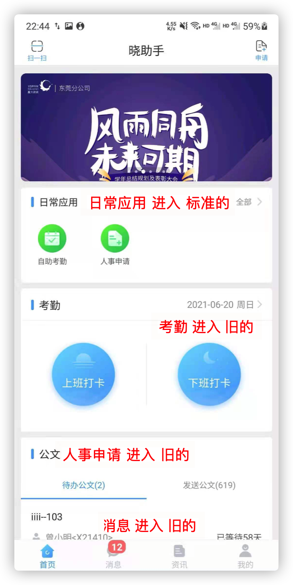
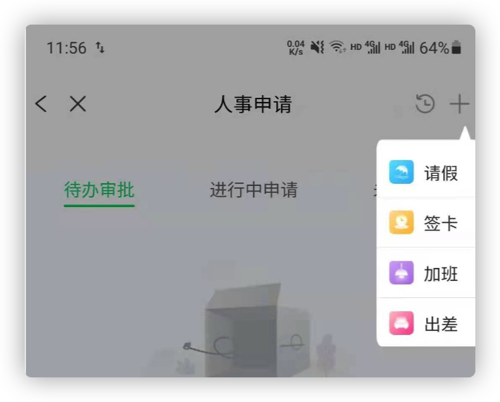

# v2.27 升级兼容新版晓助手默认 webview

> 其实晓助手默认的 webview 就是原APP团队封装给星火APP使用那一套，[晓助手默认 webview 文档地址](https://xiaojiaoyukeji.yuque.com/gvbet5/hr1no0/ud0gy8)。

本次 v2.27 版本涉及项目：

- [人事H5](https://gitlab.xinghuolive.com/efficiency-engineer/hrms-h5)
- [自助考勤H5](https://gitlab.xinghuolive.com/efficiency-engineer/hrms-attendance-h5)

需求目标：

1. 对接新版本 API
2. 新旧版本 webview 兼容

## 新旧版本 webview 兼容

下面标出各入口进入的 webview 的版本

## 对接新版本 API

新版本默认 webview 提供的 API 大改，需要对接的内容：

- JS SDK接入指南，https://xiaojiaoyukeji.yuque.com/gvbet5/hr1no0/ewsugg
- 登陆授权
- 非全屏/导航栏
- 软盘兼容
- 自助考勤跳转人事流程H5
- 其他兼容测试
  
  测试页面功能、样式之类是否正常

### 登陆授权

旧版本，用户可通过以上方式对项目页面进行访问。

> 补充
>
> 自助考勤 H5  => 人事H5
>
> - 考勤汇总、展开异常信息、点击去处理
> - 考勤日历、异常时间、点击处理异常

新版本，对登陆授权方式进行统一行为封装，根据 UA 环境再分配到具体行为。

### 非全屏/导航栏、软盘兼容

新版本晓助手提供以下几种屏幕模式

> 在Android上，软键盘属性为adjustResize，即软键盘弹出或收起时，WebView的高度会自动改变，位于软键盘上方；但当UI布局到系统状态栏时（沉浸式），软键盘adjustResize属性会失效，为了减少H5的软键盘适配工作，当页面有软键盘输入场景时，需要在H5 url上添加参数softKeyboard=1。

- 自助考勤H5：非全屏

- 人事H5：非沉浸式全屏，h5 url 上会带参数 `showTitle=0&softKeyboard=1` **需要实现原头部菜单栏**

  

  

### 自助考勤跳转人事流程H5

自助考勤 H5  跳转 人事H5

- 考勤汇总、展开异常信息、点击去处理
- 考勤日历、异常时间、点击处理异常

原自助考勤跳转人事流程H5，是通过当前窗口加载新的页面。
按照接入规范：**第三方页面打开新页面，通过navigateTo开启新的webview打开，尽可能模拟原生 APP 页面栈**。

