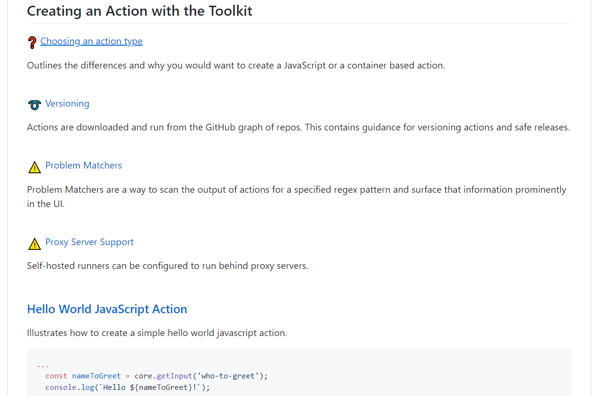
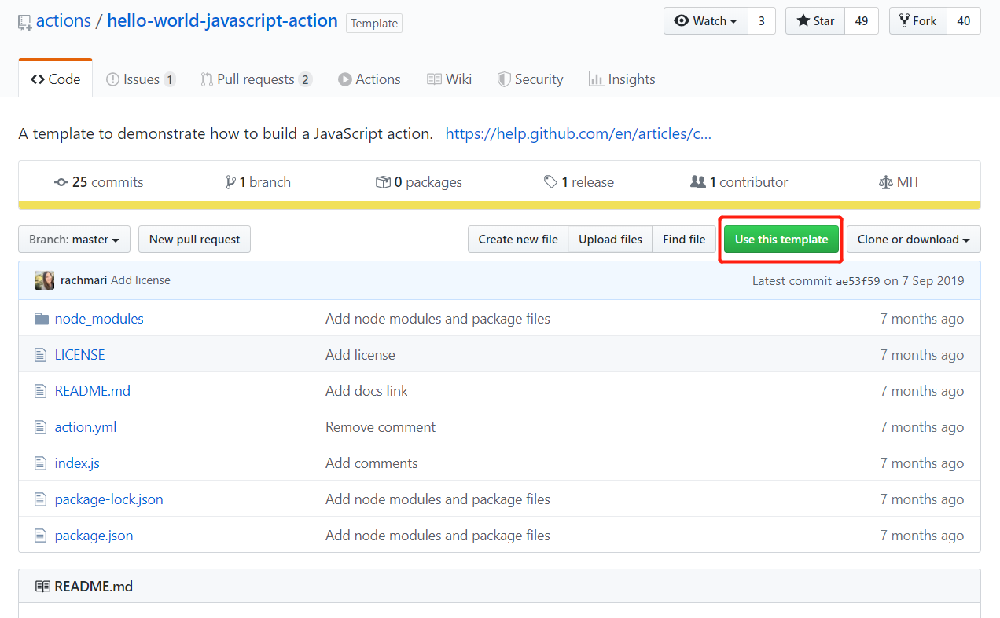
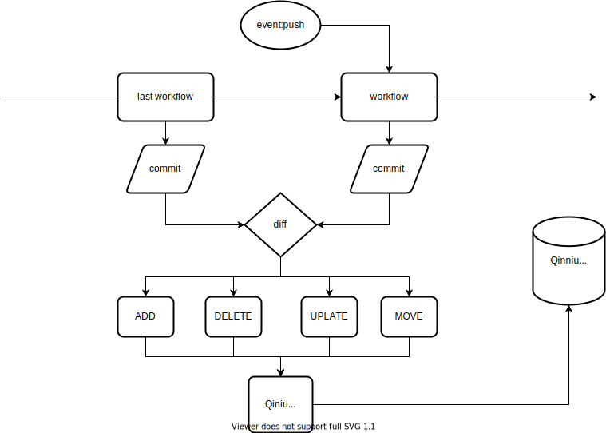

# 开发一个七牛图床的 GithubAction

笔者喜欢将图片和文件置于同个项目中，写作的时候方便直接相对引用显示，构建时替换成 Github Raw 线上地址。但由于国内访问 Github 上仓库的图片速度是比较慢的，使用 Github 作为图床是不太理想。[七牛云](https://www.qiniu.com/)对注册用户提供了免费 10G 的对象储存，刚好可以用来作为图床。

梳理下本次需求：
1. 源图片文件存储在同项目中，方便写作时或者 vuepress dev 模式下直接预览
2. 源图片文件能够自动上传七牛云
3. 构建成功时 url 自动替换成七牛云对象储存地址

借此机会，笔者正好学习开发一个 Github Action，能够自动将项目中指定的文件夹（即储存图片的 images 文件夹）的内容同步到七牛对象储存上。

## 开通七牛云服务

## vuepress webpack 构建配置修改

根据上述的需求，我们在项目中创建一个 `src/images` 目录用于存放图片，静态写作时，我们只需要相对引用图片，笔者用 vscode 及相关 markdown 插件进行编写及同步预览。有时我们也需要线下 vuepress dev 开发模式，查看效果如何，通过查看 vuepress 源码，了解 vuepress 构建时使用 [url-loader](https://github.com/webpack-contrib/url-loader) 对图片资源进行处理，10KB 大小下的图片转成 base64 嵌入。

```javascript
// node_modules/@vuepress/core/lib/node/webpack/createBaseConfig.js

config.module
    .rule('images')
      .test(/\.(png|jpe?g|gif)(\?.*)?$/)
      .use('url-loader')
        .loader('url-loader')
        .options({
          limit: inlineLimit // 10KB,
          name: `assets/img/[name].[hash:8].[ext]`
        })
```

这在 dev 模式下依旧符合我们期望，但在 build 模式下构建出来的资源对图片的引用，我们需要构建时替换成七牛云的外链域名地址，我们需要对 vupress webpack config 进行修改。

```javascript
// vue.config.js

...
 chainWebpack: (config, isServer) => {
    config.module
      .rule('images')
      .clear()

    config.module
      .rule('images')
      .test(/\.(png|jpe?g|gif)(\?.*)?$/)
      .use('url-loader')
        .loader('url-loader')
        .options({
          limit: 100 * 1024, // 100KB
          name: process.env.NODE_ENV === 'production' ? '[name].[hash:8].[ext]' : `assets/img/[name].[hash:8].[ext]`,
          publicPath: process.env.NODE_ENV === 'production' ? IMG_URL : '/'
        })
  }
...
```

做完上面，接下来的一个主要需求就是：将 `src/images` 目录下的图片同步到七牛云对象储存上。笔者将这个功能开发成一个 `sync-to-qiniu-action` 的 Github Action，方便以后其他项目使用。

## sync-to-qiniu-action

This action can synchronize files in the path you specified to qiniu(KODO), including delete, modify, and move&rename operations.

[项目地址](https://github.com/laoergege/sync-to-qiniu-action)

### 关于 Github Action

Github Action 就是一个独立功能的脚本，您可以通过编写自定义代码来创建操作某些操作，比如说可以读写仓库、发送短信、或者调用 github 或第三方的 API。然后你可以使用在你的 workflow 中使用本地或者公开仓库，github 商城分享给其他人使用（Docker 实现的 Action 则通过 Docker Hub 等镜像仓库平台分享）的 action。其实 Github Action 类似于 npm 包，只不过用于 Github 的 CI/CD 功能中。

Github Action 分成两类实现：

- Docker 容器实现，Docker 实现更为强大自由，可以自定义操作系统和工具，但由于构建延迟，Docker 容器操作比JavaScript操作慢。
- JavaScript 实现，直接运行在机器上，执行速度更快（本项目选择 JavaScript Action，故不涉及 Docker Action 相关）。

###  Workflow 中如何使用 Action

如果 action 是独立公开仓库，你可以使用 `{owner}/{repo}@{ref}` 或者 `{owner}/{repo}/{path}@{ref}` 去引用

```yml
jobs:
  my_first_job:
    steps:
      - name: My first step
      # Uses the master branch of a public repository
        uses: actions/heroku@master
      # use a specific version tag of a public repository
      - name: My second step
        uses: actions/aws@v2.0.1
```

如果 Action 跟 workflow 是位于统一仓库，你能使用**相对项目仓库根目录**去引入 `./path/to/dir`

> 这里要注意了 ./ 不是 action 文件所在位置，而是仓库根位置

```yml
jobs:
  my_first_job:
    steps:
      - name: Check out repository
        uses: actions/checkout@v2
      - name: Use local my-action
        uses: ./.github/actions/my-action
```

从某个角度来说，githua 上大多数项目都是公开的，故可以直接使用 `{owner}/{repo}@{ref}` 或者 `{owner}/{repo}/{path}@{ref}` 去引入。

推荐将 Github Action 作为一个独立仓库进行维护，而不是放在在某个应用的仓库中，这样方便**分享、跟踪、迭代**。如果不是想分享，而是想自我单独快速使用，推荐放在 `.github/actions` 文件下，比如 `.github/actions/action-a` 和 `.github/actions/action-b`，并使用相对路径引用。

```yml
jobs:
  my_first_job:
    steps:
      - name: My first step
        uses: ./.github/actions/my-action
```

### Action 开发

本次开发中我们选择以 JavaScript 实现的 Github Action 方式。

[actions/toolkit](https://github.com/actions/toolkit) The GitHub ToolKit for developing GitHub Actions. 官方工具包，不仅提供了常用的开发工具，并且还有项目模板以及指引。



创建项目我们可以使用官方提供的开发模板 [actions/javascript-action](https://github.com/actions/javascript-action)

进入模板仓库，点击 **Use this template** 创建模板



创建好模板仓库，我们需要调整修改某些文件，其中最主要的就是 action.yml。

#### action.yml

action.yml 相当 npm 包 package.json ，用于描述 action 的相关信息。

> [官方 action.yml 语法参考](https://help.github.com/en/actions/building-actions/metadata-syntax-for-github-actions)

```yml
name: 'sync-to-qiniu-action'
description: 'synchronize the files in the specified path to qiniu'
inputs:
  accessKey:
    description: 'qiniu accessKey'
    required: true
  secretKey: 
    description: 'qiniu secretKey'
    required: true
  bucket:
    description: 'qiniu bucket'
    required: true
  zone:
    description: 'bucket zone'
    required: true
  path:
    description: 'the path under files you want to upload'
    required: true
  token:
    default: 'a token with access to your repository scoped in as a secret'
    required: true
  fsizeLimit:
    description: 'maximum upload file size limit(byte)'
    default: 5 * 1024 * 1024 #默认 5M
  mimeLimit:
    description: 'File MimeType'
runs:
  using: 'node12'
  main: 'dist/index.js'
  post: 'dist/index.js'
branding:
  icon: 'upload-cloud'
  color: 'blue'
```

其中 `runs.post` 指定后置处理脚本。与七牛交互的过程是比较耗时的任务，故需要把该 action 作为后置处理。

```javascript
// core from actions/core
// 通过 save-state command 保存 isPost 状态
if (core.getState("isPost")) {
  main()
} else {
  core.saveState("isPost", '1');
}
```

#### sync-to-qiniu-action 设计思路



主要思路如下：
1. workflow 事件触发
2. 获取近两次 wofkflow 的 commit
3. diff commit
4. 调用 qiniu 工具完成同步操作

具体代码实现可参考 [sync-to-qiniu-action](https://github.com/laoergege/sync-to-qiniu-action)。

### 测试

一般为了测试我们编写 action 或者 workflow 是否符合期望，我们每次都会提交并推送到 github 服务器去跑 workflow，这是最常规方法。当然我们也可以本地进行单元测试，但是我们可能需要模拟以下环境变量，如
  
- 模拟 action 输入
- 模拟 [github 上下文环境变量](https://help.github.com/en/actions/configuring-and-managing-workflows/using-environment-variables#default-environment-variables)
- 模拟文件系统
- 模拟 webhook 事件内容（在 workflow 中，GITHUB_EVENT_PATH 变量记录完整的 webhook 事件内容文件存放位置）

等等...

#### Debugging

#### 分支及版本管理

> [Versioning](https://github.com/actions/toolkit/blob/master/docs/action-versioning.md)

```yml
steps:
    - uses: actions/javascript-action@v1        # recommended. starter workflows use this
    - uses: actions/javascript-action@v1.0.0    # if an action offers specific releases 
    - uses: actions/javascript-action@41775a4da8ffae865553a738ab8ac1cd5a3c0044 # sha
```

step 使用 action 中，我们可以在 `ower/repo` 后指定 `@ref` 版本，ref 可以是一个 **git 分支**、**tag** 甚至 **git 对象的 SHA**。


### 发布 Github Marketplace

<https://help.github.com/en/actions/building-actions/publishing-actions-in-github-marketplace>


> 官方教程 [Creating an Action using the GitHub Context](https://github.com/actions/toolkit/blob/master/docs/github-package.md)