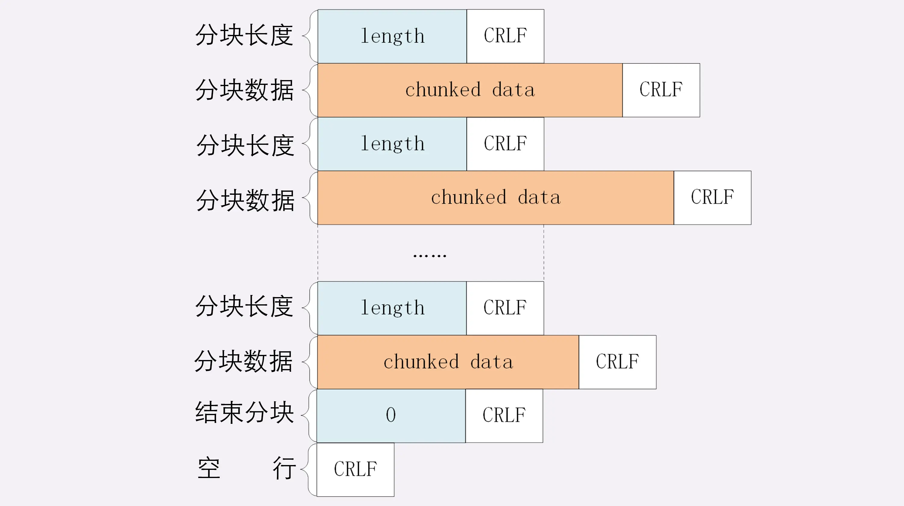
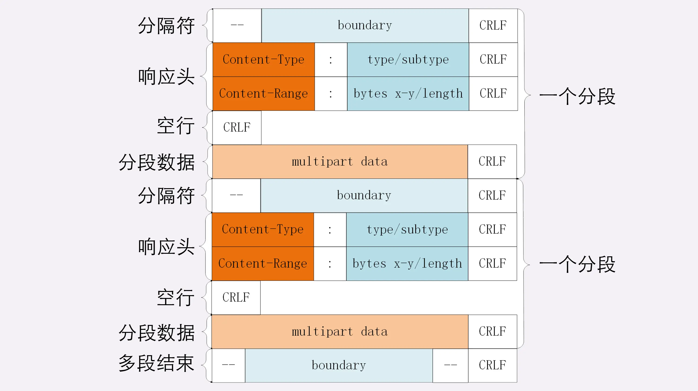
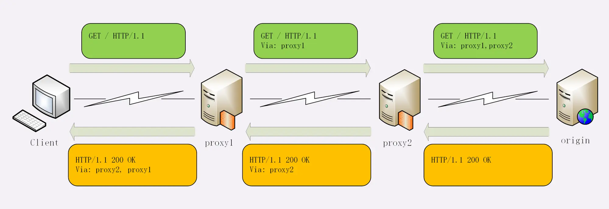
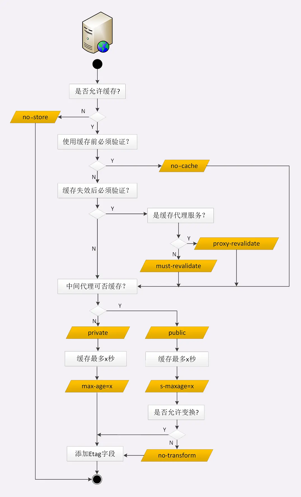

# HTTP HEAD 字段总结

> 学习笔记 《透视 http 协议》 进阶篇

## Body 内容相关

数据类型、压缩编码、语言、字符集

  

1. 数据类型表示实体数据的内容是什么，使用的是 MIME type，相关的头字段是 Accept 和 Content-Type；
2. 数据编码表示实体数据的压缩方式，相关的头字段是 Accept-Encoding 和 Content-Encoding；
3. 语言类型表示实体数据的自然语言，相关的头字段是 Accept-Language 和 Content-Language；
4. 字符集表示实体数据的编码方式，相关的头字段是 Accept-Charset 和 Content-Type；
5. 客户端需要在请求头里使用 Accept 等头字段与服务器进行“内容协商”，要求服务器返回最合适的数据；
6. Accept 等头字段可以用“,”顺序列出多个可能的选项，还可以用“;q=”参数来精确指定权重。
   > 例如，Accept: text/html,application/xml;q=0.9,*/*;q=0.8  
   > 在http 中，“;”的意义是小于“,”

Accept-* 只用于请求中  
Content-* 是实体字段，所以请求和响应里都可以用，作用是指明body数据的类型。(例如，post 请求含有 body 数据)

> tip💡：如果返回 content-type:"octet-stream"，表示不透明的数据流，浏览器不认识这个图片了，转而会下载这个文件

## 大文件分片传输相关

- 数据压缩
- 分块传输
- 分段请求
  - 多段数据

> 这几种方式可以混合起来使用，例如压缩后再分块传输，或者分段后再分块。

### 分块传输

分块传输可以流式收发数据，节约内存和带宽，使用响应头字段**Transfer-Encoding: chunked** 来表示。

“Transfer-Encoding: chunked”和“Content-Length”这两个字段是互斥的，也就是说响应报文里这两个字段不能同时出现，一个响应报文的传输要么是长度已知，要么是长度未知（chunked）。

响应体格式：

  

### 分段请求
范围请求可以只获取部分数据，即“分块请求”，实现视频拖拽或者断点续传.

- 客户端、请求头、字段、**Range: bytes=x-y**：请求范围。
- 服务器、响应头、字段、**Accept-Ranges: bytes**：明确告知客户端：“我是支持范围请求的”。

> tip💡：range是针对原文件的，即使文件在传输过程中被压缩。

假设文件是 100 个字节，那么：
- “0-”表示从文档起点到文档终点，相当于“0-99”，即整个文件；
- “10-”是从第 10 个字节开始到文档末尾，相当于“10-99”；
- “-1”是文档的最后一个字节，相当于“99-99”；
- “-10”是从文档末尾倒数 10 个字节，相当于“90-99”。

服务器要添加一个响应头字段 **Content-Range: bytes x-y/length**，表示片段的实际偏移量和资源的总大小。

#### 多端请求
- 客户端、请求头、字段、**Range: bytes=x-y, x-y, ...**：多个范围请求。
- 服务器、响应头、字段、**Content-Type: multipart/byteranges; boundary=xxx**：明确告知客户端：“我是支持范围请求的”。

响应体格式：

  

## 连接管理

- 长连接
- 队头阻塞

### 长连接

长连接，也就是持久连接、连接复用，http/1.1默认开启。

如果服务器支持长连接，则会在响应报文头部 **Connection: keep-alive**字段。

如果连接长时间不关闭，服务器必须在内存里保存它的状态，这就占用了服务器的资源，
- 在客户端，可以在请求头里加上“Connection: close”字段，指示服务端
- 服务端关闭策略
  > nginx 为例：
  > 1. 使用“keepalive_timeout”指令，设置长连接的超时时间
  > 2. 使用“keepalive_requests”指令，设置长连接上可发送的最大请求次数  
  >
  > 报文头里如果有“Connection: close”就意味着长连接即将关闭。

### 队头阻塞

同一条连接中，即使是长连接，由于 http 的请求应答模式，决定了 http 是“半双工”，只能一来一回收发数据，这就是队头阻塞的根源，后面的连接复用请求会被阻塞。

  

“队头阻塞”问题会导致性能下降，可以用“并发连接”和“域名分片”技术缓解，
并发连接就是是一个浏览器并发多个连接，访问服务器，    
域名分片就是申请多个域名，突破浏览器同域请求数的限制。

> 大多数浏览器同域连接数在 6~8 个

> http1.1 没有明确的标识出某个rsp是哪个req的。如果服务端不等待上一个req-rsp结束就发出另一个rsp，那么客户端无法区分收到的数据。
> http2 解决了队头阻塞
> 每个request-response都被拆分为若干个frame发送
> 序号可以区分出rsp是哪个req的

## 重定向

重定向，由服务器来发起的，浏览器使用者无法控制，相对地就可以称为“被动跳转”。

浏览器收到 301/302 报文，会根据响应头的 **Location** 进行跳转。
非绝对的 URI 会根据当前请求去拼出完整的 URI，如果是站外第三方，建议使用绝对的 URI。

301/302 是最常用的重定向状态码，分别是“永久重定向”和“临时重定向”。

## Cookie 机制

HTTP 是“无状态”的？

Cookie 技术，就相似给客户端贴上小纸条，上面写了一些只有服务器才能理解的数据，需要的时候客户端把这些信息发给服务器，服务器看到 Cookie，就能够认出对方是谁了。

Cookie 机制的工作流程：

  

1. **Set-Cookie** 在客户端设置 cookie 信息
2. 服务端通过 **Cookie** 字段获取 cookie 信息

服务器可以在响应头里添加一个甚至多个 Set-Cookie，存储多个“key=value”。但浏览器这边发送时不需要用多个 Cookie 字段，只要在一行里用“;”隔开就行。

### Cookie 属性

- 时效
  - Expires 绝对过期时间
  - MaxAge 相对过期时间，单位是秒，浏览器用收到报文的时间点再加上 Max-Age，就可以得到失效的绝对时间；优先级比 Expires 高；MaxAge = 0 会话结束过期
- 作用范围
  - Domain
  - Path
- 安全
  - HttpOnly
  - Secure，仅能用 HTTPS 协议加密传输
  - SameSite

> - set-cookie 是作用全浏览器
> - document.cookie 只对当前文档

### 应用

- cookie、session 的身份识别、会话机制
- 广告跟踪？

## 代理相关

- Via
- X-Forwarded-For
- X-Real-IP

**Via** 是一个通用字段，请求头或响应头里都可以出现。每当报文经过一个代理节点，代理服务器就会把自身的信息追加到字段的末尾,追加的是代理主机名（或者域名）。

  

**X-Forwarded-For**，字面意思是“为谁而转发”，形式上和“Via”差不多，追加的是请求方的 IP 地址。

**X-Real-IP**，相当于是“X-Forwarded-For”的简化版，是记录客户端 IP 地址，没有中间的代理信息。

### 代理协议

通过“X-Forwarded-For”操作代理信息必须要解析 HTTP 报文头，这对于代理来说成本比较高，原本只需要简单地转发消息就好，而现在却必须要费力解析数据再修改数据，会降低代理的转发性能；“X-Forwarded-For” 等头必须要修改原始报文，而有些情况下是不允许甚至不可能的（比如使用 HTTPS 通信被加密）

“代理协议” 虽然不是 RFC 标准，但也是一个“事实标准”，被广泛采用。

“代理协议”有 v1 和 v2 两个版本，v1 和 HTTP 差不多，也是明文，而 v2 是二进制格式。今天只介绍比较好理解的 v1，它在 HTTP 报文前增加了一行 ASCII 码文本，相当于又多了一个头。

`PROXY [TCP4|TCP6] 请求方地址、应答方地址、请求方端口号、应答方端口号`

```txt
PROXY TCP4 1.1.1.1 2.2.2.2 55555 80\r\n
GET / HTTP/1.1\r\n
Host: www.xxx.com\r\n
\r\n
```

## HTTP 缓存

1. Cache-Control(HTTP/1.1，优先级高)
2. Expires(HTTP/1.0)
3. Pragma: no-cache(相当于 Cache-Control: no-cache，主要是为了兼容 HTTP/1.0s)

- Cache-Control
  - no-store，不允许缓存
  - no-cache，不允许先使用缓存资源
  - must-revalidate，缓存失效必须与**回源服务器验证**
    > 测试发现，缓存失效，有无 must-revalidate，**只要有 If 验证条件存在，服务器大多都会进行协商验证**，**must-revalidate 更多与 proxy-revalidate 做区分，强调是源服务器验证还是代理服务器**。
  - max-age，缓存时间，相对响应报文的创建时刻
    > 当没有显示设置 cache-control 或是 expire 时, 大部分浏览器会使用**启发式缓存**, 把资源缓存下来; 如果真的不想用缓存, 还是主动设置一下cache-control。  
    >
    > 启发式计算缓存在 RFC 里的建议是 **(Date - Last-modified) * 10%**

**Cache-Control**，应答的双方都可以用这个字段进行缓存控制，互相协商缓存的使用策略。

> 💡 浏览器刷新行为会自动请求带上 `max-age=0`，`max-age=0` 的效果和 `Cache-Control: no-cache` 一样，刷新时就不会走强缓存，甚至某些浏览器可能屏蔽 If 条件验证，不做协商缓存，直接请求返回 200 情况。

### 协商缓存（条件验证请求）

HTTP 协议就定义了一系列“If”开头的“条件请求”字段，专门用来与服务器检查验证资源是否过期。

- If-Modified-Since 、Last-modified，根据文件修改日期做验证
- If-None-Match 、 ETag，

ETag 是“实体标签”（Entity Tag）的缩写，是资源的一个唯一标识。比 Last-modified 做判断更精准，做验证时**优先级比 Last-modified 高**， 因为有时一个文件内容没什么变化，但修改时间发生了变化。

ETag 还有“强”“弱”之分。强 ETag 要求资源在字节级别必须完全相符，弱 ETag 在值前有个“W/”标记，只要求资源在语义上没有变化，但内部可能会有部分发生了改变（例如 HTML 里的标签顺序调整，或者多了几个空格）。

ETag 工作原理：

  

Last-modified 也同样类似。

### 缓存代理

  

缓存代理身份特殊，即是客户端也是服务端，所以还需要有一些新的“Cache-Control”属性来对它做细致的控制。

- Cache-Control
  - private，表示缓存只能在客户端保存，不能放在代理上与别人共享
  - public，缓存完全开放，谁都可以存，谁都可以用
  - proxy-revalidate，过期到代理服务器验证即可
  - s-maxage，代理服务器缓存时间
  - no-transform，禁止代理服务对资源做转换

**Cache-Control**，应答的双方都可以用这个字段进行缓存控制，互相协商缓存的使用策略。

  


no-store、cache

文档怎么查询？
哪些字段是单一方或者双方？


客户端是否可以在分片接受数据过程中，使用数据？

因为tcp要一来一回才能确认消息能够正确收发，a端一个来回，然后b端一个来回，最少要三次通信，所以这是最经济的做法。

李发明了万维网，使用 HTTP 协议传输“超文本”，让全世界的人都能够自由地共享信息。“超文本”里含有“超链接”，可以从一个“超文本”跳跃到另一个“超文本”，对线性结构的传统文档是一个根本性的变革。能够使用“超链接”在网络上任意地跳转也是万维网的一个关键特性。它把分散在世界各地的文档连接在一起，形成了复杂的网状结构，用户可以在查看时随意点击链接、转换页面。再加上浏览器又提供了“前进”“后退”“书签”等辅助功能，让用户在文档间跳转时更加方便，有了更多的主动性和交互性。


html no-cache
css js must-revalidate

浏览器判断缓存流程
1. 是否命中缓存
   1. service worker
   2. memory cache
      1. preloader
      2. preload
   3. disk cache
      1. 启发式缓存
2. 缓存是否失效
3. 缓存是否要验证


服务器响应慢
网络有问题
 - 丢包，需要不断重传