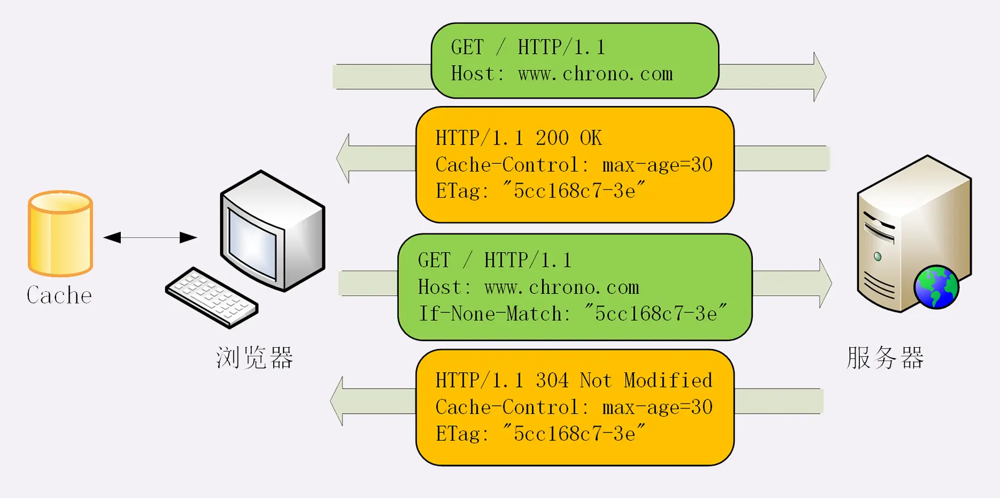

# HTTP 缓存

http 中缓存控制主要字段有一下三个：

1. Cache-Control(HTTP/1.1，优先级高)
2. Expires(HTTP/1.0)
3. Pragma: no-cache(相当于 Cache-Control: no-cache，主要是为了兼容 HTTP/1.0)

重点关注学习 `Cache-Control` 以及代理缓存。

## Cache-Control
  
**Cache-Control**，请求头和响应头都支持使用这个字段进行缓存控制。缓存指令是单向的，但 http 是一种规范，“应答方”不一应实现对应缓存命令，通常是服务端进行缓存控制，客户端执行缓存操作。

- no-store，不缓存资源
- no-cache，不允许使用缓存资源
- max-age，缓存时间，相对响应报文的创建时刻
  > 当没有显示设置 cache-control 或是 expire 时, 大部分浏览器会使用**启发式缓存**, 把资源缓存下来; 如果真的不想用缓存, 还是主动设置一下cache-control: no-store。  
  > 启发式计算缓存在 RFC 里的建议是 **(Date - Last-modified) * 10%**
- must-revalidate，缓存过期时必须与服务器验证
  > 当缓存失效，请求发送，服务器都会进行重新验证，那么 must-revalidate 好像没什么作用？  
  > 1. HTTP 规范是允许客户端在某些特殊情况下直接使用过期缓存的，比如校验请求发送失败的时候，还比如有配置一些特殊指令（stale-while-revalidate、stale-if-error等）的时候，可以 must-revalidate 
  > 2. 与 proxy-revalidate（下文介绍），做区别，强调**回源服务器**

> 💡 浏览器某些行为会在请求头带上“私货”以控制缓存：  
> - 刷新行为会自动请求带上 `Cache-Control:max-age=0`，导致缓存失效
> - 禁止缓存会带上 `Cache-Control: no-cache` ，屏蔽 If 条件验证，不做协商缓存。

## 代理缓存

  

缓存代理身份特殊，即是客户端也是服务端，所以还需要有一些新的“Cache-Control”属性来对它做细致的控制。

- Cache-Control
  - private，表示缓存只能在客户端保存，不能放在代理上与别人共享
  - public，缓存完全开放，谁都可以存，谁都可以用
  - proxy-revalidate，缓存过期时代理服务器验证即可
  - s-maxage，代理服务器缓存时间
  - no-transform，禁止代理服务对资源做转换

## 协商缓存（条件验证请求）

HTTP 协议就定义了一系列“If”开头的“条件请求”字段，专门用来与服务器检查验证资源是否过期。**当请求带有条件字段，服务器就会验证资源是否过期**。

- If-Modified-Since 、Last-modified，根据文件修改日期做验证
- If-None-Match 、ETag，

ETag 是“实体标签”（Entity Tag）的缩写，是资源的一个唯一标识。比 Last-modified 做判断更精准，做验证时**优先级比 Last-modified 高**， 因为有时一个文件内容没什么变化，但修改时间发生了变化。

ETag 还有“强”“弱”之分。强 ETag 要求资源在字节级别必须完全相符，弱 ETag 在值前有个“W/”标记，只要求资源在语义上没有变化，但内部可能会有部分发生了改变（例如 HTML 里的标签顺序调整，或者多了几个空格）。

ETag 工作原理：

  

Last-modified 也同样类似。 

## HTTP 最佳缓存策略

1. 版本化 URL 的长期缓存 max-age

web开发者发明了一种被 Steve Souders 称之为 revving 的技术[1] 。不频繁更新的文件会使用特定的命名方式：在URL后面（通常是文件名后面）会加上版本号。加上版本号后的资源就被视作一个完全新的独立的资源，同时拥有一年甚至更长的缓存过期时长。

index.html 不做版本化控制，不缓存控制 no-cache，协商验证

缓存控制

1. 是否缓存
   1. 否，no-store
2. 能否中间（代理）缓存
   1. 是，public（默认）
      1. 是否允许转变
         1. 否，no-stransform
   2. 否，private
3. 每次是否重新验证
   1. 是，no-cache
      1. 协商验证
         1. 设置 etag、last-modified
4. 缓存时间 
   1. 代理，s-maxage, 可选
   2. max-age
5. 是否过期
  1. 是否代理验证
    1. 是，proxy-revalidate
    2. 否，must-revalidate
  2. 跳 2.1.1

## 参考学习

- [HTTP 缓存](https://developer.mozilla.org/zh-CN/docs/Web/HTTP/Caching#Cache_validation)
- [可能是最被误用的 HTTP 响应头之一 Cache-Control: must-revalidate](https://zhuanlan.zhihu.com/p/60357719)

文档怎么查询？

客户端是否可以在分片接受数据过程中，使用数据？

因为tcp要一来一回才能确认消息能够正确收发，a端一个来回，然后b端一个来回，最少要三次通信，所以这是最经济的做法。

浏览器判断缓存流程
1. 除非 no-store，不然现代浏览器都会启发式缓存
2. 是否命中缓存
   1. service worker
   2. memory cache
      1. preloader
      2. preload
   3. disk cache
3. 缓存是否失效
4. 缓存是否要验证

服务器响应慢
网络有问题
 - 丢包，需要不断重传

http
- 半双工