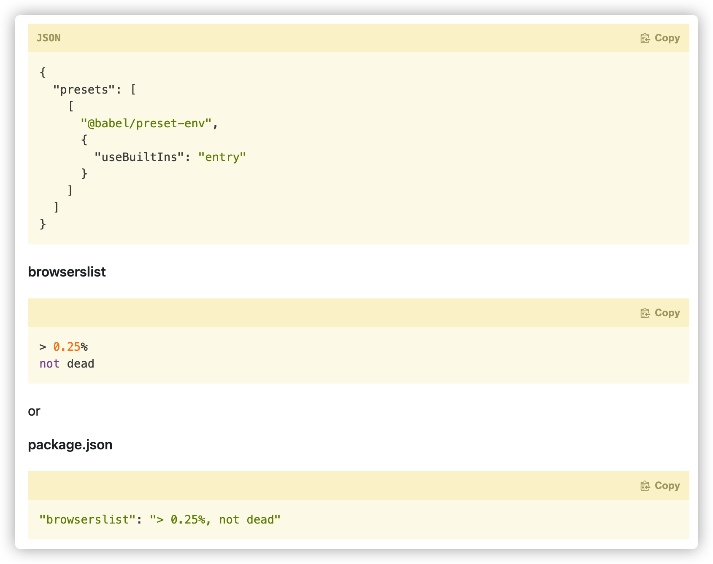

> 本文主要以 babel 7.x 及以上
>
> 参考 
>
> https://babeljs.io/docs/en/babel-preset-env#usebuiltins

### @babel/preset-env

根据 target environment 转化语法和作为可选项引入相应的 polyfills

> 注意：@babel/preset-env 不会包含低于 Stage 3  的 JavaScript语法建议，因为在 TC39 流程的那个阶段，任何浏览器都还不会去实现它。


#### Target

该参数决定了我们项目需要适配到的环境，默认情况下，除非设置了 target 或 ignoreBrowserslistConfig 选项，否则 @ babel/preset-env 将使用browserslist配置源。



如果未设置  target environment，将 transform all ES2015-ES2020 code to be ES5 compatible， babel 7 并不会设置 target 为 default 选项（babel 8 可能会改变）。

```json
{
  "presets": [["@babel/preset-env", { "targets": "defaults" }]]
}
```

target environment 查询语法参考 https://github.com/browserslist/browserslist#queries


#### useBuiltIns

"usage" | "entry" | false, defaults to false

```javascript
// useBuiltIns: false
// 在入口中引入，会把所有的 polyfills 全部打入，造成包体积庞大
import'core-js/stable';
import'regenerator-runtime/runtime';


// useBuiltIns: usage
// 在项目的入口文件处不需要 import 对应的 polyfills 相关库。babel 会根据用户代码的使用情况，并根据 targets 自行注入相关 polyfills。


// useBuiltIns: entry
// 在项目的入口文件处 import 对应的 polyfills 相关库
// 此时 babel 会根据当前 targets 描述，把需要的所有的 polyfills 全部引入到你的入口文件
```


#### corejs

简单讲 corejs-2 不会维护了，所有浏览器新 feature 的 polyfill 都会维护在 corejs-3 上。

By default, only polyfills for stable ECMAScript features are injected

useBuiltIns

- entry：直接 import 对应的  [proposal polyfill](https://github.com/zloirock/core-js/tree/master/packages/core-js/proposals)
- usage：`corejs: { version: "3.8", proposals: true }`

  

#### 总结

```javascript
{
    "presets": [
        [
            "@babel/preset-env",
            {
                "targets":
                {
                    "chrome": "58"
                    // 按自己需要填写
                },
                "useBuiltIns": "entry",
                "corejs":
                {
                    "version": 3, "proposals": true
                }
            }
        ]
    ],
    "plugins": []
}


import 'core-js/stable';
import 'regenerator-runtime/runtime';
// 入口文件代码
```

这样配置的原因是：targets 下设置我们业务项目所需要支持的最低环境配置，useBuiltIns 设置为 entry 为，将最低环境不支持的所有 polyfill 都引入到入口文件（即使你在你的业务代码中并未使用）。这是一种兼顾最终打包体积和稳妥的方式，为什么说稳妥呢，因为我们很难保证引用的三方包有处理好 polyfill 这些问题。当然如果你能充分保证你的三方依赖 polyfill 处理得当，那么也可以把 useBuiltIns 设置为 usage。


### @babel/plugin-transform-runtime

问题一：还是会有一定程度的代码重复

问题二：针对项目，polyfill 会污染全局可以接受，但是作为 Library 我更希望它不会污染全局环境

需要注意的是，一旦采用 @babel/plugin-transform-runtime, @babel/preset-env 中的 targets 将会失效