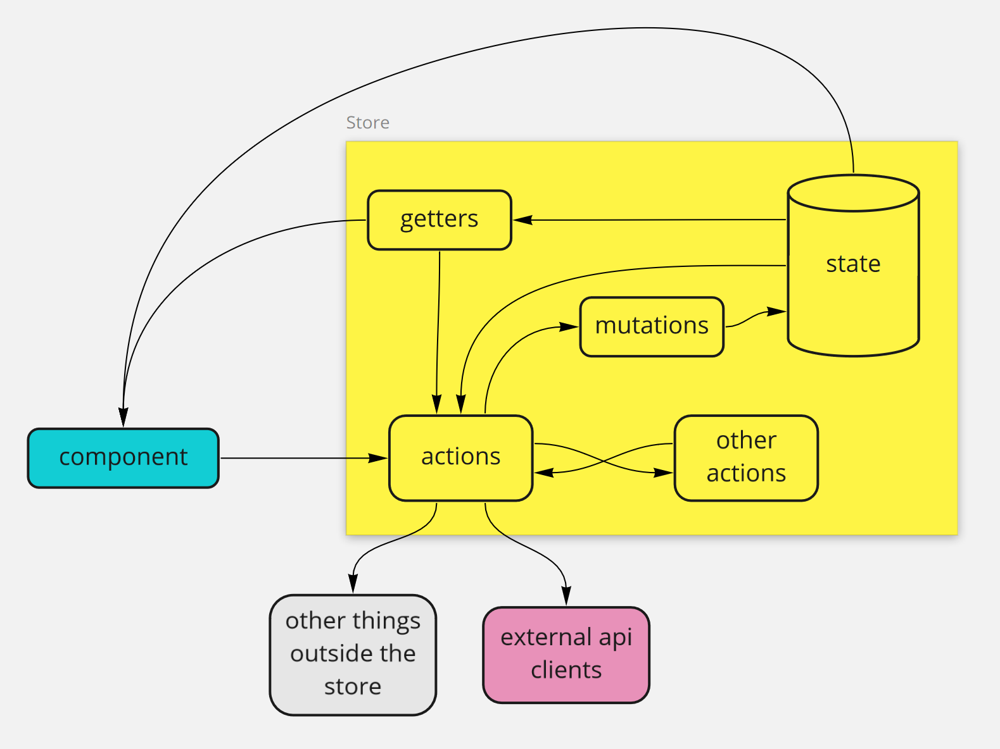
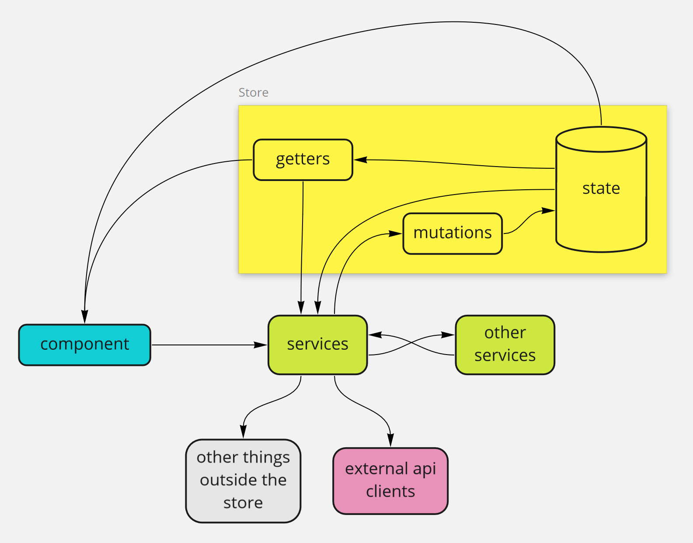

有一个建议，就是在vue生成的传统目录里我觉得 api 这层是可以删除的。直接升级 service 层。

自从 vue reactive api 抽出后，我们就可以不再使用 vuex 去做全局数据管理

我一直挺反感类 redux 之类，需要写一堆模板代码。vue3 后，个人感觉 vuex 现存的意义也就是大项目下对 全局数据 做一套统一规范管理。

我们现在 state + api => service 

service 面向后端接口服务，service 可以复用在不同端上，通过 *tree-shaking* 去删除不需要的代码

```javascript
import http from "http";
import { Ref, computed} from "vue;

// commonjs 规范下，user 会被单例缓存
const user = Ref({})

export setUser = (user) => {
    user.value = user
}

export user = computed(() => {
    return user
})

---------------------------------------------

import userService from "user.service.ts"

setup() {
    userService.setUser({...})

    return {
        // 直接使用 user 响应数据源
        user: userService.user
    }
}
```


业务逻辑代码

- 业务交互
  - UI 交互
  - 服务交互
- 业务数据


```javascript
// STORE 
import * as searchApiClient from '@/apiClients/searchApiClient';
... 
{
  namespaced: true,
  state: {
    isSearchInProgress: false,
    searchResults: {},
  },
  getters: {
    [getterNames.resultsCount]: (state) =>
      (state.searchResults.results || []).length,
  },
  mutations: {
    [mutationNames.searchStarted](state) {
      state.isSearchInProgress = true;
      state.searchResults = {};
    },
    [mutationNames.searchCompleted](state, { results }) {
      state.isSearchInProgress = false;
      state.searchResults = results;
    },
  },
  actions: {
    async [actionNames.getSearchResultsAsync](context, { query }) {
      if (!query) {
        return;
      }
      context.commit(mutationNames.searchStarted);      const results = await searchApiClient.searchAsync(query);      context.commit(mutationNames.searchCompleted, { results });
    },
  },
}
```



难以阅读和调试

你不直接调用“动作”，而是调用一个`dispatch `方法并给出你的“动作方法”的名称。您依赖于*名称*的*字符串匹配*。调用代码和被调用函数之间没有直接关系。IDE 无法帮助您导航到操作。您需要对名称进行字符串搜索并导航到正确的匹配项

store 直接依赖于外部 API 的客户端

store 本质上是一个“内存数据库”，只用于储存链接数据




ts、ide、func、组合 才是最方便快速


参考阅读

- [Stop using actions in Vuex](https://javascript.plainenglish.io/stop-using-actions-in-vuex-a14e23a7b0e6)
