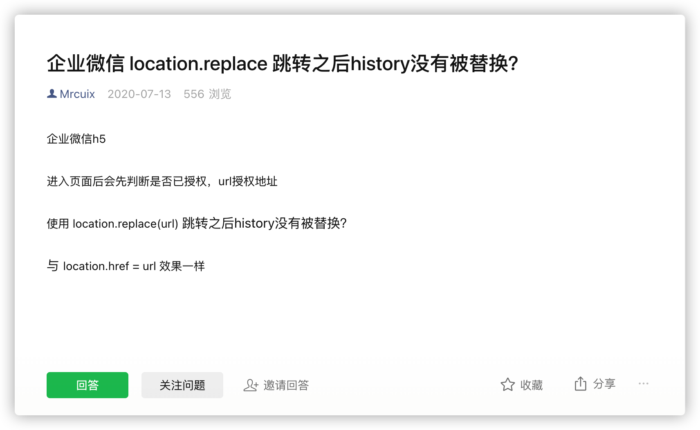

- history.replaceState 都能替换当前历史记录，页面不发生跳转

- location.replace 都能替换当前历史记录，替换当前页面文档

OAuth 授权方式时，前端跳转情况，一般使用 location.replace 进行授权页面跳转，不过微信网页有兼容问题

解决以上问题，把授权页面地址单独配置到按钮上，点击直接进入授权页面再重定向回来，而不是先进到前端页面再判断 使用 location.replace  跳转。

