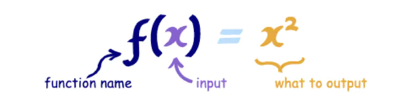

# 函数式编程

函数式编程中的“函数”，并不是指编程中普通的函数，而是具有学术含义上的函数，即函数是一种描述集合和集合之间的映射关系，输入值集合中的每个元素有且只有一个输出值集合中的元素。

  

一个函数的输出类型可以匹配另一个函数的输入，那他们就可以进行组合。
数学好的童鞋就知道，这就是数学上的复合运算：`g°f = g(f(x))`。

明白了上述两点，我们再来什么是看函数式编程。

函数式编程是一种编程范式，这意味着它是一种基于一些基本的定义原则来思考软件构造的方式，所以我们要以一种新的世界观思维去构建我们的软件。

> 函数式编程关心数据的映射，命令式编程关心解决问题的步骤

如果编程说白了就是操作运算数据，那么命令式编程方式就是关注具体运算步骤。
而函数式编程中着眼点是函数、寻找数据映射关系，把命令式数据运算过程尽量看作是通过一个映射关系而来。

```js
// (1 + 2) * 3 - 4

// 传统的过程式编程，可能这样写：

var a = 1 + 2;

var b = a * 3;

var c = b - 4;

// 函数式编程要求使用函数，我们可以把运算过程定义为不同的函数，然后写成下面这样：

var result = subtract(multiply(add(1,2), 3), 4);
````

函数式编程的特点

- 函数是“一等公民” (First-Class Functions)
  > 函数式编程中函数是第一构件。这个特性意味着函数与其他数据类型一样，处于平等地位，可以赋值给其他变量，也可以作为函数参数、函数返回值。
- 纯函数
  > 要做到真正意义上的 “函数”，编程中的函数必须是纯函数，即没有副作用（跟函数外部环境有依赖、有交互就都是副作用；函数要保持独立，所有功能就是返回一个新的值，其他跟运算无关的就是副作用），相同的输入，永远会得到相同的输出。
- 无状态和不可变、惰性执行
函数式编程使用参数保存状态，最好的例子就是递归。

好处

- 可缓存
- 可测试
- 文档自动化


### 柯里化
柯里化的意思是将一个多元函数，转换成一个依次调用的单元函数。

### 组合
