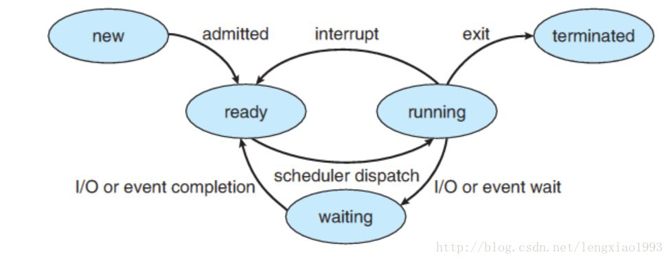
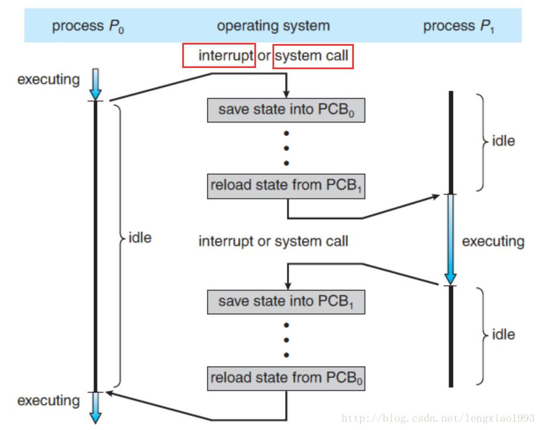
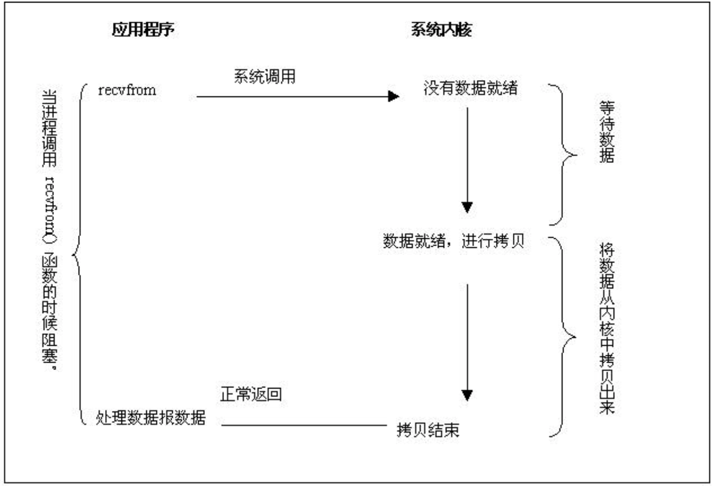
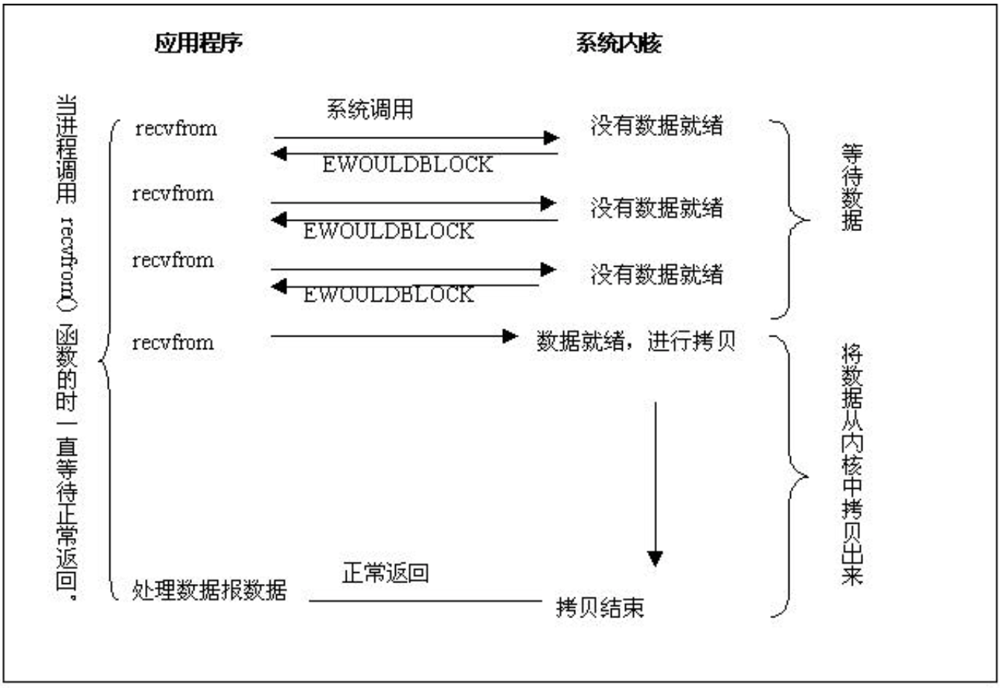
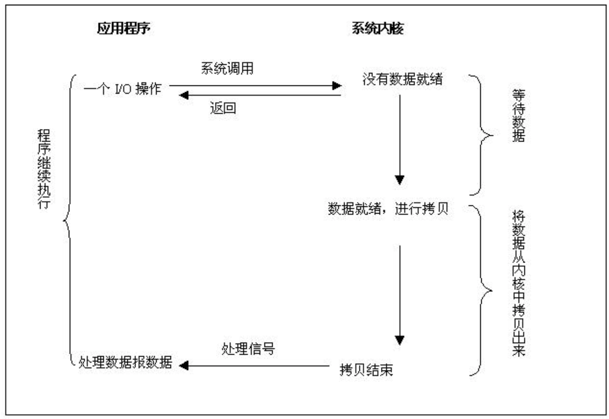

## 用户空间和内核空间

为什么划分？

1. 操作系统内核需要拥有高于普通进程的权限， 以此来调度和管理用户的应用程序
2. 为了安全，多数应用程序应该运行在最小权限下

具体行为

内存空间被划分为两部分，一部分为内核空间，一部分为用户空间，内核空间存储的代码和数据具有更高级别的权限。内存访问的相关硬件在程序执行期间会进行访问控制（ Access Control），使得用户空间的程序不能直接读写内核空间的内存。

## 进程/线程

进程/线程 状态

- 创建
- 就绪
- 执行
- 阻塞
- 终止

  

进程/线程 切换时机

- CPU 中断
- 系统调用

  

## IO 模型

同步阻塞IO

I/O System Call 的阻塞/非阻塞， 同步/异步

阻塞这个词是与系统调用 System Call 紧紧联系在一起的， 因为要让一个进程进入 等待（waiting） 的状态, 要么是它主动调用 wait() 或 sleep() 等挂起自己的操作， 另一种就是它调用 System Call, 而 System Call 因为涉及到了 I/O 操作， 不能立即完成， 于是内核就会先将该进程置为等待状态， 调度其他进程的运行， 等到 它所请求的 I/O 操作完成了以后， 再将其状态更改回 ready 。

  

同步非阻塞IO

现在的大部分操作系统也会提供非阻塞I/O 系统调用接口（Nonblocking I/O system call）

  

异步非阻塞IO

非阻塞I/O 系统调用( nonblocking system call ) 和 异步I/O系统调用 （asychronous system call）的区别是：一个非阻塞I/O 系统调用 read() 操作立即返回的是任何可以立即拿到的数据， 可以是完整的结果， 也可以是不完整的结果， 还可以是一个空值。而异步I/O系统调用 read（）结果必须是完整的， 但是这个操作完成的通知可以延迟到将来的一个时间点。

  
