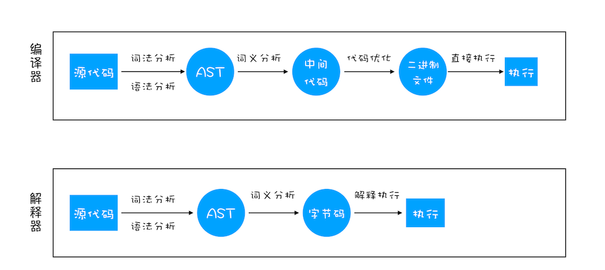

---
tags:	
 - javascript
 - 编译
 - 解释
---

# JavaScript 代码执行过程（编译时）

## JavaScript 是 “解释型语言”？

很多 JS 初学者都会学习认为到 JS 是一个解释型语言，与之相对就是编译型语言，如 C/C++、GO。

但是**用解释型或者编译型来分类一个语言，是完全不正确的，不够严谨**。

编译跟解释只是源码到运行过程中的不同**执行流程行为**：

- 编译型：**程序执行之前，需要经过编译器的编译过程**，并且编译之后会直接**保留**机器能读懂的二进制文件，这样每次运行程序时，都可以直接运行该二进制文件，而**不需要再次重新编译**了。

- 解释型：程序在**每次运行时**才需要**通过解释器**对程序进行动态解释和执行。

其实语言一般只会定义其抽象语义，定义一组规范，而不会强制性要求采用某种实现方式。换句话说，只要能实现语义，你也可以写一个C的解释器解释运行 C，但 C 主流的是用GCC编译执行的，所以大多数人会认为 C 是编译型语言；就同比 JavaScript 是通过解释器执行，JavaScript 就是解释型语言。

## 编译器和解释器

虽然解释器不会像编译器直接编译成目标平台的可执行文件，但**任何语言都是需要从高到低编译成机器语言**。

解释器就是个黑箱，输入是源码，输出就是输入程序的执行结果，对用户来说中间没有独立的“编译”步骤。实际上很多解释器内部是以“编译器+虚拟机”的方式来实现的，先通过编译器将源码转换为AST或者字节码（可以获得跨平台），然后由虚拟机去完成实际的执行。所谓“解释型语言”并不是不用编译，而只是不需要用户显式去使用编译器得到可执行代码而已。

> 虚拟机在执行字节码也有两种方式（编译和解释）：编译的话会把输入的源程序以某种单位（例如[基本块](http://en.wikipedia.org/wiki/Basic_block) / 函数/方法/trace等）翻译生成为目标代码，并存下来（无论是存在内存中还是磁盘上，无所谓），后续执行可以复用之，比如 JIT 方式；解释的话则把源程序中的指令是逐条解释，不生成也不存下目标代码，后续执行没有多少可复用的信息。

如果一种语言的主流实现是解释器，其内部是编译器+虚拟机，而虚拟机又是采用解释方式实现的，内部实现是编译器+树遍历解释器，那它就是名副其实的“解释型语言”。JavaScript 早期确实是这么做，将源码编译成语法树，然后直接执行语法树。

编译器和解释器工作流程：



编译器和解释器有编译过程，将原码编译成中间码或者字节码。这个编译过程一般有三个阶段：

1. 词法分析
2. 语法分析
3. 语义分析

## 编译过程

### 词法分析

计算机无法像人类一样一眼读取理解语句，只能非常笨拙地一个符号一个符号去识别。

词法分析，目的就是在连续的字符中识别出一个一个的不可能再分的、最小的单个字符或字符串（token），并尽可能地识别出符号的属性。


### 语法分析

经过词法分析阶段有了上面的符号（token）流后，结合不同 token 属性作用，一个一个去套对应的语法规则，就可以识别出一句完整的语句，并确定这条语句的语法。

语法分析就是在词法分析基础上根据语法规则把符号组成各类的语法单位，例如各种语句，表达式、程序块等。并且以树形结构去记录，就形成语法树（Abstract Syntax Tree，AST），该结构是计算机容易理解和处理的，和渲染引擎将 HTML 格式文件转换为计算机可以理解的 DOM 树的情况类似。


### 语义分析

语法分析只能分析句子的语法结构是否正确，而语义分析是编译过程的一个逻辑阶段， 语义分析的任务是对结构上正确的[源程序](https://baike.baidu.com/item/源程序/9752646)进行上下文有关性质的审查，检查源程序是否符合程序语言的规则，语言设计的核心就在语义阶段上体现出来。

比如类型检查时，下面两句函数传参类型不符合。

```java
function test(int p) {}

test("abc")
```

了解了上面的相关概念后，接下来看看 V8 是怎么执行 JavaScript 代码。

## V8 是如何执行一段 JavaScript 代码的

V8 执行一段代码流程图：


按照中间不同产物划分阶段：

1. 生成抽象语法树（AST）和 执行上下文
2. 生成字节码
3. 执行代码

从源码到生成抽象语法树（AST，上文已说，这里就不重复） 是一个解析阶段。有了 AST 后，那接下来 V8 就会生成该段代码的执行上下文。因为 JavaScript 的作用域是词法作用域，生成执行上下文主要是代码在执行过程中的环境信息，（下一篇再做介绍）。

### 生成字节码

解释器 Ignition 会根据 AST 生成字节码。字节码就是介于 AST 和机器码之间的一种代码。但是与特定类型的机器码无关，字节码需要通过解释器将其转换为机器码后才能执行。


#### 为什么使用字节码

早先 V8 是直接把 JS 编译成机器码，所以执行效率非常高，但是生成的机器码需要消耗大量的内存来存放。相比之下，引入字节码消耗空间更少，牺牲时间换空间。

### 执行代码

解释器 Ignition 除了负责生成字节码之外，它还有另外一个作用，就是解释执行字节码。在 Ignition 执行字节码的过程中，如果发现有热点代码（HotSpot），比如一段代码被重复执行多次，这种就称为热点代码，那么后台的编译器 TurboFan 就会把该段热点的字节码编译为高效的机器码，然后当再次执行这段被优化的代码时，只需要执行编译后的机器码就可以了，这样就大大提升了代码的执行效率。


其实，Ignition + TurboFan 的组合，就是字节码解释器 + JIT 编译器的黄金组合。除了 V8 使用了“字节码 +JIT”技术之外，苹果的 SquirrelFish Extreme 和 Mozilla 的 SpiderMonkey 也都使用了该技术。


隐藏类、内联缓存

对于优化 JavaScript 执行效率，你应该将优化的中心聚焦在单次脚本的执行时间和脚本的网络下载上

提升单次脚本的执行速度，避免 JavaScript 的长任务霸占主线程，这样可以使得页面快速响应交互；避免大的内联脚本，因为在解析 HTML 的过程中，解析和编译也会占用主线程；减少 JavaScript 文件的容量，因为更小的文件会提升下载速度，并且占用更低的内存。


全局代码，或者函数 ！

比如下载完一个js文件，先编译这个js文件,但是js文件内定义的函数是不会编译的。

等调用到该函数的时候，Javascript引擎才会去编译该函数！


V8 实现了 script 流和代码缓存技术。Script 流即当脚本开始下载的时候，async 和 deferred 的脚本在单独的线程中进行解析。这意味着解析会在脚本下载完成时立即完成。这会提升 10% 的页面加载速度。

页面缓存

每当访问页面的时候，JavaScript 代码通常会被编译为字节码。但是，当用户访问另一个页面的时候，该字节码会作废。这是因为编译的代码严重依赖于编译阶段机器的状态和上下文。从 Chrome 42 开始带来了字节码缓存。该技术会本地缓存编译过的代码，这样当用户返回到同一页面的时候，诸如下载，解析和编译等所有步骤都会被跳过。这样就会为 Chrome 节约大概 40% 的代码解析和编译时间。另外，这同样会节省手机电量。


参考及推荐：

- 李兵老师的《浏览器工作原理与实践》
- [JavaScript到底是解释型语言还是编译型语言?](https://segmentfault.com/a/1190000013126460)
- [什么是解释型语言？ - 李广胜的回答 - 知乎]( https://www.zhihu.com/question/268303059/answer/336730398)
-  [虚拟机随谈（一）：解释器，树遍历解释器，基于栈与基于寄存器，大杂烩](https://www.cnblogs.com/bozhang/articles/3115089.html)
- [V8 Ignition：JS 引擎与字节码的不解之缘](https://zhuanlan.zhihu.com/p/26669846)

