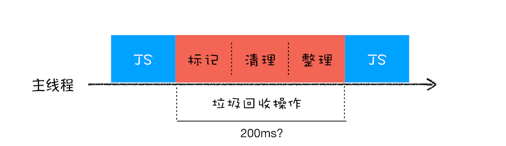

---
tags:
 - javascript
 - memory
 - 内存
---

# JavaScript 内存管理机制

>  参考阅读
>
> - [垃圾回收：垃圾数据是如何自动回收的？](https://time.geekbang.org/column/article/131233)
> - [内存管理及如何处理 4 类常见的内存泄漏问题](https://github.com/Troland/how-javascript-works/blob/master/memory-management.md)

## 不同语言的垃圾回收策略

通常情况下，垃圾数据回收分为**手动回收**和**自动回收**两种策略。如 C/C++ 就是使用手动回收策略，何时分配内存、何时销毁内存都是由代码控制的，如使用 `malloc` 申请内存， `free` 释放内存。**如果未能及时释放已经不再使用的内存，那么这种情况就被称为内存泄漏**。

另外一种使用的是自动垃圾回收的策略，如 JavaScript、Java、Python 等语言，产生的垃圾数据是由**垃圾回收器**来释放的，并不需要手动通过代码来释放。

## 内存生命周期

无论我们运行任何语言写的程序都会经历以下内存生命周期


1. 分配内存：向操作系统申请分配内存。某些底层语言（如 C）需要显示申请操作，在高级语言当中，就不需要这样的操作
2. 使用内存：在代码中使用分配变量的进行读取和写入操作
3. 释放内存：当你不需要使用的时候，应该释放内存使之空闲可用。某些底层语言提供此操作。

## JavaScript 内存分配

### 内存模型

1. 栈

2. 堆
3. 数据段
4. 代码段

#### 栈内存

栈内存就是调用栈，是用来存储执行上下文。

#### 堆内存

JavaScript 引擎并将该对象类型数据分配存放到堆空间里面，分配后该对象会有一个在“堆”中的地址，然后再将该数据的地址写进到栈中的引用变量值，最终分配好内存的示意图如下所示：


#### Why 栈堆内存

为什么一定要分“堆”和“栈”两个存储空间呢？所有数据直接存放在“栈”中不就可以了吗？

“堆”和“栈” 其实只是个内存空间概念，实际内存上并什么区分。

大多数语言利用该内存栈，来保存函数内部的局部变量，并且结合硬件（CPU 寄存器 esp、ebp 模拟栈顶、栈低指针）形成函数调用栈。栈在内存的分配与归还速度极快，因为也就是指针方向移动而已。

所有数据不可以直接存放在栈内存中，因为操作系统划分的栈空间大小有限，数据量过大时，也就容易发生栈溢出。

### 闭包的内存形成

[内存模型的角度来分析 JavaScript 闭包过程](./JavaScript 闭包.md)。

## 垃圾回收

### 垃圾回收算法

引用是内存垃圾回收算法所依赖的主要概念之一。**引用计数**是最简单的内存垃圾回收算法。当一个对象被 0 引用，会被标记为 "可回收内存垃圾"。但是该算法存在一问题：**循环引用**，两个互相引用的对象，引用计数算法会认为由于两个对象都至少互相引用一次，所以他们都不可回收的。

```javascript
function f() {
  var o1 = {};
  var o2 = {};
  o1.P = O2; // O1 引用 o2
  o2.p = o1; // o2 引用 o1. 这就造成循环引用
}
// f 执行完毕，o1、o2 也不会被回收
f();
```

目前主流浏览器基本用**标记清理**等算法，所有对于 JavaScript 内存垃圾收集(分代/增量/并发/并行 垃圾收集)的优化都是针对标记-清除算法的实现的优化，但既没有提升垃圾收集算法本身，也没有提升判定对象是否可获得的能力，但他们有一套共同的执行流程：

1. 从根开始遍历，标记活动对象和非活动对象（标记）
2. 回收非活动对象所占据的内存（清理）
3. 内存整理（整理）

### 调用栈中的数据是如何回收的


当一个函数执行结束之后，JavaScript 引擎会通过向下移动 ESP 来销毁该函数保存在栈中的执行上下文，再次调用另外一个函数时，原来旧内容块会被直接覆盖掉，用来存放另外一个函数的执行上下文。

### 堆中的数据是如何回收的

要回收堆中的垃圾数据，就需要用到 JavaScript 中的垃圾回收器了。

先学习下，代际假说（垃圾回收领域中一个重要的术语，后续垃圾回收的策略都是建立在该假说的基础之上的，所以很是重要。）有以下两个特点：

1. 第一个是大部分对象在内存中存在的时间很短，简单来说，就是很多对象一经分配内存，很快就变得不可访问；
2. 第二个是不死的对象，会活得更久。

 有了上面理论基础，根据对象的生存周期的不同而使用不同的算法， 以便达到最好的效果。所以V8 中会把堆分为**新生代和老生代**两个区域，新生代中存放的是生存时间短的对象，老生代中存放的生存时间久的对象。新生区通常只支持 1～8M 的容量，而老生区支持的容量就大很多了。对于这两块区域，V8 分别使用两个不同的垃圾回收器，以便更高效地实施垃圾回收。

- **副垃圾回收器，主要负责新生代的垃圾回收。**
- **主垃圾回收器，主要负责老生代的垃圾回收**。


#### 新生代垃圾回收

新生代中用 **Scavenge 算法**来处理。所谓 Scavenge 算法，是把新生代空间对半划分为两个区域，**一半是对象区域，一半是空闲区域**。

1. 新加入的对象都会存放到对象区域
2. 当对象区域快被写满时，对对象区域中的垃圾做标记
3. 标记完成之后，执行一次垃圾清理操作
4. 副垃圾回收器会把这些存活的对象整齐复制到空闲区域中，也就相当于完成了内存整理操作
5. 完成复制后，对象区域与空闲区域进行角色翻转，也就是原来的对象区域变成空闲区域，原来的空闲区域变成了对象区域

默认下，由于新生代中的对象存活存活周期短，需要经常进行垃圾回收，故不能设置过大空间影响回收效率。

所以在新生代空间有限的情况下，那些多次存活的对象需要转移到老生区去。JavaScript 引擎采用了**对象晋升策略**，**经过两次垃圾回收依然还存活的对象，会被移动到老生区中**。

#### 老生代垃圾回收

主垃圾回收器主要负责老生区中的垃圾回收。除了新生区中晋升的对象，一些大的对象会直接被分配到老生区。因此老生区中的对象有两个特点，

- 一个是对象占用空间大
- 另一个是对象存活时间长

由于老生区的对象比较大而且存活长，顾不需要使用 Scavenge 算法经常进行垃圾回收，而且复制这些大的对象将会花费比较多的时间，所以主垃圾回收器是只用**标记 - 清除（Mark-Sweep）**的算法进行垃圾回收的

首先是标记过程阶段。标记阶段就是从一组根元素开始，递归遍历这组根元素，在这个遍历过程中，能到达的元素称为**活动对象**，不可达的元素就可以判断为**垃圾数据**。

可以理解这个过程是清除掉红色标记数据的过程，可参考下图大致理解下其清除过程：


清除算法后，会产生大量不连续的内存碎片，因此需要 **标记 - 整理（Mark-Compact）**，这个标记过程仍然与标记 - 清除算法里的是一样的：


#### 增量标记算法

JavaScript 是运行在主线程之上的，一旦执行垃圾回收算法，如果都需要将正在执行的 JavaScript 脚本暂停下来，待垃圾回收完毕后再恢复脚本执行，那么我们把这种行为叫做**全停顿（Stop-The-World）**。这种情况，应用的性能和响应能力都会直线下降。



在 V8 新生代的垃圾回收中，因其空间较小，且存活对象较少，所以全停顿的影响不大，但老生代就不一样了。为了降低老生代的垃圾回收而造成的卡顿，V8 将标记过程分为一个个的子标记过程，同时让垃圾回收标记和 JavaScript 应用逻辑交替进行，直到标记阶段完成，我们把这个算法称为**增量标记（Incremental Marking）算法**。


使用增量标记算法，可以把一个完整的垃圾回收任务拆分为很多小的任务，与其他任务交替执行，避免阻塞线程造成页面卡顿的感觉。

## 优化策略

引用是内存垃圾回收算法所依赖的主要概念之一，无论是引用计数还是标记清除，都需要使用到“引用”。虽然浏览器会自动帮助我们进行垃圾回收，但是根据垃圾回收机制，我们还是有必要了解一下常见的几种避免内存泄漏的方式，主要还是围绕“引用”展开：

1. 尽可能少地创建全局变量，以及保留数据引用到全局中

   标记清除算法从根开始遍历标记存活对象，根，就是像 window、document 等全局对象，我们应该减少创建或其他的对象数据引用保留到分支链中，比如应该 消除DOM，却被我们引用又要留全局中

   ```javascript
   var elements = {
     button: document.getElementById('button'),
     image: document.getElementById('image')
   };
   
   function doStuff() {
     elements.image.src = 'http://example.com/image_name.png';
   }
   
   function removeImage() {
       // image 元素是 body 元素的直系后代元素
       document.body.removeChild(document.getElementById('image'));
       // 这时，我们仍然在 elements 全局对象中引用了 #button 元素
       // 换句话说，按钮元素仍然在内存中且不能够被垃圾回收器收集
   }
   ```

2. 少用闭包

3. 弱引用

   WeakMap 和 WeakSet

4. 手动清除定时器

5. 不再使用的对象，手动赋为 null

为了提高应用稳定、和响应速度，总的来说，宗旨是尽可能**减少内存占用，尽可能减少 GC 触发**。

## 内存分析实战

如何判断 JavaScript 中内存泄漏的？

可通过 Performance来观察，如果是有规律的周期平稳变化，则不存在内存泄漏，如果整体趋势上涨则说明存在内存泄漏。
