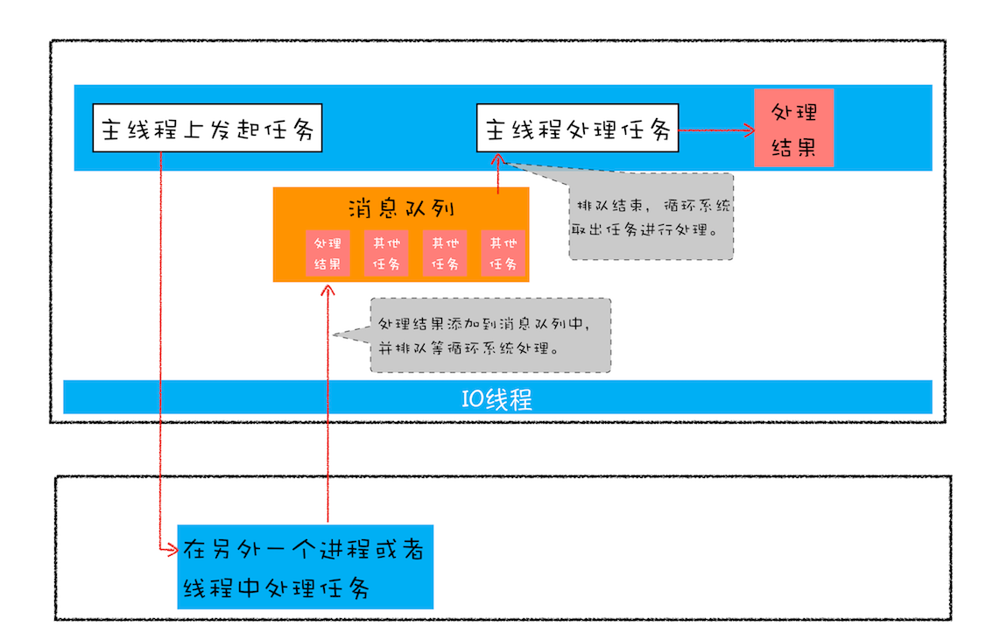

# JavaScript 异步编程

## 何为异步、异步编程

同步和异步是相对的概念，从本质上来理解：

- **同步即事物之间有顺序依赖关系，必须等上一事物完成才能进行下一事物**
- **异步则是事物之间是独立存在的，没有顺序依赖关系，他们可以同时发生或者不同时间发生**

总之，**同步异步的区别就是事物之间有无顺序关联关系**。

如何理解异步？最好的方式就是**从个体视角去看待事物问题**，比如经典的消息通信例子：比如你发送电子邮箱，如果是同步方式，你需要等待对方回复，异步则是你不需要等待邮件回复，邮件回复事件是独立发生，你只要不定时去查看邮箱或者系统通知就行了。

#### 异步编程

编程语言默认都是同步的，简单来理解就是：同步按你的代码顺序执行，异步不按照代码顺序执行，异步的执行效率更高。

**cpu 执行指令顺序都是按照一个控制流序列**。cpu 中有个程序计数器是用来装载下一条要执行指令的地址的一个计算机硬件，假设在计算机运行过程中，其指令序列为a1a2a3....an，则每次从an到an+1的过渡叫做**控制转移**。而a1a2a3a4...an这条完整的控制转移的序列叫做处理器的**控制流**。所以，控制流说白了就是cpu执行指令的序列。

同步、异步在编程语言中指的是执行步骤在一个控制流序列中按的顺序，，每条语句、每个方法都是同步执行调用的

使用**异步意味着代码不再是按照逻辑顺序执行，而是独立于主程序流而发生**。

JavaScript 默认情况下是同步的，并且是单线程的，这就意味着一旦遇到耗时的操作， JavaScript 无法创建新的线程来执行异步操作。

- 异步调用
- 任务调度

线程是程序执行中一个单一的顺序控制流程，是程序执行流的最小单元

- 回调
- 

在前端编程中（甚至后端有时也是这样），我们在处理一些简短、快速的操作时，例如计算 1 + 1 的结果，往往在主线程中就可以完成。主线程作为一个线程，不能够同时接受多方面的请求。所以，当一个事件没有结束时，界面将无法处理其他请求。

现在有一个按钮，如果我们设置它的 onclick 事件为一个死循环，那么当这个按钮按下，整个网页将失去响应。

为了避免这种情况的发生，我们常常用子线程来完成一些可能消耗时间足够长以至于被用户察觉的事情，比如读取一个大文件或者发出一个网络请求。因为子线程独立于主线程，所以即使出现阻塞也不会影响主线程的运行。但是子线程有一个局限：一旦发射了以后就会与主线程失去同步，我们无法确定它的结束，如果结束之后需要处理一些事情，比如处理来自服务器的信息，我们是无法将它合并到主线程中去的。

为了解决这个问题，JavaScript 中的异步操作函数往往通过回调函数来实现异步任务的结果处理。

## Promsie

