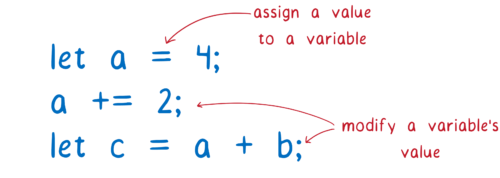

# JavaScript 模块

**模块化是工程化的基础**：只有能将代码模块化，拆分为合理单元，才具备调度整合的能力，才有架构和工程一说。

到底什么是模块化？简单来说就是：**对于一个复杂的应用程序，与其将所有代码一股脑地放在一个文件当中，不如按照一定的语法，遵循确定的规则（规范）拆分成几个互相独立的文件。这些文件应该具有原子特性，也就是说，其内部完成共同的或者类似的逻辑，通过对外暴露一些数据或调用方法，与外部完成整合。**

这样一来，每个文件彼此独立，开发者更容易开发和维护代码，模块之间又能够互相调用和通信，这是现代化开发的基本模式。

其实，不论在我们的日常生活还是其他科学领域，都离不开模块化的概念，它主要体现了以下原则：

- 可复用性
- 可组合型
- 中心化
- 独立性

## JavaScript 模块发展历程

但随着代码复杂度也日益增长，对变量的操作就变得更加频繁，一个突出的问题就是发生变量的覆盖、篡改和删除，尤其是在多人开发的情况下，这是一个很头疼的问题。

如何组织管理变量变得尤为重要，因为对编写、维护代码方式和减少产生的错误有很重要的影响。

所以对于模块的引入初衷是为了对变量的控制。当然还有其他的好处，例如对代码的封装、复用等等。

### 文件划分

该阶段仅仅只是文件形式上模块化划分变量，文件模块里的变量成员还是直接工作在全局环境，但依旧存在以下严重问题：

1. 污染全局作用域，容易发生命名冲突 &#x2718;
2. 变量容易被外部访问修改 &#x2718;
3. 难以维护模块依赖关系（我们需要在 HTML 中控制好 script 引入顺序）&#x2718;

那么初期在没有模块标准的支持下，开发者们是如何实现类似模块的效果呢？有 2 种方式。

### 对象命名空间方式

用一个全局对象包裹所有模块成员，这种方式就好像是为模块内的成员添加“命名空间”，通过命名空间以及规范命名的方式，能够较大可能解决变量命名冲突问题，但是2、 3问题依旧存在。

### IIFE（立即执行函数）

在 ES6 之前，作用域只有 2 种，分别是：

- 全局作用域（Global Scope）
- 函数作用域（Function Scope）

将所有成员放在一个立即执行函数所形成的私有函数作用域，私有成员只能通过公开成员以闭包的形式访问，而公开成员可以通过挂载全局对象或者返回的方式暴露出去

- 解决了全局污染、命名冲突和成员访问控制 &#x2714;

### IIFE 依赖参数

通过 IIFE 依赖参数声明，可以使得模块依赖关系明显

- 但模块依赖管理还是没有解决 &#x2718;

总结：在 ES 语言层面未实现的模块功能前，IIFE 是实现模块化最好的方式。
而模块依赖管理的本质就是模块加载顺序的问题，早期的模块加载顺序管理只能手动维护HTML script 标签的顺序，而要实现自动化模块加载，需要两点

- **统一的模块化标准规范**
- 在同一模块标准规范后，才能实现 **自动加载模块的基础库**

## 模块化标准

### CommonJS、AMD、UMD

### ES Modules

参考

- [webpack 原理与实践]()