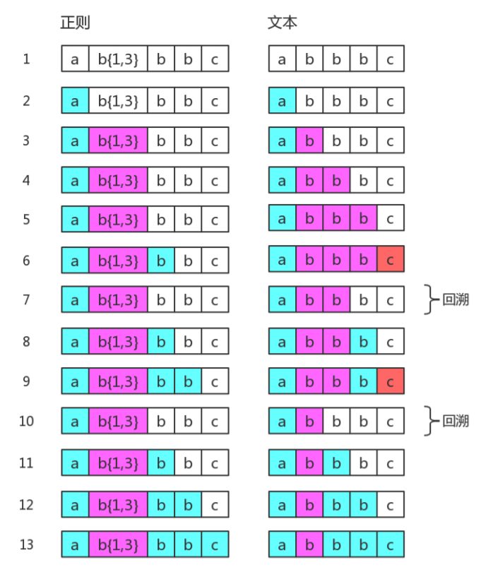
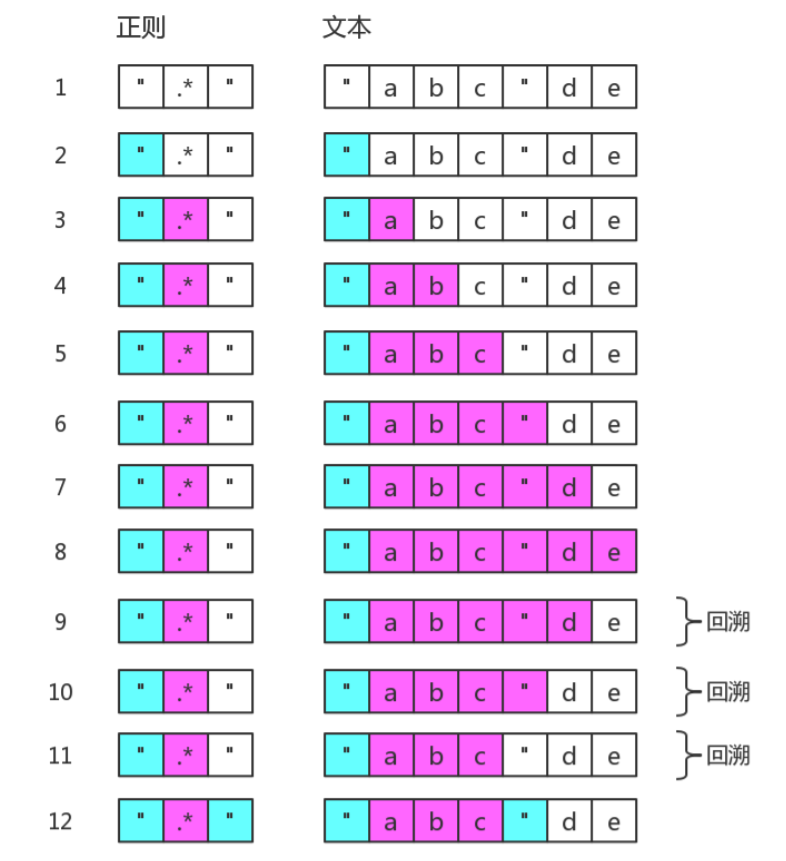
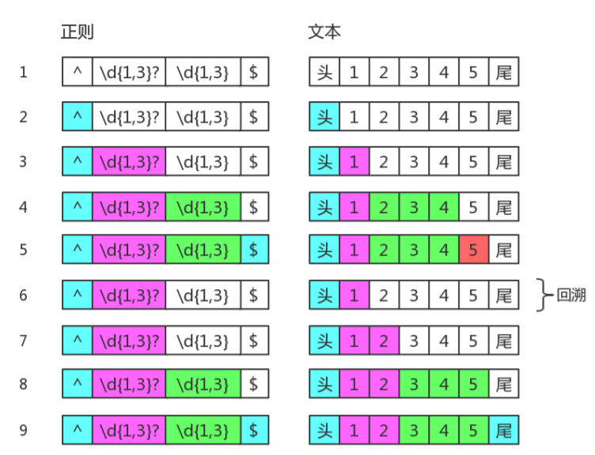

# JavaScript 正则表达式

## 目录

- [JavaScript 正则表达式](#javascript-正则表达式)
  - [目录](#目录)
  - [正则是匹配模式，要么匹配字符，要么匹配位置](#正则是匹配模式要么匹配字符要么匹配位置)
    - [字符类](#字符类)
      - [修饰符 s 与字符类 .](#修饰符-s-与字符类-)
      - [Unicode：修饰符 “u” 和 class \p{...}](#unicode修饰符-u-和-class-p)
    - [集合和范围 [...]](#集合和范围-)
    - [量词](#量词)
      - [贪婪匹配和惰性匹配](#贪婪匹配和惰性匹配)
    - [选择符（|）](#选择符)
    - [锚符 ^、$](#锚符-)
      - [多行模式 m 与 ^、$](#多行模式-m-与-)
      - [锚符 ^$ 对比 \n](#锚符--对比-n)
    - [单词边界 \b 和 \B](#单词边界-b-和-b)
    - [前瞻断言和后瞻断言](#前瞻断言和后瞻断言)
  - [分组](#分组)
    - [捕获分组](#捕获分组)
    - [嵌套分组](#嵌套分组)
    - [分组命名及引用](#分组命名及引用)
    - [排除捕获分组](#排除捕获分组)
  - [正则表达式回溯法原理](#正则表达式回溯法原理)
  - [练习题](#练习题)
      - [将每个单词的首字母转换为大写](#将每个单词的首字母转换为大写)
      - [字符串 trim 方法模拟](#字符串-trim-方法模拟)
      - [匹配成对标签](#匹配成对标签)

参考阅读

- [JavaScript 正则表达式迷你书](https://link.zhihu.com/?target=https%3A//github.com/qdlaoyao/js-regex-mini-book)
- [正则表达式](https://zh.javascript.info/regular-expressions)

正则表达式是搜索和替换字符串的一种强大方式。

正则表达式（可叫作“regexp”或者“reg”）包含**模式**和可选的**修饰符**。

创建 JavaScript 正则表达式的方式有：
- RegExp 实例 `regexp = new RegExp("pattern", "flags");`
- 字面量 `regexp = /pattern/flag;`

> 相比正则字面量的方式 `new RegExp` 允许从字符串中**动态地构造模式**

修饰符有

- i 不区分大小写
- g 全局搜索所有匹配项
- m 多行模式
- u 开启完整的 unicode 支持
- s . 符号表示任意字符
- y 粘滞模式

## 正则是匹配模式，要么匹配字符，要么匹配位置

匹配字符的模式有
- 普通字符
- 字符类
- 集合和范围

无论是字符类还是集合、范围的模式都只能表示一个字符，**量词**用来形容我们所需要的数量

集合和范围模式赋予匹配单个字符能够有多种模式选择，但如果想匹配多个字符多种模式，可用选择符OR(|)

匹配位置的模式有锚符：
- ^、$
- \b、\B
- x(?=y)、x(?!y)、(?<=y)x、(?<!y)x

### 字符类

- \d 数字0到9
- \D 非 \d
- \s 空格、水平制表符\t、垂直制表符\v、换行符\n、换页页符\f、回车符\r
- \S 非 \s
- \w 拉丁字母、数字、下划线
- \W 非 \w
- .  任意字符，除 \n
- \p{...} 配合修饰符u，表示 unicode 字符

#### 修饰符 s 与字符类 .
默认情况下字符类 `.` 不匹配换行符`\n`，但修饰符 **s** 下的模式的字符类 `.` 能够匹配换行符`\n`，但是修饰符 s 在兼容性不是特别高，详见 [https://caniuse.com/#search=dotall](https://caniuse.com/#search=dotall)，我们可以通过 `[\s\S]` 模式表示任意字符，`\s` 和 `\S` 相冲，两者用集合的方式结合起来，就表示全部，类似的还有 `[\d\D]`、`[^]` 等

#### Unicode：修饰符 “u” 和 class \p{...}

### 集合和范围 [...]

- 集合，如 [eao] 意味着查找在 3 个字符 'a'、'e' 或者 `‘o’ 中的任意一个
- 范围，如 [0-5] 表示从 0 到 5 的数字，[\d] 表示 0 到 9 数字
- 排除范围 [^…]，如 [^]
- [...] 除了在方括号中有特殊含义的字符外，其它所有特殊字符都是都不需要添加反斜杠的，如 [-().^+] 会查找 -().^+ 的其中任意一个字符

### 量词

- \+ 至少1次
- \* 至少0次
- ? 一个或零个
- {n,m} 如 {5} 5次 {3,5} 3到5次 {3,} 大于等于3次

#### 贪婪匹配和惰性匹配

```
'a "witch" and her "broom" is one'.match(/".+"/g) // "witch" and her "broom"
'a "witch" and her "broom" is one'.match(/".+?"/g) // "witch"、"broom"
```

量词有两种工作模式

**在贪婪模式下（默认情况下），量词都会尽可能地重复多次**。

惰性模式(量词之后添加一个问号 '?')只有在模式的剩余部分无法在给定位置匹配时，正则表达式引擎才会增加重复次数。

> 参考 [贪婪量词和惰性量词](https://zh.javascript.info/regexp-greedy-and-lazy)

### 选择符（|）

选择符号`(|)`作用并非在字符级别生效，而是在**表达式级别**。

- A|B|C 意思是命中 A、B 或 C 其一均可
- gra|ey 匹配 “gra” or “ey”
- gr(a|e)y 严格等同 gr[ae]y

### 锚符 ^、$

符号 `^` 匹配文本开头，而美元符号 `$` 则匹配文本末尾

```javascript
let str1 = "it's fleece was white as snow";
alert( /snow$/.test(str1) ); // true
```

#### 多行模式 m 与 ^、$

修饰符 m 开启的多行模式下，^、$ 不仅仅匹配文本的开始与结束，还**匹配每一行的开始与结束**

```
'aaaab\nccccc'.match(/b$/) // null
'aaaab\nccccc'.match(/b$/mg) // ['b']
```

#### 锚符 ^$ 对比 \n

上述列子中如果要进行每一行匹配的话，我们还也可以使用换行符 `\n`。
`\n` 和锚符 `$` 的第一个不同点是它不像锚符那样，它会消费 `\n` 即将 `\n` 加入到匹配结果中

```javascript
'aaaab\nccccc'.match(/b\n/mg) // ["b\n"]
```

### 单词边界 \b 和 \B

`\b` 是单词边界，具体就是 `\w` 与 `\W` 之间的位置，也包括 `\w` 与 `^` 之间的位置，和 `\w` 与 `$` 之间的位置。

```javascript
"[JS] Lesson_01.mp4".replace(/\b/g, '#') // "[#JS#] #Lesson_01#.#mp4#"
```

\B 就是 \b 的反面的意思，非单词边界。例如在字符串中所有位置中，扣掉 \b，剩下的都是 \B 的。

```javascript
"[JS] Lesson_01.mp4".replace(/\B/g, '#') // "#[J#S]# L#e#s#s#o#n#_#0#1.m#p#4"
```

### 前瞻断言和后瞻断言

前瞻断言
语法为：`x(?=y)`，它表示 “匹配 x, 仅在后面是 y 的情况"”
语法为：`x(?!y)`，意思是 “查找 x, 但是仅在不被 y 跟随的情况下匹配成功”
后瞻断言
后瞻肯定断言：`(?<=y)x`, 匹配 x, 仅在前面是 y 的情况。
后瞻否定断言：`(?<!y)x`, 匹配 x, 仅在前面不是 y 的情况。

> 断言括号不会成为捕获分组，即内容不会再去匹配第一个匹配的结果

> 把位置理解空字符，是对位置非常有效的理解方式。

```javascript
// 比如把 "12345678"，变成 "12,345,678"

// \B 是词与词的边界，故相当 1#2#3#4#5#6#7#8，用 # 表示 \B
// 从后开始匹配 \B，仅其后是三个数字
"12345678".replace(/\B(?=(\d{3})$)/g, ',') // "12345,678"
// 要求 \B 后面 3 个数字一组，也就是 \d{3} 至少出现一次
"12345678".replace(/\B(?=(\d{3})+$)/g, ',') //"12,345,678"
```

## 分组

括号将正则表达式的一部分组合在一起，因此量词可以整体应用

```javascript
// 不带括号，模式 go+ 表示 g 字符，其后 o 重复一次或多次。例如 goooo 或 gooooooooo。

// 括号将字符组合，所以 (go)+ 匹配 go，gogo，gogogo等
'Gogogo now!'.match(/(go)+/gi) // "Gogogo"
```

**提供了分组，便于我们引用它。引用某个分组结果**，会有两种情形：在 JavaScript 里引用它，在正则表达式里引用它。

### 捕获分组

如果正则**不带修饰符 g**，正则引擎将用分组顺序匹配前一个匹配的结果

```javascript
let str = '<h1>Hello, world!</h1>';

let tag = str.match(/<(.*?)>/);

alert( tag[0] ); // <h1>
alert( tag[1] ); // h1
```

### 嵌套分组

分组里嵌套分组

```javascript
'abcdefg'.match(/a(b(cd)e)/) // ["abcde", "bcde", "cd"]
```

从上面结果看出，匹配的结果很有顺序，**因为正则引擎默认从左到右，以左括号开始为分组编号，并且以分组顺序匹配前一个匹配的结果**。

### 分组命名及引用

默认情况下，正则引擎默认从左到右，以左括号开始为分组编号，可以通过在开始括号之后立即放置 `?<name>` 来为分组命名

正则引擎在匹配过程中，给每一个分组都开辟一个空间，用来存储每一个分组匹配到的数据

使用 `$<name>` 在 JavaScript 中引用分组匹配的结果

```javascript
let regexp = /(?<year>[0-9]{4})-(?<month>[0-9]{2})-(?<day>[0-9]{2})/g;

let str = "2019-10-30, 2020-01-01";

alert( str.replace(regexp, '$<day>.$<month>.$<year>') );
// 30.10.2019, 01.01.2020
```

在模式中，使用 `\N`、`\k<name>` 引来分组匹配的结果，其中 N 是分组编号

```javascript
// 获取 引号内的内容
let str = `He said: "She's the one!".`;

let regexp = /['"](.*?)['"]/g;

// 不是我们想要的结果
alert( str.match(regexp) ); // "She'

regexp = /(['"])(.*?)\1/g;

alert( str.match(regexp) ); // "She's the one!"

regexp = /(?<quote>['"])(.*?)\k<quote>/g;

alert( str.match(regexp) ); // "She's the one!"
```

### 排除捕获分组

有时我们需要括号才能正确应用量词，但不会引用它，即，既不在 JavaScript API 里引用，也不在正则里反向引用可以通过在开头添加 ?: 来排除组。

```javascript
let str = "Gogogo John!";

// ?: 从捕获组中排除 'go'
let regexp = /(?:go)+ (\w+)/i;

let result = str.match(regexp);

alert( result[0] ); // Gogogo John（完全匹配）
alert( result[1] ); // John
alert( result.length ); // 2（数组中没有更多项）
```

另外引用编号 `\10` 是表示第 10 个分组，为了区分为 `\1` 和 0 ，可以请使用 `(?:\1)0` 或者 `\1(?:0)`

## 正则表达式回溯法原理

正则表达式回溯法，正则表达式匹配字符串的这种方式，有个学名，叫回溯法。回溯法也称试探法，它的基本思想是：从问题的某一种状态（初始状态）出发，搜索从这种状态出发所能达到的所有“状态”，当一条路走到“尽头”的时候（不能再前进），再后退一步或若干步，从另一种可能“状态”出发，继续搜索，直到所有的“路径”（状态）都试探过。这种不断“前进”、不断“回溯”寻找解的方法，就称作“回溯法”。

本质上就是深度优先搜索算法。**其中退到之前的某一步这一过程**，我们称为“回溯”。从上面的描述过程中，可以看出，路走不通时，就会发生“回溯”。即，尝试匹配失败时，接下来的一步通常就是回溯。

正则引擎发生回溯主要在以下三种地方

- 贪婪量词
- 惰性量词
- 选择分支符（|）

**贪婪量词下的回溯**

`'abbbc'.match(/ab{1,3}bbc/)`，贪婪模式下，量词已经匹配完所有可能的字符，下一部分模式发现没有字符可匹配到，就会向前要字符，即让出一个字符给下一部分模式进行匹配，总之量词后的部分模式中，只要有没匹配到的字符的，正则引擎就会向前回溯，重新匹配



`'"abc"de'.match(/".*"/)`，第 8 步中由于没有字符可以匹配 `"`，故会不断向前回溯匹配



**惰性量词下的回溯**

`"12345".match(/(\d{1,3}?)(\d{1,3})/)`，惰性模式下，量词只会先匹配 1 次，只有在模式的剩余部分无法在给定位置匹配时，正则表达式引擎才会增加重复次数



**分支下的回溯**

分支也是具有惰性的，比如 `/can|candy/`，去匹配字符串 "candy"，得到的结果是 "can"，因为分支会一个一个尝试，如果前面的满足了，后面就不会再试验了。但如果接下来表达式整体不匹配时，仍会继续尝试剩下的分支。这种尝试也可以看成一种回溯，例如

`/"candy".match(^(?:can|candy)$/)`

## 练习题

####  将每个单词的首字母转换为大写

```javascript
'hello world'.replace(/(?<=\b)\w/g, (e) => (e.toUpperCase())) // "Hello World"
```

#### 字符串 trim 方法模拟

```javascript
" foobar ".replace(/^\s+|\s+$/g, '') // "foobar"
```

#### 匹配成对标签

```javascript
'<title>regular expression</title> <title>regular expression</title>'.match(/<(.+)>.*?<\/\1>/g)
// ["<title>regular expression</title>", "<title>regular expression</title>"]
```