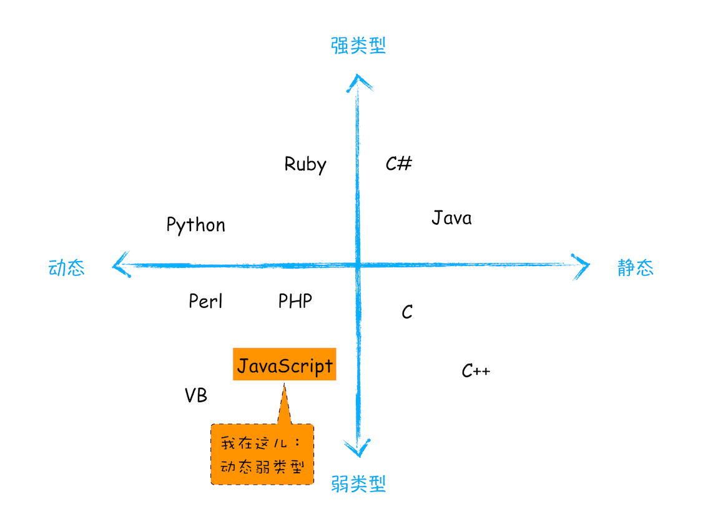

## JavaScript

- JavaScript 是一种弱类型的、动态的语言
  - 使用之前就需要确认其变量数据类型的称为静态语言；而 JavaScript 只有在运行中才能确定变量数据类型，并且同一个变量可以保存不同类型的数据，这类语言称为动态语言
  - 弱类型语言：支持隐式类型转换的语言称为弱类型语言
    
- 基础
  - 数据类型
    - 原始类型
      - undefined
      - null
      - boolean
      - number
      - string
      - symbol
        - 创建唯一标识
        - 创建对象的“隐藏”属性
      - bigInt
    - 引用类型
      - object（键值对集合）
        - 属性
          - 属性名限制
            - 字符串（其他类型会被自动转成字符串）
            - symbol
            - 特殊关键字 `__proto__`
          - 分类
            - 自身属性
            - 继承属性
            - [Symbol 属性](https://zh.javascript.info/symbol#yin-cang-shu-xing)（创建对象的“隐藏”属性、防止对象属性冲突）
            - 可枚举属性
          - 对象属性存在性检测及遍历
            |                             | 自身属性 | 继承属性 | 枚举属性 | 不可枚举属性 | Symbol 属性 |
            | --------------------------- | :------: | :------: | :------: | :----------: | :---------: |
            | in                          |    ✓     |    ✓     |    ✓     |      ✓       |      ✓      |
            | hasOwnProperty              |    ✓     |          |    ✓     |      ✓       |      ✓      |
            | for...in                    |    ✓     |    ✓     |    ✓     |              |             |
            | Object.keys                 |    ✓     |          |    ✓     |              |             |
            | Object.values               |    ✓     |          |    ✓     |              |             |
            | Object.entries              |    ✓     |          |    ✓     |              |             |
            | Object.getOwnPropertyNames  |    ✓     |          |    ✓     |      ✓       |             |
            | Object.getOwnPropertySymbol |          |          |          |              |      ✓      |
          - `Object.defineProperty`
          - 属性排序
            - 数字：当属性的类型时数字类型时，会按照数字的从大到小的顺序进行排序；
            - 字符串：当属性的类型是字符串时，会按照时间的先后顺序进行排序；
            - Symbol：当属性的类型是Symbol时，会按照时间的先后顺序进行排序。
          - 计算属性
          - 属性名简写
          - 扩展运算符
        - 对象比较
          - 比较的是否同一引用
          - 当两个变量引用同一个对象时，它们无论是 == 还是 === 都会返回 true
        - 对象拷贝
          - 浅拷贝
            - `Object.assign()`
          - 深拷贝
        - 序列化
          - JSON
            - [JSON.stringify() 的 5 个秘密特性](https://medium.com/javascript-in-plain-english/5-secret-features-of-json-stringify-c699340f9f27)
      - 函数
        - [形参之按值传递](https://github.com/mqyqingfeng/Blog/issues/10)
          - 传参（实参到形参赋值的过程）
            - 按值传递，即复制实参的值
            - 引用传递，即复制实参的地址
          - 当变量为引用类型时，传参只是复制该变量的值（即引用的对象地址）
  
  
  
  

- JavaScript
  - 编程语言的一般规律：用一定的词法和语法，表达一定语义，从而操作运行时
  - 语义
  - 文法
    - 词法
    - 语法
  - 运行时
    - 数据类型
      - 基本类型
      - 引用类型
        - [对象](./JavaScript 对象.md)
        - 内置对象
    - 执行过程
      - 从最顶层的程序与模块
      - 事件循环机制和微任务
      - 调用栈
      - 执行上下文
        - [this 指针](./this 指针.md)
  - 运行环境
    - 内存管理机制
      - 堆栈内存
      - 垃圾回收
  - ES Next
    - Proxy & Reflect
  - JavaScript 专题
    - [JavaScript 正则表达式](./JavaScript%20正则表达式.md)
    - [JavaScript 模块](./JavaScript%20模块.md)

