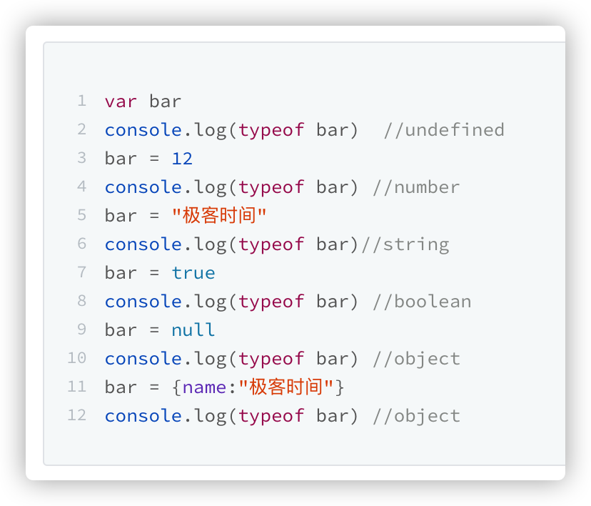

## JavaScript

- JavaScript
  - JavaScript 是一种弱类型的、动态的语言
    - 使用之前就需要确认其变量数据类型的称为静态语言；而 JavaScript 只有在运行中才能确定变量数据类型，意味着同一个变量可以保存不同类型的数据，这类语言称为动态语言
    
    - 弱类型语言：支持隐式类型转换的语言称为弱类型语言
    
      
  - 编程语言的一般规律：用一定的词法和语法，表达一定语义，从而操作运行时
    - 运行时
      - 运行时库（标准实现）
      - 运行时系统（又称运行时环境、执行环境，实现语言特性，启动、执行程序）
    - 操作运行时
      - 标准库调用
      - 元编程
  - 语言规范
    - 词法（定义组成语言的单词， 是语言中最小单元）
    - 语法（将单子组织成有含义的短语和句子的规则）
      - JavaScript 的赋值操作都是值复制
    - 语义（结合上下文，可以推导出语句的真实含义）
  - 运行时
    - 运行时库
      - 数据类型
        - 类型检测
          - typeof
      - 标准 API
    - 运行时系统
      - 执行过程
        - [编译时](./JavaScript 代码执行过程（编译时）.md)
        - [运行时](./JavaScript 代码执行过程（运行时）.md)
          - 作用域
          - 变量提升
          - 调用栈
          - 执行上下文
            - [this 指针](./this 指针.md)
          - 闭包
          - [微任务、Promise](./JavaScript 微任务、Promise.md)
      - 对象模型
      - 异步编程
        - 异步回调
        - promise 链式
        - async/await（generator + promise）同步
      - [内存管理机制](./JavaScript 内存管理机制.md)
        - 堆栈内存
        - 标记-清除
      - 元编程
        - defineObjectProperty
        - Proxy & Reflect
  - ES Next
  - JavaScript 专题
    - [JavaScript 正则表达式](./JavaScript%20正则表达式.md)
    - [JavaScript 模块](./JavaScript%20模块.md)
    - 手写 Promise 实现
    - 序列化
      - [JSON.stringify() 的 5 个秘密特性](https://medium.com/javascript-in-plain-english/5-secret-features-of-json-stringify-c699340f9f27)

1. javascript 是如何怎么实现变量动态类型？

   
