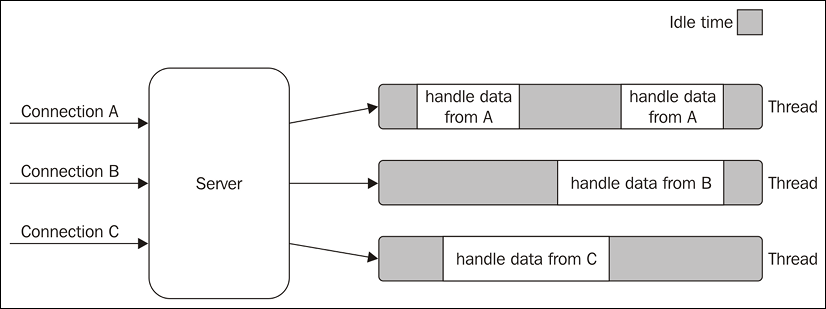

为了保证安全和协同，只有内核才能与硬件直接打交互

系统调用过程
多数操作系统的设计都遵循一个原则：进程向内核发起一个请求，然后将 CPU 执行权限让出给内核。内核接手 CPU 执行权限，然后完成请求，再转让出 CPU 执行权限给调用进程

按照权限管理的原则，多数应用程序应该运行在最小权限下。因此，很多操作系统，将内存分成了两个区域：
- 内核空间（Kernal Space），这个空间只有内核程序可以访问；
- 用户空间（User Space），这部分内存专门给应用程序使用。

用户态和内核态
用户空间中的代码被限制了只能使用一个局部的内存空间，我们说这些程序在用户态（User Mode） 执行。内核空间中的代码可以访问所有内存，我们称这些程序在内核态（Kernal Mode） 执行。

进程切换，时机：
1. 中断
2. 系统调用

提到 NodeJS，总会想到异步回调、非阻塞 IO，

## 如何理解区分同步/异步、阻塞/非阻塞？

可能很多人会难以区分、混淆两者概念？比如，

- 如果“同步”是发起了一个调用后， 没有得到结果之前不返回， 那它毫无疑问就是被“阻塞”了（即调用进程处于 “waiting” 状态）。
- 如果“异步”调用发出了以后就直接返回了， 毫无疑问， 这个进程没有被“阻塞”。

甚至可能会将两者意思等价起来。但回归本质来讲两者是不同的概念:

> 同步/异步关注的是事物之间的协作关系，是一种行为模式；阻塞/非阻塞描述的是事物的状态

一个事物的发生必须等待另一事物的结束，这就是同步，反之亦是异步，说明事物之间没有顺序关系，是独立发生的。

阻塞/非阻塞描述的是事物的状态，在计算机世界，事物即为线程。阻塞状态时就是只能等待，其他事都做不了。

**区分两者只要明白两者关注点不同，一个是双方行为关系，一个是单方状态**。

接下来，通过一个系统 I/O 调用过程分层来将同步/异步、阻塞/非阻塞串联起来理解，因为要让一个进程进入阻塞的状态, 要么是它主动调用 `wait()` 或 `sleep()` 等挂起自己的操作，另一种就是它调用 System Call, 而 System Call 因为一般会涉及到了 I/O 操作，不能立即完成，于是内核就会先将该进程置为阻塞状态，调度其他进程的运行，等到它所请求的 I/O 操作完成了以后，再将其状态更改回就绪状态。

一个 系统 I/O 调用过程需要经历：
1. 从 A 的业务代码到A的软件框架
2. 从 A 的软件框架到计算机的操作系统内核
   > 同步IO 跟异步IO 
3. 从 A 所在计算机的内核到 I/O 设备
4. 从 I/O 设备到A所在计算机的内核
5. 从 A 所在计算机的内核到 A 的程序的用户空间
6. 从 A 的软件框架到 A 的业务代码

1 和 6 这一层都是我们的用户进程的代码，我

3和4，操作系统内核在执行 System Call 时， CPU 需要与 IO 设备完成一系列物理通信上的交互， 其实再一次会涉及到阻塞和非阻塞的问题， 例如， 操作系统发起了一个读硬盘的请求后， 其实是向硬盘设备通过总线发出了一个请求，它即可以阻塞式地等待IO 设备的返回结果，也可以非阻塞式的继续其他的操作。 在现代计算机中，这些物理通信操作基本都是异步完成的， 即发出请求后， 等待 I/O 设备的中断信号后， 再来读取相应的设备缓冲区。 

但是，大部分操作系统默认为用户级应用程序提供的都是阻塞式的系统调用 （blocking systemcall）接口， 因为阻塞式的调用，使得应用级代码的编写更容易（代码的执行顺序和编写顺序是一致的）。

但同样， 现在的大部分操作系统也会提供非阻塞I/O 系统调用接口（Nonblocking I/O system call）。 一个非阻塞调用不会挂起调用程序， 而是会立即返回一个值， 表示有多少bytes 的数据被成功读取（或写入）。

编程层次


异步编程
- 异步调用
- 协程


3和5，内核与 IO 设备一般通过缓冲区，使用DMI来传输数据，所以这一步又是异步的。

讨论究竟是异步还是同步，一定要严格说明说的是哪一部分。其他答主说非阻塞是同步而不是异步，这毫无疑问是正确的，然而说某个框架是异步IO的框架，这也是正确的，因为说的其实是框架提供给业务代码的接口是异步的，不管是回调还是协程，比如说我们可以说某个库是异步的HTTPClient，并没有什么问题，因为说的是给业务代码的接口。由于通常异步的框架都需要在2中使用非阻塞的接口，的确会有很多人把非阻塞和异步混为一谈。

为什么会两者混淆，大家经常争论是因为同步异步阻塞非阻塞根本就说的不在一个点上。有些人看了经典的书是关于系统的，但有些人看得是框架，自然争论起来了。

参考：

- [怎样理解阻塞非阻塞与同步异步的区别？ - 灵剑的回答 - 知乎](https://www.zhihu.com/question/19732473/answer/117012135)


# Node.js 事件驱动架构

当发起 I/O 的系统调用，线程/进程会进入阻塞状态。

> 因为要让一个进程进入 等待（waiting） 的状态, 要么是它主动调用 `wait()` 或 `sleep()` 等挂起自己的操作， 另一种就是它调用 System Call, 而 System Call 因为涉及到了 I/O 操作， 不能立即完成， 于是内核就会先将该进程置为等待状态， 调度其他进程的运行， 等到它所请求的 I/O 操作完成了以后，再将其状态更改回 ready。 
>  
> 作者：萧萧  
> 链接：https://www.zhihu.com/question/19732473/answer/241673170  
> 来源：知乎  
> 著作权归作者所有。商业转载请联系作者获得授权，非商业转载请注明出处。

传统并发模型：多线程 + 阻塞 I/O

  

缺点：请求越多线程越多，**线程上下文切换占据的时间和内存浪费的也就越多**。

除了阻塞 I/O 系统调用外，大多数现代操作系统还支持另一种访问资源的机制，称为非阻塞 I/O，即发起  I/O 系统调用时线程不会被阻塞，但对于资源的获取，你得主动轮询。**没必要的轮询也只会浪费 CPU 时间**。

```c
resources = [socketA, socketB, fileA]
while (!resources.isEmpty()) {
  for (resource of resources) {
    // try to read
    data = resource.read()
    if (data === NO_DATA_AVAILABLE) {
      // there is no data to read at the moment
      continue
    }
    if (data === RESOURCE_CLOSED) {
      // the resource was closed, remove it from the list
      resources.remove(i)
    } else {
      //some data was received, process it
      consumeData(data)
    }
  }
}
```


非阻塞 I/O 模型
- 主动轮询
  - 浪费 CPU 时间
- 异步 I/O 模型

reactor 模式

没有进程内竞争条件和多线程同步如何使我们能够使用更简单的并发策略


1. 如何防止单线程被阻塞？
2. 单线程如何实现高并发？
  


单线程
- 注册事件、事件分发
- 事件循环处理回调