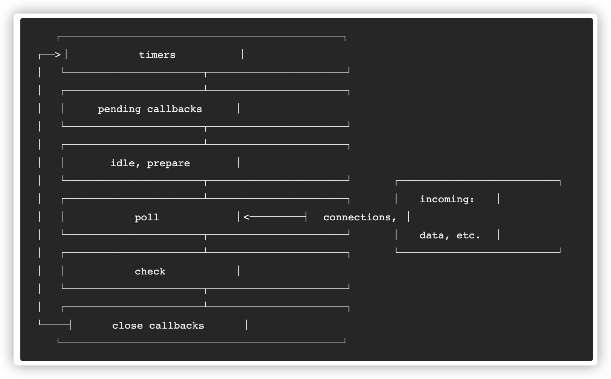

---
tags:
  - NodeJS
  - event loop
---

# Node.js 事件循环

事件循环通俗来说就是一个无限的 while 循环

1. 谁来启动循环
   1. Node.js 进程启动后，就发起了一个新的事件循环，也就是事件循环的起点
2. 谁来执行循环
3. 循环条件
4. 循环任务及优先级


初始化及执行用户 JS 脚本后，如果用户的 JS 代码会往 Libuv 注册
一些任务，就会进入 Libuv 的事件循环中，开始一轮又一
轮的事件循环处理。如果没有需要处理的队列任务和，Libuv 会退出，从而 Node.js 退出。




微任务
- process.nextTick
- Promise
宏任务
- setTimeout、setInterval
- IO
- setImmediate
- close

###  timers


与浏览器事件循环区别？
Node.js 10+ 版本后虽然在运行结果上与浏览器一致，但是两者在原理上一个是基于浏览器，一个是基于 libuv 库。浏览器核心的是宏任务和微任务，而在 Node.js 还有阶段性任务执行阶段。


不要在主线程执行阻塞性任务？
交给其他线程/进程执行

timers 与 IO

即使您将计时器设置为0ms延迟，延迟实际上也会被覆盖并设置为1ms。

setTimeout 与 setImmediate ？
即使计时器到期时间为零我们也不能保证其回调何时执行的计时器不同，立即队列保证在事件循环的 I/O 阶段之后立即处理。
```
const fs = require('fs');

fs.readFile(__filename, () => {
    setTimeout(() => {
        console.log('timeout')
    }, 0);
    setImmediate(() => {
        console.log('immediate')
    })
});
```

nextTick、promise、setTimeout 与 setImmediate

在 promise 微任务队列完成后，事件循环会再次检测到有 一 项目在 process.nextTick在承诺微任务处理期间添加的队列。然后节点将处理 nextTick 队列中剩余的 1 个项目。

IO Poll

## 事件循环最佳事件

1. 避免