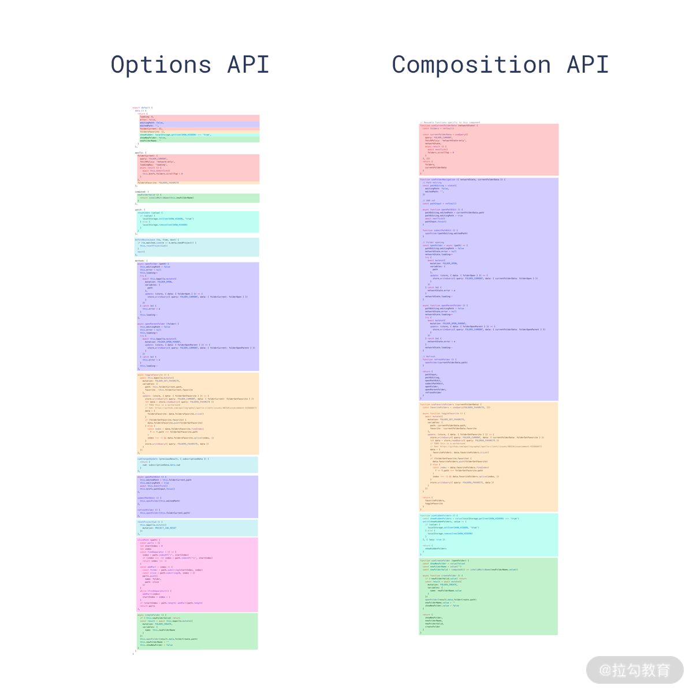

- 项目管理

  - [RFC](https://github.com/vuejs/rfcs)

- 源码

  - 更好的代码管理方式：yarn monorepo 方案
  - TypeScript
  - *[API Extractor](https://api-extractor.com/)*

- 性能优化

  - 源码体积优化

    - 移除一些冷门的 feature（比如 filter、inline-template 等）
    - *tree-shaking*

  - 数据劫持优化 Object.defineProperty => proxy

    - vue2 深度对象无脑递归
    - proxy 代理整个对象，真正访问到的内部对象才会变成响应式

  - 编译优化（通过在编译阶段优化编译的结果，来实现运行时 patch 过程的优化）

    

    - *通过编译阶段对静态模板的分析，编译生成了 Block tree。Block tree 是一个将模版基于动态节点指令切割的嵌套区块，每个区块内部的节点结构是固定的，而且每个区块只需要以一个 Array 来追踪自身包含的动态节点*

  - Slot 的编译优化

  - 事件侦听函数的缓存优化

  - diff 算法

- 语法 API 优化：Composition API

  - 逻辑组织（关注点聚焦）

    

  - 逻辑复用
  
    - 极致复用（回归 原生 JS 函数）
    - 函数可组合

