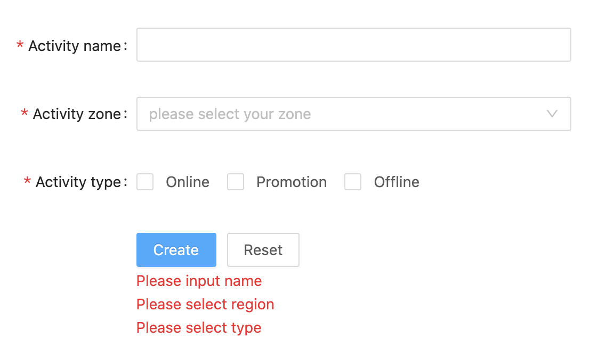

组件 = 状态 + UI

我们能够将“状态“和 UI 彻底(理想状态)分开，组件都是无状态组件，只接收属性，负责展示，所有的状态逻辑交由一个独立的包(这里我们暂且叫他 use-hooks吧)去管理

我不喜欢 ant design 的设计，你可以只使用 use-hooks，去写一套自己的无状态组件库

尼玛，组件库不支持，要自研，实现成本高，要延期，和历史设计规范不一致，改设计，总之各种借口和理由开始各方撕逼了。

### 使用 JSX 的场景

- ##### 一个文件写多个组件

- ##### 强依赖编译时的检查

- ##### 拥有 JS 完全编程能力

- ##### 泛型组件

https://mp.weixin.qq.com/s/VEtPc2PkJDJmWHn8YuRZHw

### vue jsx 环境配置

vue2

https://github.com/vuejs/jsx

vue3

https://github.com/vuejs/jsx-next

### 使用 JSX 需要注意的点

- 对 props 的处理是 merge