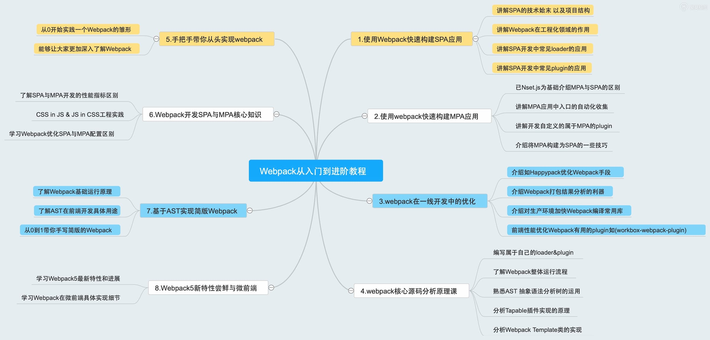

# Github Action 开发之 gitee 图床



## 关于 Github Action
Github Action 就像是一个库，实现某些功能的脚本，比如说可以读写仓库、发送短信、或者调用 github 或第三方的 API。你能够将某些功能抽成一个 Github Action，使用在你的 workflow 中或者通过公开仓库、 github 商城分享给其他人使用（Docker 实现的 Action 则通过 Docker Hub 等镜像仓库平台分享）。

推荐将 Github Action 作为一个独立仓库进行维护，而不是继承在某个应用的仓库中，这样方便分享、跟踪、迭代。如果不是想分享，而是想自我单独快速使用，推荐放在 `.github/actions` 文件下，比如 `.github/actions/action-a` 和 `.github/actions/action-b`，并使用相对路径引用。

```yml
jobs:
  my_first_job:
    steps:
      - name: My first step
        uses: ./.github/actions/my-action
```

Github Action 分成两类实现：
- Docker 容器实现，Docker 实现更为强大自由，可以自定义操作系统和工具，但由于构建延迟，Docker 容器操作比JavaScript操作慢。
- JavaScript 实现，直接运行在机器上，执行速度更快。

action.yml

input、ouput、environment variables.

## 指定版本
https://help.github.com/en/actions/automating-your-workflow-with-github-actions/about-actions