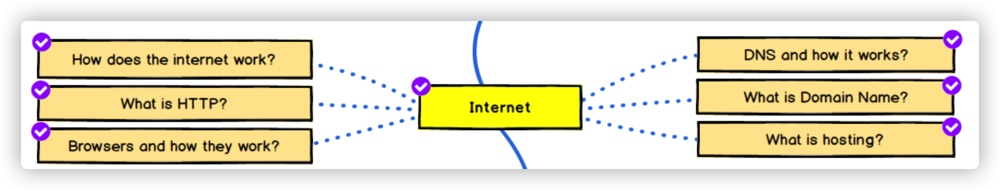

##  技术栈结构

1. 工程化
   - [前端工程化](./前端工程化/README.md)
2. 方案化及工具链
   - *typescript*
3. 框架技术
   - [Vue](./Vue/README.md)
   - [浏览器工作原理及API](./浏览器原理及API/README.md)
   - *NodeJS*
   - *Flutter*
4. 软件工程、设计模式、架构
   - JavaScript 设计模式与开发实践
5. 语言、运行时原理
   - [JavaScript](./JavaScript/README.md)
   - [HTML&CSS](./HTML&CSS/README.md)
6. 计算机基础
   1. 计算机导论
   2. 操作系统
   3. 计算机网络
      - [HTTP](./HTTP/README.md)
   4. [数据结构与算法](./数据结构与算法/README.md)
   5. 编译原理

## 2021 技术目标

- 深入 JS 学习
- 深入 Vue 框架
- 浏览器渲染原理
  - canvas
    - https://www.html5canvastutorials.com/tutorials/html5-canvas-wrap-text-tutorial/
  - 资源调度
    - https://github.com/GoogleChromeLabs/preload-webpack-plugin
  - https://www.youtube.com/watch?v=kNzoswFIU9M&list=PLNYkxOF6rcICgS7eFJrGDhMBwWtdTgzpx
- 数据结构与算法
- node 学习与应用
  - cli
    - https://github.com/iwfan/chore-cli
- http
- 重学 typescript
  - https://www.typescriptlang.org/docs/handbook/intro.html
- rust 学习
- 计算机导论
  - https://www.coursera.org/learn/jisuanji-biancheng/home/week/1

# 每日时间段安排

- 7 - 8 学习
- 8 - 10 阅读
- 10 - 12 工作
- 13 - 14 阅读
- 14 - 16 工作
- 16 - 17 学习
- 17 - 18 工作
- 21 - 22 阅读
- 22 - 23 学习
- 23 - 睡觉 算法

#  前端面试

- JS
- CSS
- 框架
- 算法

- web 安全

  

- 包管理工具

- CSS 处理工具

  - scss
  - postcss

- 构建工具

  - 工作流命令工具 npm script
  - 打包工具 
    - webpack
    - rollup
  - lint & prettier

- 前端框架

  - vue

- 现代化 CSS

  - BEM
  - CSS Modules
  - CSS in JS 
  - Atom css

- Web component

- 测试

  - Jest

- 类型检测

  - Typescript

- 性能测试工具

  

- PWA