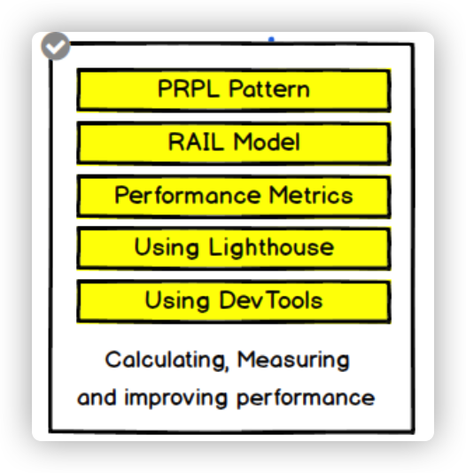

##  技术栈结构

1. 工程化标准
   - [前端工程化](./前端工程化/README.md)
2. 工具链及方案化
   - typescript
     - https://github.com/type-challenges/type-challenges
   - 微前端
3. 框架技术
   - [Vue](./Vue/README.md)
   - React
     - [react-router-5-course](https://github.com/ReactTraining/react-router-5-course)
   - 容器技术
     - Docker
4. 软件工程、设计模式、架构
   - JavaScript 设计模式与开发实践
   - 依赖注入
     - https://github.com/mgechev/injection-js
5. 语言、运行时原理
   - [HTML&CSS](./HTML&CSS/README.md)
   - [JavaScript](./JavaScript/README.md)
   - [浏览器工作原理及API](./浏览器原理及API/README.md)
     - https://github.com/Troland/how-javascript-works
   - *NodeJS*
   - *Flutter*
6. 计算机基础
   1. 计算机组成原理
   
      讲述的是计算机是什么？计算是怎么回事？硬件如何为应用提供计算？
   
   2. 操作系统
   
      如何合理规划应用的生命周期以及资源使用？
   
      1. [重学操作系统](https://kaiwu.lagou.com/course/courseInfo.htm?courseId=478#/content)
   
   3. 计算机网络
   
      网络中的不同节点的应用之间如何进行通信？
   
      - [HTTP](./HTTP/README.md)
   
   4. [数据结构与算法](./数据结构与算法/README.md)
   
      算法是解决某个实际问题的计算步骤，研究如何让这个计算步骤以最小的代价实现。
   
      - 极客算法训练营
   
   5. 图形学
   
   6. 编译原理
   
      - babel
        - [ babel 插件通关秘籍](https://juejin.cn/book/6946117847848321055/section)
        - https://github.com/QuarkGluonPlasma/babel-plugin-exercize
        - https://github.com/estree/estree

- 切勿心傲
- 有问题多向别人请教，切勿一直沉迷
- 收起你的自卑、任性等坏毛病，多观察其他人

## 2021 技术目标

- 深入 JS 学习
- 深入 Vue 框架
- 浏览器渲染原理
  - 渲染管道
    - https://docs.google.com/presentation/d/1ak7YVrJITGXxqQ7tyRbwOuXB1dsLJlfpgC4wP7lykeo/edit#slide=id.p
    - https://docs.google.com/document/d/1aitSOucL0VHZa9Z2vbRJSyAIsAz24kX8LFByQ5xQnUg/edit?pli=1#heading=h.dr7ct95ht2sw
    - https://fed.taobao.org/blog/taofed/do71ct/performance-composite/?spm=taofed.homepage.header.13.7eab5ac8Ut2aYd
    - https://docs.google.com/presentation/d/1boPxbgNrTU0ddsc144rcXayGA_WF53k96imRH8Mp34Y/edit#slide=id.g60f92a5151_40_0
  - canvas
    - https://www.html5canvastutorials.com/tutorials/html5-canvas-wrap-text-tutorial/
    - https://joshondesign.com/p/books/canvasdeepdive/toc.html
    - https://juejin.cn/post/6844903828916011022
    - https://www.kirupa.com/canvas/canvas_high_dpi_retina.htm
    - https://github.com/jondavidjohn/hidpi-canvas-polyfill
  - 资源调度
    - https://mp.weixin.qq.com/s/K24X2uNPvtbD4vZlXwJMYA
    - https://github.com/GoogleChromeLabs/preload-webpack-plugin
    - https://medium.com/reloading/preload-prefetch-and-priorities-in-chrome-776165961bbf
  - https://www.youtube.com/watch?v=kNzoswFIU9M&list=PLNYkxOF6rcICgS7eFJrGDhMBwWtdTgzpx
  - 编译
    - https://www.youtube.com/watch?v=5nmpokoRaZI
    - https://www.youtube.com/watch?v=KM9coMpy5sQ&t=499s
    - https://www.youtube.com/watch?v=p-iiEDtpy6I
    - https://zhuanlan.zhihu.com/p/28590489
- 数据结构与算法
- node 学习与应用
  - [Introduction to the Node.js reference architecture, Part 3: Code consistency](https://developers.redhat.com/articles/2021/05/17/introduction-nodejs-reference-architecture-part-3-code-consistency?utm_source=ESnextNews.com&utm_medium=Weekly+Newsletter&utm_campaign=2021-05-25#)

  - http://nodejs.cn/learn/introduction-to-nodejs
  - cli
    - https://github.com/iwfan/chore-cli
    - https://github.com/google/zx/blob/main/index.mjs
    - https://github.com/Tencent/feflow
- http
- 重学 typescript
  - https://www.typescriptlang.org/docs/handbook/intro.html
- rust 学习
- 计算机导论
  - https://www.coursera.org/learn/jisuanji-biancheng/home/week/1
  - https://www.bilibili.com/video/av21376839/

## 系列教程

- vue3 conf https://node.fequan.com/videodetail/1621773573110
- canvas 
  - https://joshondesign.com/p/books/canvasdeepdive/toc.html

# 每日时间段安排

- 7 - 8 学习
- 8 - 10 阅读
- 10 - 12 工作
- 13 - 14 阅读
- 14 - 16 工作
- 16 - 17 学习
- 17 - 18 工作
- 21 - 22 阅读
- 22 - 23 学习
- 23 - 睡觉 算法

- web 安全

  

- 包管理工具

- CSS 处理工具

  - scss
  - postcss

- 构建工具

  - 工作流命令工具 npm script
  - 打包工具 
    - webpack
    - rollup
  - lint & prettier

- 前端框架

  - vue

- 现代化 CSS

  - BEM
  - CSS Modules
  - CSS in JS 
  - Atom css

- Web component

- 测试

  - Jest

- 类型检测

  - Typescript

- 性能测试工具

  

- PWA