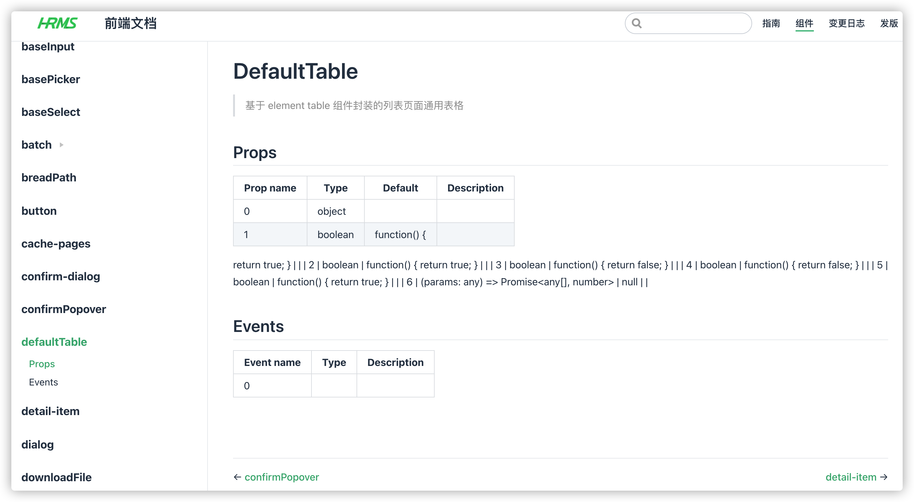
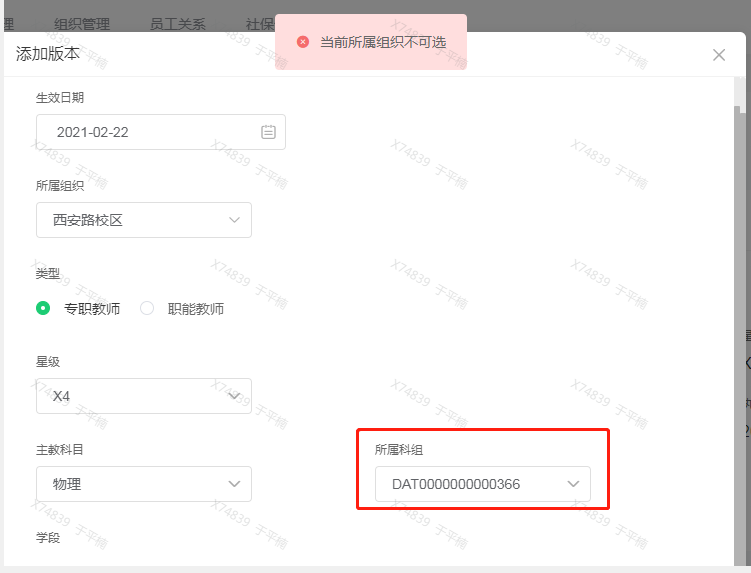

hrms-web

- hrms 文档

  https://hr-test.xiaojiaoyu100.com/docs/components/defaultTable/index.html#props

  https://gitlab.xinghuolive.com/efficiency-engineer/vue-project-docs/-/tree/master

  

  - 指南
  - 组件
  - 变更日志
  - 发版

- 全局

  - 权限控制

    路由跟菜单分离，导致权限配置上比较困难，容易遗漏
    
  - 请求报错

    **系统会出现报错信息不对应的错误提示** 是因为code 被占位使用了，像code为 6、8都是后台全局默认错误，如果没有特殊捕获将返回小于10的code，而前端有些代码地方就直接把 6、8 对应提示语，当后台不知道什么原因返回6、8时，就提示成了错误的对应不上的信息。

    

    做理想的请求报错提示是直接使用后台返回 msg 信息，不过介于历史原因，目前建议做法

    1. 如果发现 hrms 代码还存在如此的代码建议去除掉，

    2. 改用以下代码做处理，小于10的code 直接使用后台返回的 msg
    3. 全局使用上 catchHttpErrorForTip 做处理，防止前端未做处理，导致报错时没有任何系统反应提示用户（理想做法，不过目前加上可能导致出现两次以上重复提示）

    ```javascript
    // src/constants/errorMap.js
    export function catchHttpErrorForTip(error) {
      const { errorCode: code, msg } = error.response.data;
    
      switch (code) {
        case 6:
        case 8:
          Message.error(msg.replace(/.*?:[^:]/, ''));
          break;
    
        default:
          if (errorMap[code]) {
            Message.error(errorMap[code]);
          }
          break;
      }
    
      return Promise.reject(error);
    }
    
    ```

    

    

- 考勤

  - 排班

    排班 这块代码及接口交互设计得不是很好，除了周循环（后面优化了下），前端数据加载、修改、交流后端都是当前条件下的全部用户数据，最好只传送 排班数据


