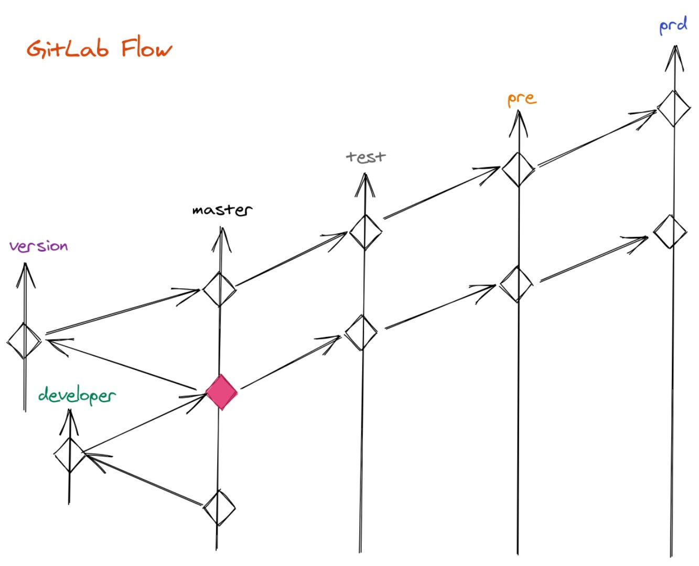
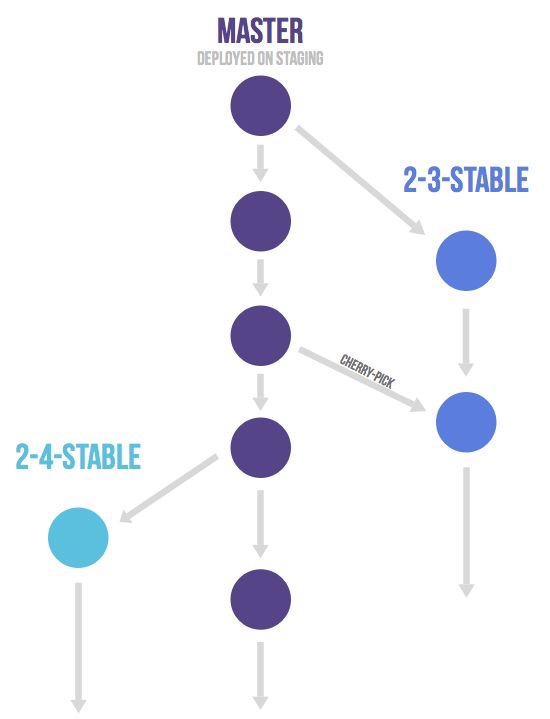
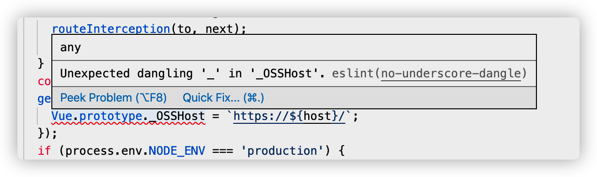

# 前端规范实践总结

本文主要是对前端开发的工作流程及一些工具使用规范小总结

**内容目录**
- [前端规范实践总结](#前端规范实践总结)
  - [Commit 规范](#commit-规范)
    - [必选类型](#必选类型)
  - [GitLab Flow 规范](#gitlab-flow-规范)
    - [GitLab Flow 模型原则](#gitlab-flow-模型原则)
    - [提交流程](#提交流程)
  - [代码规范（eslint）](#代码规范eslint)

## Commit 规范

推荐阅读
- [Commit Message Guidelines(Angular)](https://github.com/angular/angular/blob/22b96b9/CONTRIBUTING.md#-commit-message-guidelines)

提交 message 的结构如下所示

```
<类型>[可选的作用域]: <描述>

[可选的正文]

[可选的脚注]
```

### 必选类型

开发常用

- fix 修复 BUG
- feat 新增功能
- refactor 代码重构
- perf 性能优化

项目管理及构建系统

- style 
- build
- ci
- chore
- docs 文档变更

其他
- revert
- test


## GitLab Flow 规范

> 1.以下默认熟悉 git 相关操作
>
> 2.阅读 [Introduction to GitLab Flow](https://docs.gitlab.com/ee/topics/gitlab_flow.html#commit-often-and-push-frequently)

个人总结来说相比 [Github Flow](https://docs.gitlab.com/ee/topics/gitlab_flow.html#github-flow-as-a-simpler-alternative) 的单一和 [Git FLow](https://docs.gitlab.com/ee/topics/gitlab_flow.html#git-flow-and-its-problems) 的复杂，GitLab Flow 的单向流动合并模型更为清晰明了和多版本环境部署优势



- version 版本存储分支
- developer 个人开发分支
- master 持续集成分支 
- test 测试服分支
- pre 预发服分支
- prd 正式服分支

如果按照长短期分支区分，除了 developer 为短期分支，其他都为长期分支。短期分支按照特性划分可以为 Hotfix、Feature、Optimize 分支等

### GitLab Flow 模型原则

**持续集成原则**

*Commit often and push frequently*，反正就是多 commit 多 push，保证每个 commit 变动明确及只包含相关变动文件，尽量多次合并到 master，这样才能及早发现冲突，尤其是愈多人合作参与开发的项目显得更为重要

**上游优先原则**

代码合并的顺序，要按环境依次推送，确保代码被充分测试过,才会从上游分支合并到下游分支。除非是很紧急的情况，才允许跳过上游分支，直接合并到下游分支。这种规则称之为 “upstream first”，也就是 “上游优先”

在 GitLab Flow 中，master 永远作为最新版本及持续集成的分支，每当 master 上的版本要发生变更时，建议的做法是每一个稳定版本，都要从 master 分支拉出一个 version 分支，比如 2-3-stable、2-4-stable等等。发现问题，就从对应版本分支创建修复分支，完成之后，先合并到 master，才能再合并到 release 分支，遵循 “上游优先” 原则



### 提交流程

1. 从对应版本切换相应短期个人开发分支进行开发
2. `git rebase -i` 压缩整理提交
3. `git pull origin master --rebase` 提交前先合并 master
4. 发起 merge request ，进行 code review
5. Git merge --no-ff myfeature
6. CI Pipe Stage
7. 逐步自动合并到下游环境分支

> Rebae 变基的本质是创建新的 Commit，不要对已经上交到远程分支共享的 Commit 进行变基
> 
> https://docs.gitlab.com/ee/topics/gitlab_flow.html#squashing-commits-with-rebase


## 代码规范（eslint）

好的编码规范不仅可以大幅提高代码可读性，甚至会提高代码质量。很多优秀的团队，都根据最佳实践设定了特别优秀的编码规范，如 [airbnb javascript style](https://github.com/airbnb/javascript)。*不要重复造轮子*，从工程化复用的角度，可以选择继承第三方团队定制的规范。

在 vue 项目中，选择 vue 官方 recommended 插件及定制的 airbnb 版本

```javascript
// .eslintrc.js
'extends': [
    'plugin:vue/recommended',
    '@vue/airbnb'
  ],
```
再根据团队项目情况，进行部分 rule 配置

```javascript
rules: {
    /**************** eslint rules ******************/
    'no-console': process.env.NODE_ENV === 'production' ? 'warn' : 'off',
    'no-debugger': process.env.NODE_ENV === 'production' ? 'warn' : 'off',
    'object-shorthand': 'off',
    'no-plusplus': 'off',
    'consistent-return': 'off',
    ...
```

一个良好的编码规范会带来解放强迫症的舒适感，但过于严格的代码风格有时也会使人烦躁，失去开发体验，比如你正在快速修改一个 bug，修改后的代码打算测试验证是否符合期望，但是严格的规范要求阻断你的节奏，你不得不停下来重新修改代码使其通过规范，如此反复确实容易令人失望。最好的做法是在提交代码时候才进行规范校验，不打断开发体验。

为了平衡开发体验与编程规范的意义，对工作流程分为几层进行渐进式的限制

**Dev 环境下分离 eslint 集成**

webpack 是当今主流的前端构建工具，得益于强大的扩展性，越来越多的流程可以轻松集成在一起，前端工程化才能有巨大的提升。但是随着项目规模的增加，构建流程的繁重也会导致项目的开发体验下降，这也是为什么现在前端构建工具有分离或者部分工具替换成其他语言平台开发的工具的趋势

分离 eslint 的好处不仅可以带来编译速度的提升，而且也不会阻断开发流程

```javascript
// vue.config.js
module.exports = {
  // 本地开发环境停用 eslint-loader，便于加快编译
  lintOnSave: process.env.NODE_ENV === 'production' ? 'error' : false, 
  ...
```

以上是 vue-cli 的配置，同理 webpack 上 es-loader 也是一样

```javascript
{
  test: /\.(js|mjs|jsx|ts|tsx)$/,
  enforce: 'pre',
  use: [
    {
      options: {
        cache: true,
        // 可结合 webpack 与 eslint-loader，根据当前环境的环境变量配置 emitWarning
        emitWarning: true,
      },
      loader: require.resolve('eslint-loader'),
    },
  ]
}
```

**IDE && eslint plugin**

从构建流程分离了 eslint 后，需要借助 IDE 配合 eslint 插件下做到错误提示

以 VSCode 及 eslint 插件做到自动提示为例



并通过 VSCode 配置，保存时自动化 fix 部分错误 

```javascript
// vscode settings
"eslint.validate": [
        "javascript",
        "javascriptreact",
        "vue"
    ],
    "editor.codeActionsOnSave": {
        "source.fixAll.eslint": true
    },
    "eslint.codeAction.showDocumentation": {
        "enable": true
    },
    //关闭 vetur template validate，使用自定义 rules
    "vetur.validation.template": false, 
    ...
```

**GIT Hooks 自动化 eslint 代码**

利用 git 提供的 hooks 自动化在代码提交的时候进行检验

[husky](https://github.com/typicode/husky) 是一个使 git hooks 变得更简单的工具，只需要配置几行 package.json 就可以愉快的开始工作。

[lint-staged](https://github.com/okonet/lint-staged)

**在 CI/CD 中自动化 eslint 代码**