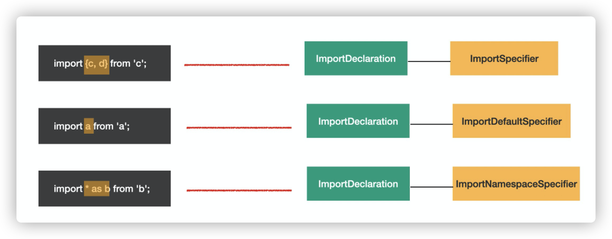

## what babel

babel 是 js 转译器。

一般编译器 Compiler 是指高级语言到低级语言的转换工具，对于高级语言到高级语言的转换工具，被叫做转译器 (Transpiler)。

babel 的主要作用是代码转换

- es next => es5、typescript => es，
- 基于 AST 的结构，能够做一些静态分析功能，更加强大
  - linter 工具就是分析 AST 的结构，对代码规范进行检查。
  - api 文档自动生成工具，可以提取源码中的注释，然后生成文档。
  - type checker 会根据从 AST 中提取的或者推导的类型信息，对 AST 进行类型是否一致的检查，从而减少运行时因类型导致的错误。
  - 压缩混淆工具，这个也是分析代码结构，进行删除死代码、变量名混淆、常量折叠等各种编译优化，生成体积更小、性能更优的代码。
  - js 解释器，除了对 AST 进行各种信息的提取和检查以外，我们还可以直接解释执行 AST。

### babel 编译流程

## Babel AST Ndoe Type

AST 是对源码的抽象，可以分为以下几类结点，有些语法比较特殊，会被单独分类出来

- 字面量 Literal

- 标识符 Identifier

- 语句 Statement

  **statement 是语句，它是可以独立执行的单位**。比如 break，continue，debugger，return 或者 if 语句、while 语句、for 语句，还有声明语句，表达式语句等。我们写的每一条可以独立执行的代码，都是语句。

- 声明 Declaration

  **声明语句是一种特殊的语句，声明语句用于定义变量**，有变量、函数、class、import、export 等

- 表达式 Expression

  expression 是表达式，**特点是执行完以后有返回值**，这是和语句 (statement) 的区别。

  **有的表达式可以单独执行，符合语句的特点，所以也是语句，比如赋值表达式、数组表达式等**，但有的表达式不能单独执行，需要和其他类型的节点组合在一起构成语句。比如匿名函数表达式和匿名 class 表达式单独执行会报错

  

- 特殊

  - 模块语法

    - import

      

    - export

      

  - class 语法

    class 的语法比较特殊，有专门的 AST 节点来表示

    

  - File、program、comments 

    babel 的 AST 最外层节点是 File，它有 program、comments 等属性

[更多 babel 结点类型参考](https://github.com/babel/babel/blob/main/packages/babel-parser/ast/spec.md)。

