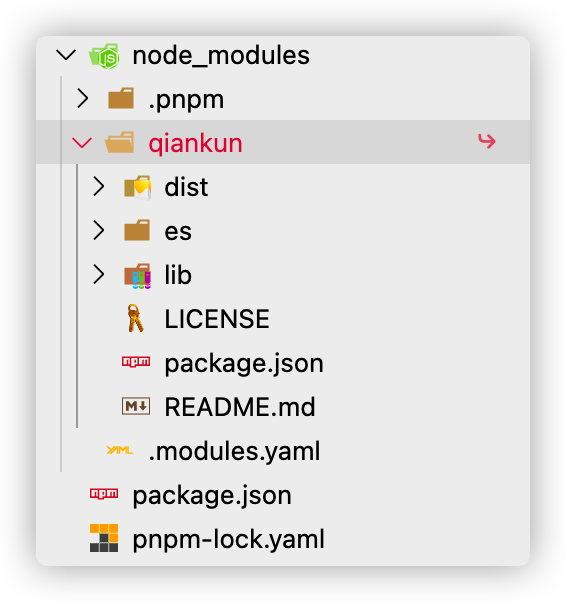
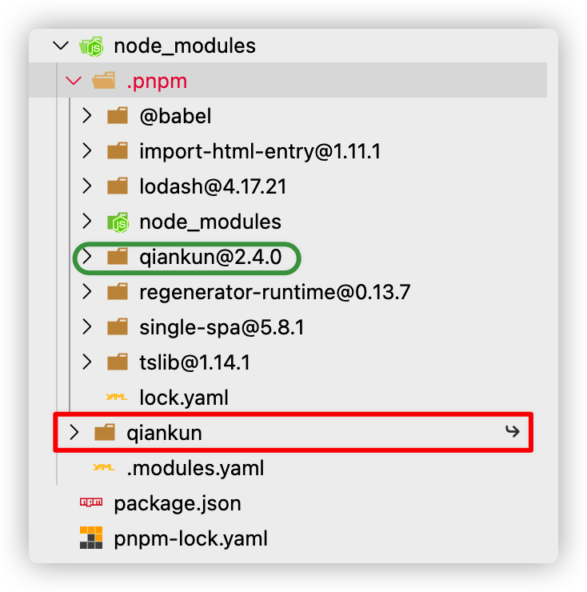
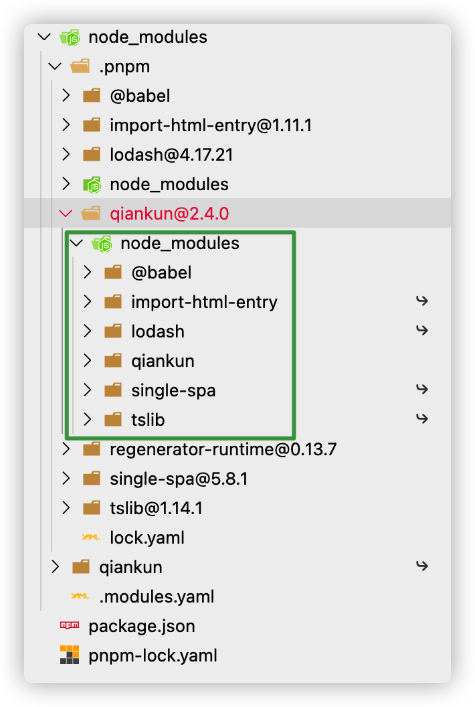
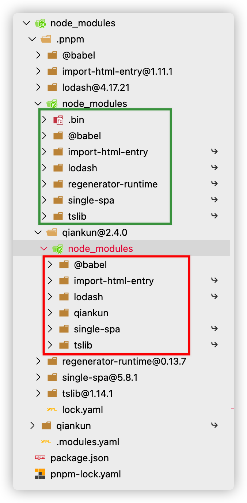

# Pnpm

> 推荐阅读
>
> [关于现代包管理器的深度思考——为什么现在我更推荐 pnpm 而不是 npm/yarn?](https://mp.weixin.qq.com/s/1Wm-iYFBgJXMg_7SgWktXA)
>
> [Flat node_modules is not the only way](https://pnpm.js.org/blog/2020/05/27/flat-node-modules-is-not-the-only-way/)

## pnpm 介绍

### pnpm 特点

#### 安装快，磁盘空间利用效率高

- 不会重复安装同一个包
- 版本管理单位为 单文件
- 基于内容寻址

#### 安全性高

- 校验包完整性

- pnpm 独创的依赖管理

  对比下  npm/yarn 、pnpm 依赖管理：

  npm/yarn 

  - npm 3 之前 `嵌套结构`
    - 过度嵌套
    - 重复安装、占用空间
  - npm 3 之后及 yarn `扁平化结构`
    - 依赖结构的**不确定性**，依据声明顺序
    
      lock 文件除了保证依赖版本一致性，维持依赖结构
    
    - 扁平化算法本身的**复杂性**很高，耗时较长
    
    - 项目中仍然可以**非法访问**没有声明过依赖的包，因为 Node Module Resolution


  下边例子，我们用 pnpm 创建一个项目并且 `pnpm install qiankun`来观察：

  pnpm 创建了的是一个**非扁平非嵌套**的依赖结构

  - node_modules 只存在 package 上声明的依赖，保证结构对应，清晰明了；

    **而且你的代码就只能加载到项目 node_modules 里的依赖，保证安全性、严谨性**

    

    但点开 qiankun 并没有发 node_modules，那 qiankun 的依赖呢？

    

  - qiankun 只是个软链接，映射到 .pnpm/qiankun@2.4.0

    > `.pnpm/`会以平铺的形式储存着所有的包，每个包都可以在这种命名模式的文件夹中被找到：
    >
    > `.pnpm/<name>@<version>/node_modules/<name>`
    >
    > 与 npm3+ 以及 yarn 平铺方式不同的是
    >
    > `<name>@<version>` 保证了包之间的相互隔离
    
    
    
  - pnpm 会把 qiankun 及其依赖平级放在 node_modules 目录下

    这种设计巧妙得利用并兼容 Node Module Resolution 机制使用 qiankun 能够访问其依赖，而它的依赖也同样是软链接，映射到 .pnpm 下的包

    

#### 支持 monorepo

Monorepo 操作

- 依赖操作
  - root 
    - add 默认只能在 workspace 中，`-W` 可作用于 root workspace
  - 所有子项/单个子项目 `--filter xxx`
    - pnpm add qiankun --filter="{projects}" 对所有
  - 默认提升全局 `hoist: true`
- 任务操作

## Pnpm 半严格模式

如果仔细发现上面的案例，`node_modules/.pnpm` 路径下竟然会有 `node_modules` 文件，这样虽然我们自己的代码是被严格限制了，但第三方依赖包还是可以根据 Node Module Resolution 机制偷偷访问到其他包！



默认情况下，pnpm v5 创建一个“半严格” 的 node_modules。
默认配置如下所示：
```yaml
; 提升所有包到 node_modules/.pnpm/node_modules
hoist-pattern[]=*

; 提升所有名称包含types的包至根，以便Typescript能找到
public-hoist-pattern[]=*types*

; 提升所有ESLint相关的包至根
public-hoist-pattern[]=*eslint*
```

可通过 `hoist=false` 来禁止包提升，更多配置详情参考[《pnpm的node_modules配置选项》](https://pnpm.io/zh/blog/2020/10/17/node-modules-configuration-options-with-pnpm)。


