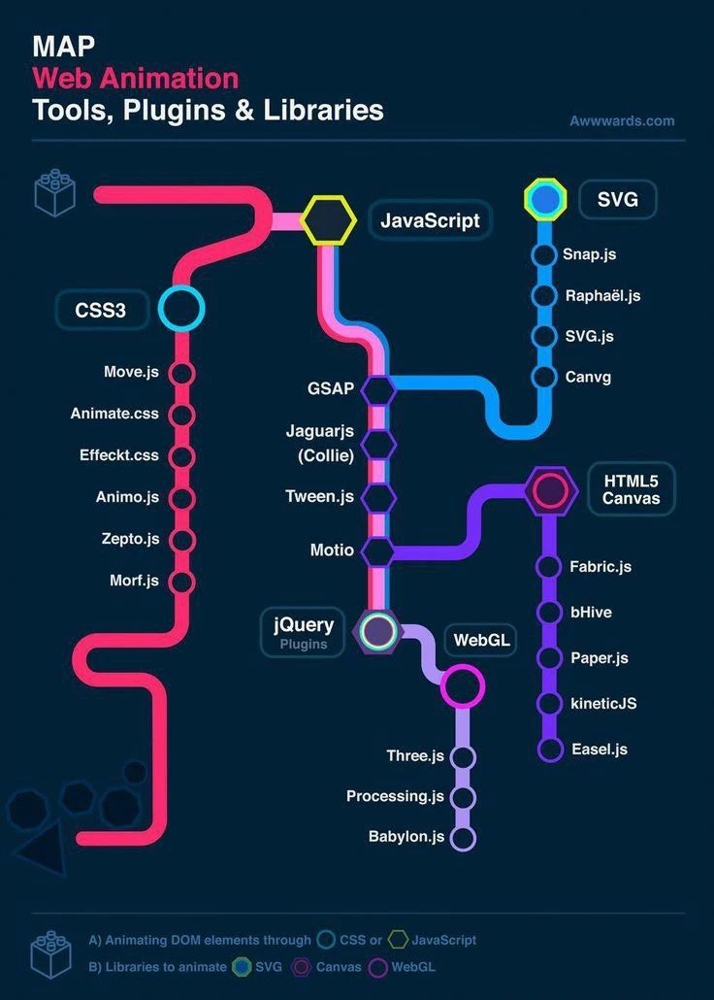

- 2021
  - 4
    - 4 - 17（ssh、阿宝）
      - [震惊！前端大佬都开始手写ECharts 了](https://mp.weixin.qq.com/s/krCm6J_O5SCtDwudGNKHWQ)
      - [前端虚拟列表的实现原理](https://mp.weixin.qq.com/s/IC5yNkaOfvM9M-s3tj-jsg)
      - [Webpack’s Hot Module Replacement Feature Explained](https://blog.bitsrc.io/webpacks-hot-module-replacement-feature-explained-43c13b169986)

4.4 - 4.24(前端大全)、4.4 - 5.11 啊宝

- 工具链及方案化
  - webpack
    - [手把手带你入门Webpack Plugin](https://mp.weixin.qq.com/s/8oDENjCOsXxlA2fyuIN4GA)
  - 微前端
    - [如何设计实现微前端框架-qiankun](https://mp.weixin.qq.com/s/zbg8B6F_QcN8oV4E6IB88A)
    - [Micro Frontends](https://martinfowler.com/articles/micro-frontends.html)
    - [Micro Frontends](http://micro-frontends.org/)
    - [可能是你见过最完善的微前端解决方案](https://zhuanlan.zhihu.com/p/78362028)
    - [**Why Not Iframe**](https://www.yuque.com/kuitos/gky7yw/gesexv)
  - Nignx
    - [前端人应该知道的 Centos/Docker/Nginx/Node/Jenkins 的基本操作](https://mp.weixin.qq.com/s/LSAYtaV-8hfPDjnzomMQgA)
- 语言、运行时原理
  - JavaScript
    - [Implementing Private Fields For JavaScript](https://www.mgaudet.ca/technical/2021/5/4/implementing-private-fields-for-javascript)
    - https://humanwhocodes.com/blog/2021/04/lazy-loading-property-pattern-javascript/
  - WebAssembly
    - [Making JavaScript run fast on WebAssembly](https://bytecodealliance.org/articles/making-javascript-run-fast-on-webassembly?utm_source=ESnextNews.com&utm_medium=Weekly+Newsletter&utm_campaign=2021-06-08)
    - [**An Introduction to WebAssembly for JavaScript Developers**](https://pascalpares.appspot.ovh/webassembly-for-javascript-developers/?utm_source=ESnextNews.com&utm_medium=Weekly+Newsletter&utm_campaign=2021-06-08)
  - CSS
    - 动画
      - [lottie](http://airbnb.io/lottie/#/README)
- 探索
  - [How to Create Reusable Web Components with Lit and Vue](https://dval.dev/blog/lit-web-components-tutorial/)
- 设计
  - [设计一个插件架构，我是如何思考的](https://mp.weixin.qq.com/s/dgz1cuNWBKw7vjUTeWhYNQ)
- vue
  - https://juejin.cn/post/6965057432544346143#heading-13
- 性能
  - https://mp.weixin.qq.com/s/5EDpl1XFEGosKxdLQem4QA 图片
- eslint
  - https://alloyteam.github.io/eslint-config-alloy/?language=zh-CN
- 字符集相关
  - https://www.grapecity.com.cn/blogs/gc-character-encoding
- typescript
  - [TypeScript 高级用法](https://mp.weixin.qq.com/s/J_tH6r4LzlmlTQ771u_IyQ)
  - [openapi-typescript](https://github.com/drwpow/openapi-typescript)
  - [json-schema-to-typescript](https://github.com/bcherny/json-schema-to-typescript)
- AST
  - [这样入门 js 抽象语法树(AST)，从此我来到了一个新世界](https://mp.weixin.qq.com/s/iAApf1IcOe0sb3Uto6X3KA)
  - [Understanding how Babel Works](https://medium.com/aia-sg-techblog/understanding-how-babel-works-d6ca363bce1e)
  - [《从 0 到 1 手写 babel》思路分享](https://zhuanlan.zhihu.com/p/372779553)
  - [基于 babel 手写 ts type checker](https://zhuanlan.zhihu.com/p/370759674)
- webpack
  - [聊聊 Webpack 热更新以及原理](https://mp.weixin.qq.com/s/oXzsXIumOmg45SOOCsevQQ)
- 实战
  - [中高级前端必须注意的 40 条移动端 H5 坑位指南 | 网易三年实践](https://mp.weixin.qq.com/s/921YtuKTJRE-Pz2WF5OQOg)
  - [Axios 如何缓存请求数据？](https://mp.weixin.qq.com/s/NfyxtWUzjHh6ucXvBF9B4Q)
- 面试
  - [当面试官问Webpack的时候他想知道什么](https://mp.weixin.qq.com/s/2-zNlGrKUngWdQNvlcgESw)
- http
  - [Deep dive in CORS: History, how it works, and best practices](https://ieftimov.com/post/deep-dive-cors-history-how-it-works-best-practices/)
- monorepos
  - makefiles https://seisman.github.io/how-to-write-makefile/recipes.html
  - [Why I Prefer Makefiles Over package.json Scripts](https://spin.atomicobject.com/2021/03/22/makefiles-vs-package-json-scripts/?utm_source=ESnextNews.com&utm_medium=Weekly+Newsletter&utm_campaign=2021-04-13)
  - https://github.com/wix/lerna-script
- 动画
  - https://github.com/greensock/GSAP
  - http://svga.io/article.html
- 工程
  - [从零开始配置 TypeScript 项目](https://juejin.cn/post/6856410900577026061#heading-0)
- devtool
  - https://mp.weixin.qq.com/s/TZ5xAyn1dZWui_ZkDP-z2A
- 系统设计
  - [什么是单点登录？如何实现？](https://mp.weixin.qq.com/s/a9VLbs555jCtNr0gJPOMpg)

