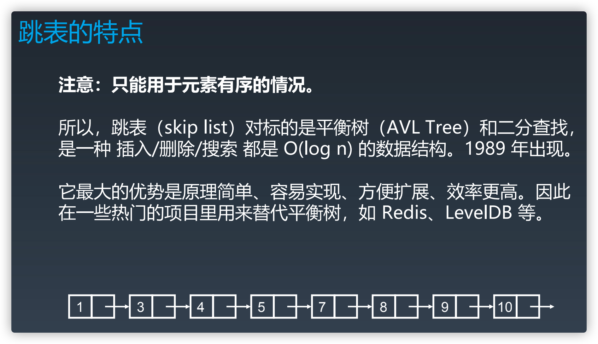

### 链表

链表（linkedList）是一种线性表数据结构。数据是通过指针关联起来。

最常见的链表结构，它们分别是：单链表、双向链表和循环链表、双向循环表。

一般情况下说的链表指的是单链表

记录下个结点地址的指针叫作后继指针 next，前继指针 previous。

第一个结点叫作头结点（head），把最后一个结点叫作尾结点（tail）。

#### 衍生链表

循环链表是一种特殊的单链表。单链表的尾结点指针指向空地址，而循环链表的尾结点指针是指向链表的头结点。

双向链表，每个结点不止有一个后继指针 next 指向后面的结点，还有一个前驱指针 prev 指向前面的结点。

双向循环链表

### 增删查

**插入结点，注入操作顺序**：x->next = c    b->next = x

增删：复杂度 O(1)

查：O(n)

### 跳表

类似链表，查找操作如果需要加速，可以添加多级索引，变成跳表，以提升效率
思想推广一下就是，一维数据结构的某项操作如果需要加速，则可以进行升维，使其更多附加信息，以提升效率。
本质是空间换时间

### 数组与链表对比

和数组相比，链表更适合插入、删除操作频繁的场景，查询的时间复杂度较高。

数组查询可以借助 CPU 的缓存机制，预读数组中的数据，所以访问效率更高。而链表在内存中并不是连续存储，所以对 CPU 缓存不友好，没办法有效预读。

内存上，数组的缺点是大小固定，一经声明就要占用整块连续内存空间。链表中的每个结点都需要消耗额外的存储空间去存储一份指向下一个结点的指针，所以内存消耗会翻倍。而且，对链表进行频繁的插入、删除操作，还会导致频繁的内存申请和释放，容易造成内存碎片，如果是 Java 语言，就有可能会导致频繁的 GC（Garbage Collection，垃圾回收）。

### 利用哨兵简化实现难度

链表的插入、删除操作，需要对插入第一个结点和删除最后一个结点的情况进行特殊处理，使用带头链表简化边界问题，所以插入第一个结点和插入其他结点，删除最后一个结点和删除其他结点，都可以统一为相同的代码实现逻辑了。

缓存实际上就是利用了空间换时间的设计思想。