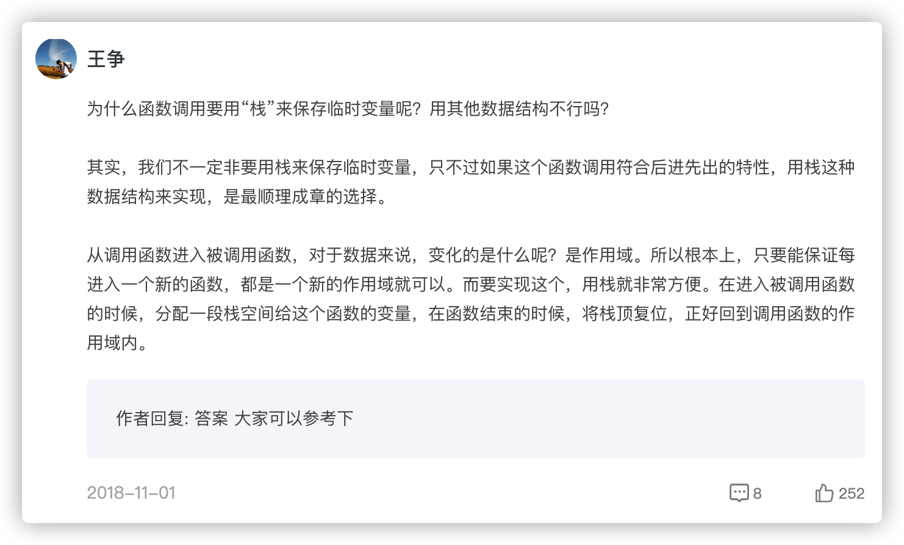

### 栈

栈是一种“操作受限”的线性表

后进先出（LIFO）

当某个数据集合只涉及在一端插入和删除数据，并且满足后进先出、先进后出的特性，这时我们就应该首选“栈”这种数据结构。

栈既可以用数组来实现，也可以用链表来实现。用数组实现的栈，我们叫作顺序栈，用链表实现的栈，我们叫作链式栈。

栈主要包含两个操作，入栈和出栈，也就是在栈顶插入一个数据和从栈顶删除一个数据。

### 增删查

增删：操作都在栈顶，复杂度 O(1)

