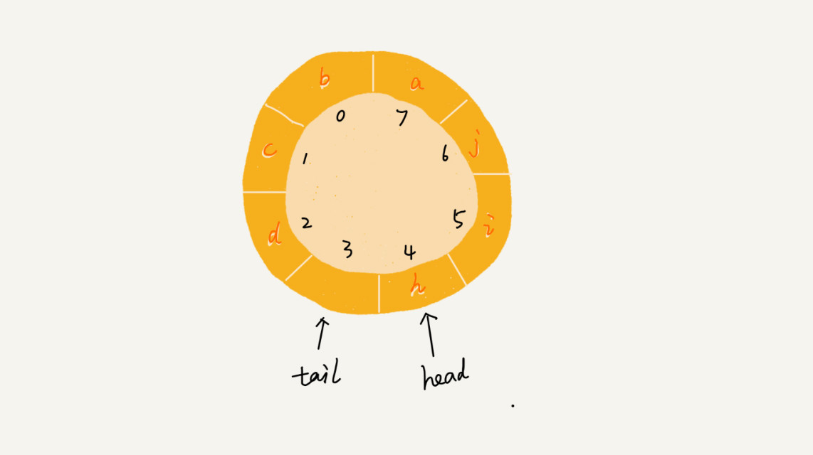

## 队列

一种操作受限的线性表数据结构。先进者先出，这就是典型的“队列”。

最基本的操作也是两个：入队 enqueue()，放一个数据到队列尾部；出队 dequeue()，从队列头部取一个元素。

用数组实现的队列叫作顺序队列，用链表实现的队列叫作链式队列。

队列需要两个指针：一个是 head 指针，指向队头；一个是 tail 指针，指向队尾。

### 双端队列（deque）

#### 循环队列

要想写出没有 bug 的循环队列实现代码，关键要确定好队空和队满的判定条件，具体的代码你要能写出来。

队满：(tail+1)%n=head

队空：tail==head

### 应用场景

- 队列在线程池等有限资源池中的应用

  对于大部分资源有限的场景，当没有空闲资源时，基本上都可以通过“队列”这种数据结构来实现请求排队。

