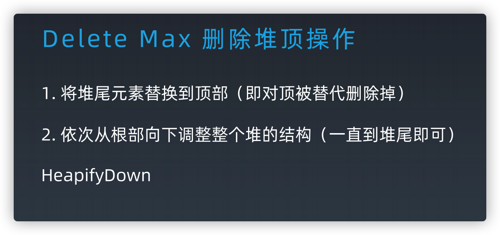

​		堆(heap)，又称为优先队列(priority queue)。尽管名为优先队列，但堆并不是队列。在队列中，我们可以进行的操作是向队列中添加元素和按照元素进入队列的选后顺序取出元素。而在堆中，我们不是按照元素进入队列的先后顺序，而是按照元素的优先级取出元素，大顶堆的优先级越往上。

二叉堆

**堆只是一个抽象概念，具体有不同的实现方式，一般只考察学习二叉堆的实现**

1. 因为完全二叉树的结构很是整齐，且极少有人类能玩转指针，我们的堆通过数组来实现。当使用数组实现时，堆的节点之间有如下关系（假设根节点的索引为0）：

1. 索引为i的左孩子的索引是 2i+1
2. 索引为i的左孩子的索引是 2i+2
3. 索引为i的父结点的索引是 Math.floor((i-1)/2)

根节点为 0 时的节点关系很容易依此推出。

2. 树中任意结点的优先级 >= 子结点

操作都是 log n	 

			 		 		 	

