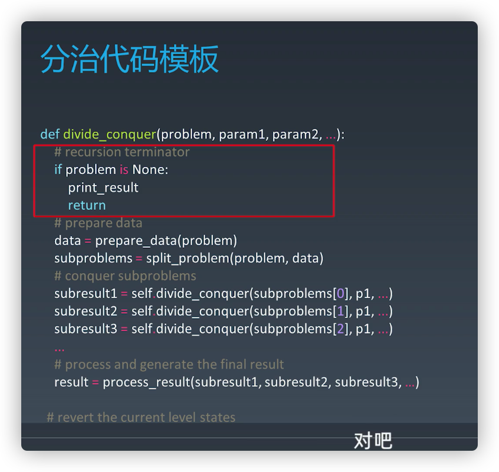

### 递归

从计算机角度来看：**递归本质是循环**，通过函数体，自己调自己来进行的循环。

由于是循环，也需要临界点，去结束循环。

从递归模型去思考问题：当在函数实现时，因为大问题和小问题是一样的问题，因此大问题的解决方法和小问题的解决方法也是同一个方法。这就产生了函数调用它自身的情况，这也正是递归的定义所在。

所以递归思想求解问题的就是**能够把规模大的问题转化为规模小的相同的子问题来解决，找到重复子问题**。

总得说，**递归是一种编程技巧，用函数体自己调自己，完成循环**。**递归求解问题，就是能够找到重复子问题，层层分解、还有终止条件**。

递归模板

```javascript
function recursion(level) {
  // 终止条件
  // 逻辑处理
  // 递归调用
  // 结果返回（可选）
}
```


递归，自顶向下

数学归纳法，自底向上？动态规划？


题目： [爬楼梯](https://leetcode-cn.com/problems/climbing-stairs/)

看到这题的时候，一开始我也是人脑枚举多种情况，寻找最优解，但人脑枚举想象是有限制的，穷举，这就容易陷入误区，头脑空白，从而不知如何求解。

这种试图想清楚整个递和归过程的做法，实际上是进入了一个思维误区

1. 数学归纳，向前递推

2. 

找出重复体、递归公式


- 递归代码要警惕堆栈溢出

- 递归代码要警惕重复计算

  可以通过一个数据结构（比如散列表）来保存已经求解过的 f(k)。当递归调用到 f(k) 时，先看下是否已经求解过了。如果是，则直接从散列表中取值返回，不需要重复计算，这样就能避免刚讲的问题了。

- 递归代码转非递归代码

  模拟栈调用


```

int f(int n) {
  if (n == 1) return 1;
  if (n == 2) return 2;
  
  int ret = 0;
  int pre = 2;
  int prepre = 1;
  for (int i = 3; i <= n; ++i) {
    ret = pre + prepre;
    prepre = pre;
    pre = ret;
  }
  return ret;
}
```


### 分治

分治算法（divide and conquer）的核心思想其实就是四个字，分而治之 ，也就是将原问题划分成 n 个规模较小，并且结构与原问题相似的子问题，递归地解决这些子问题，然后再合并其结果，就得到原问题的解。

原问题分解成的**子问题可以独立求解，子问题之间没有相关性**。



### 回溯

### 动态规划

所有动态规划问题都能通过暴力方法解决