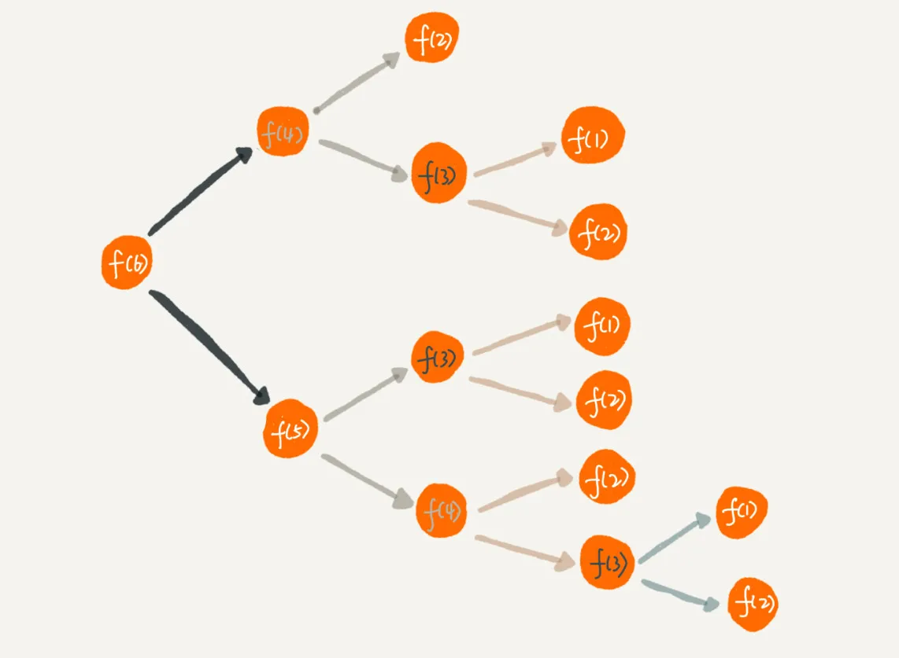

---
tags:
 - 递归
---

参考阅读

- [递归：如何用三行代码找到“最终推荐人”？](https://time.geekbang.org/column/article/41440)

## 递归

- 从计算机角度来看：**递归本质是循环**，通过函数体，自己调自己来进行的循环。由于是循环，也需要临界点，去结束循环。

- 从问题思考角度来看：递归求解问题是一种自顶向下的分解问题过程，去的过程叫“递”，回来的过程叫“归”

一个递归问题需要满足下边三种条件：

1. 大问题可以分解成小问题解决
2. 大问题与小问题的区别除了**数据规模是不同**，求解思路是一样
3. 存在递归终止条件

### 如何编写、理解递归代码？

1. 分解问题，找出**重复子问题**
2. 找出大问题和小问题的关系形成**递推公式**
3. 找出**终止条件**。

**递归逻辑不同于循环，循环是一种“直白”的思考过程方式，递归比较逻辑抽象，依靠问题的分解不断分解下去，这也正是写出递归代码比较难的一点，但递归代码有比循环代码更容易理解和简洁。**

但当我们看到递归时，我们总想把递归平铺展开，脑子里就会循环，一层一层往下调，然后再一层一层返回，试图想搞清楚计算机每一步都是怎么执行的，这样就很容易被绕进去。

对于递归代码，这种试图想清楚整个递和归过程的做法，实际上是进入了一个思维误区。很多时候，我们理解起来比较吃力，主要原因就是自己给自己制造了这种理解障碍。

你只需要思考大问题跟小问题之间的关系，屏蔽掉递归细节，这样子理解起来就简单多了。

题目： [爬楼梯](https://leetcode-cn.com/problems/climbing-stairs/)

计算机擅长做重复的事情，所以递归正合它的胃口。而我们人脑更喜欢平铺直叙的思维方式。看到这题的时候，多数人会人脑枚举多种情况，寻找最优解，但人脑枚举想象是有限制的，穷举就容易陷入误区，头脑空白，从而不知如何求解。

### 递归模板

```javascript
function recursion(level) {
  // 终止条件
  // 逻辑处理
  // 递归调用
  // 结果返回（可选）
}
```

### 递归代码要警惕堆栈溢出

### 递归代码要警惕重复计算

  

像求斐波拉契存在很多重复计算过程，可以通过一个数据结构（比如散列表）来保存已经求解过的 f(k)。当递归调用到 f(k) 时，先看下是否已经求解过了。如果是，则直接从散列表中取值返回，就不需要重复计算。

### 递归代码转非递归代码

模拟栈调用

### 分治

分治算法（divide and conquer）的核心思想其实就是四个字，分而治之 ，也就是将原问题划分成 n 个规模较小，并且结构与原问题相似的子问题，递归地解决这些子问题，然后再合并其结果，就得到原问题的解。

原问题分解成的**子问题可以独立求解，子问题之间没有相关性**。


### 回溯

### 动态规划

所有动态规划问题都能通过暴力方法解决