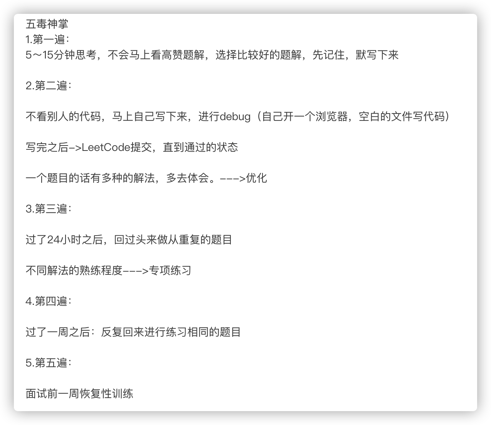

通用学习方法：

- 三分理解七分练习

- 《异类：不一样的成功启示录》，要精通一个领域，必须做到以下三点

  - Chunk it up 切碎知识点

  - Deliberate Practicing 刻意练习

  - Feedback 反馈

目标：

**通过刻意训练**，达到一种自然反射，对算法熟练运用的效果

**千万不要死磕题目**，对于不理解知识点或者题目

- 5 -10分钟想不出来，**直接看、背最佳答案**，因为你本身就不会，需要学习，理解交给时间

- 有规律过遍数（做好分类、周期性过）

  就算是会的题目同样要周期过，随着逐渐理解形成深刻记忆和条件反射，可减少周期次数，**重点练习难点、不会的题目**

极客时间的五毒神掌训练法

- 

反馈

- 主动型反馈（自己去找）
  - 高手代码 (GitHub, LeetCode, etc.)
  - 第一视角直播
- 被动式反馈（高手给你指点）
  - code review
  - 教练看你打，给你反馈

全局（数据结构与算法总览）

- 数据结构

  

- 算法

  

