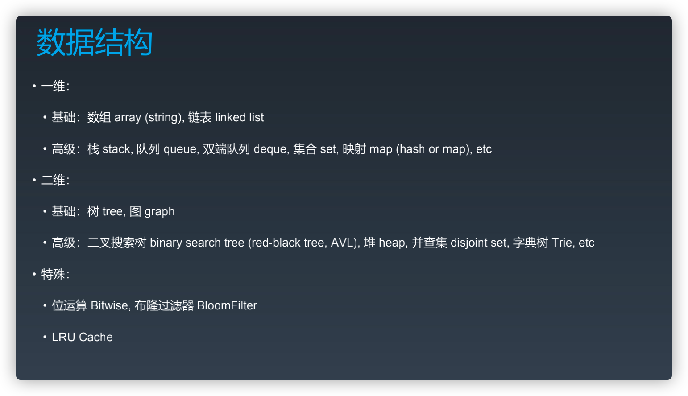
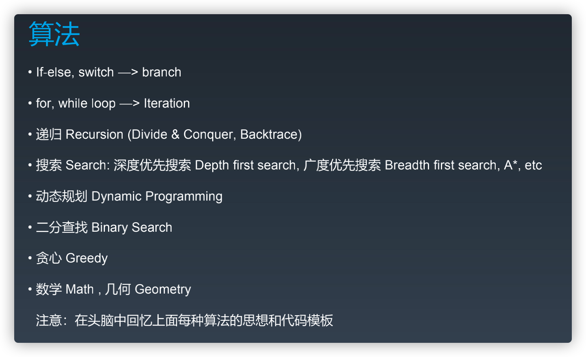

反馈

- 主动型反馈（自己去找）
  - 高手代码 (GitHub, LeetCode, etc.)
  - 第一视角直播
- 被动式反馈（高手给你指点）
  - code review
  - 教练看你打，给你反馈


全局（数据结构与算法总览）

- 数据结构

  

- 算法

  

- 数据结构
- 算法
  - 二分查找
  - 动态规划


## 二分查找

前提

- 单调性（递增、递减)
- 存在上下边界
- 索引查找（最好是数组索引，操作起来方便）

数据单调性是**二分查找从中间位置往左往右的判断依据**，但不一定，有些题目，如果能根据条件得到判断条件还是可以使用二分法
[搜索旋转排序数组](https://leetcode-cn.com/problems/search-in-rotated-sorted-array/)

代码模板

```txt
left, right = 0, len(array) - 1
while left <= right # 可能没有等于，不需要 if array[mid] == target 时就不要等于
  mid = (left + right) / 2
  if array[mid] == target:
    # break or return 
  # 大于等于、加一减一的边界，如果数据已经判断使用过了就不需要等于
  elif array[mid] < target:
    left = mid + 1
  else 
    right = mid - 1
```


计算机就是运算
计算时就需要数据
需要数据就需要查找
不同数据结构在操作（查找、增、删、改）上效率优势各个不同

查找：
基础数据结构
- 数组
  - 迭代
  - 二分查找
- 链表
  - 迭代
  - 递归