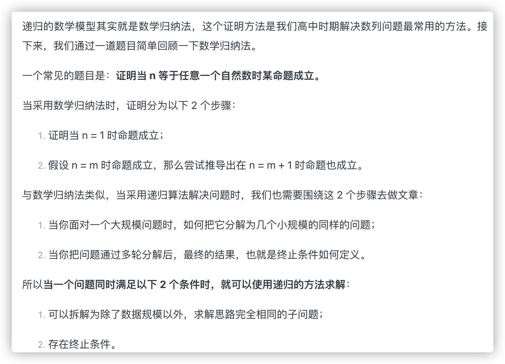

不管是数据结构还是算法思维，它们的目标都是降低时间复杂度。数据结构是从数据组织形式的角度达成这个目标，而算法思维则是从数据处理的思路上去达成这个目标。

在数学与计算机科学中，递归 （Recursion)）是指在函数的定义中使用函数自身的方法，直观上来看，就是某个函数自己调用自己.

1. 递归问题必须可以分解为若干个规模较小、与原问题形式相同的子问题。并且这些子问题可以用完全相同的解题思路来解决（找出重复体）；

2. 临界点

数学归纳法。问题能够像数学归纳法一样去采风

首先找到将大问题分解成小问题的规律，像数学归纳法一样去拆分总结并基于此写出**递推**公式；

然后找出终止条件，就是当找到最简单的问题时，如何写出答案；最终将递推公式和终止条件翻译成实际代码。

写出递归代码的关键在于，写出递推公式和找出终止条件。

