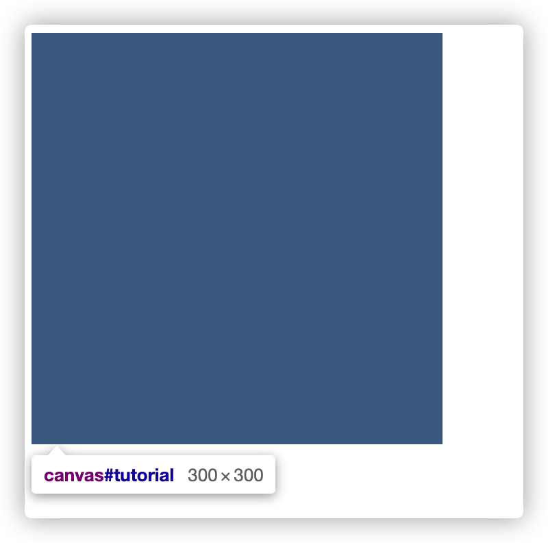

## Canvas 知识体系

- 基础
  - 开始
    - 坐标系
    - 绘制路径
  - 绘制图形
  - 样式和颜色
  - 绘制文本
  - 绘制图像
  - 变形
- 进阶
  - 动画
  - 优化
    - Path2D 缓存或记录绘画指令
- 常见问题
  - Canvas 高清适配
  - Canvas 跨域

## 目录

- [Canvas 知识体系](#canvas-知识体系)
- [目录](#目录)
- [开始](#开始)
  - [坐标系](#坐标系)
  - [绘制路径](#绘制路径)
- [绘制图像](#绘制图像)
  - [裁剪、合成](#裁剪合成)
- [动画](#动画)
- [Canvas 高清适配](#canvas-高清适配)

## 开始

Canvas API 提供了一个通过JavaScript 和 HTML的 `<canvas>` 元素来绘制图形的方式，相比较浏览器 HTML 的渲染页面方式，Canvas 更像似更接近底层，使用绘制指令，在 canvas 区域绘制图像

Canvas API 支持
- [CanvasRenderingContext2D](https://developer.mozilla.org/zh-CN/docs/Web/API/CanvasRenderingContext2D) 接口的2D渲染
- [WebGL2RenderingContext](https://developer.mozilla.org/zh-CN/docs/Web/API/WebGL2RenderingContext) 接口的硬件加速的 2D、3D 渲染

> 本文主要以 CanvasRenderingContext2D 渲染为主

Canvas 基本模板骨架

```html
<script type="text/javascript">
    function draw() {
        var canvas = document.getElementById('tutorial');
        if (canvas.getContext) {
            var ctx = canvas.getContext('2d');

            ctx.fillColor = 'yellow'
            ctx.fillRect(0, 0, 150, 150)
        }
    }
</script>
<style>
    canvas {
        width: 300px;
        height: 300px;
    }
</style>

<body>
    <canvas id="tutorial" width="150" height="150">请升级最新浏览器<canvas>
</body>
```

Canvas **元素及画布**的默认大小为一致，且为 300像素×150像素（宽×高，像素的单位是px），可通过 css 样式去改变 canvas 元素在页面布局的大小，画布内容会自适应元素大小



上面案例中，我们画布大小为 150 * 150，元素大小 300 * 300，最后图像自适应填充了整个元素大小

> 注意：如果CSS的尺寸与初始画布的比例不一致，它会出现扭曲

### 坐标系

在画布中所有元素的位置都是在按照以左上角位置为原点（0，0），y 轴向下的坐标系中


### 绘制路径

路径是有一条或多条直线、曲线形成；而图形都是通过一条或者多条路径组合而成的，CanvasRenderingContext2D 只提供 rect 矩形绘制的 api（fillRect、strokeRect），其他复杂的图形需要我们自己绘制路径形成：

1. beginPath 声明开始创建路径
   
   路径是由很多子路径构成，这些子路径都是在一个**列表**中，所有的子路径（线、弧形、等等）构成图形。而每次这个方法调用之后，列表清空重置，然后我们就可以重新绘制新的图形
   
2. moveTo 确定路径起点
3. 调用路径绘制指令
   
   调用绘制路径的函数（如 lineTo、arcTo 等）生成子路径，[CanvasRenderingContext2D 路径方法列表](https://developer.mozilla.org/zh-CN/docs/Web/API/CanvasRenderingContext2D#%E8%B7%AF%E5%BE%84)

4. closePath 闭合路径（可选）
   
   closePath 会通过绘制一条从当前点到开始点的直线来闭合图形。以 fill 填充方式绘制路径，会自动闭合

5. 使用 stroke 描边和 fill 填充的方式将路径绘制到画布中

其中最主要的也是 1、3、5 步骤

## 绘制图像

### 裁剪、合成

## 动画

## Canvas 高清适配