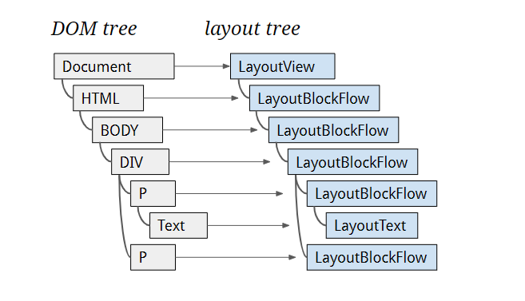
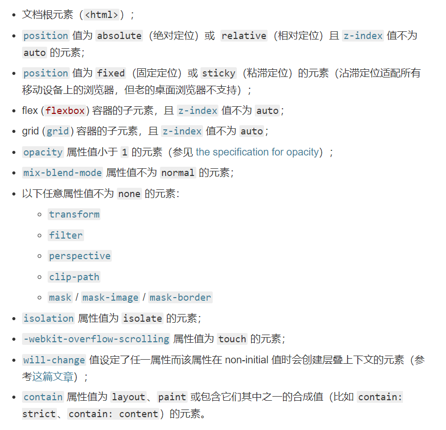

> 以 chrome 为例，分析 chrome 的页面渲染流程，

## Blink（渲染引擎）

浏览器是如何将 web content 转变成屏幕显示的像素，也就是我们看到的页面。

web content 一般指的是构成网页的物件（文本、图片、HTML、CSS、JS）。
其他内容 `<video>`, `<canvas>`, `WebAssembly`, `WebGL`, `WebVR`, `PDF`, … 则通过其他方式进行。
因为只有 web content 的才是由渲染进程(沙箱模式)进行处理渲染的。

其中 Blink 是一个渲染引擎，主要功能如下：
- 实现了 web platform APIs 和 HTML 标准规范
- 嵌入 V8 引擎执行 JavaScript 代码
- 构建 DOM 树
- 计算样式和布局
- 嵌入 Chrome Compositor 绘制图形

从这张架构图上看，Blink 就像是胶水一样，连接调用不同基础组件（V8、Skia等），实现并处理 web 标准规范的产物（PS：这也是 web 能够快速发展的原因，并不需要通过编译打包，只需要输入源码，内部便帮我即时处理渲染），并且暴露 content public APIs，外界进行一部封装便形成了我们使用到的浏览器，Chromium、Opera、WebView 等。

**渲染引擎的最终产物是调用底层操作系统提供的图形库以便显示页面像素**，在多平台的今天，有 OpenGL 标准 API 图形库，但在 window 平台，还需要额外的转成 DirectX。

## 渲染流程

> 注：由于 Chrome 对 Blank 引擎某些实现的修改，某些我们之前熟知的类名有了变化，比如 RenderObject 变成了 LayoutObject，RenderLayer 变成了 PaintLayer。感兴趣的看以参阅 [Slimming Paint](https://www.chromium.org/blink/slimming-paint?spm=taofed.bloginfo.blog.2.1d175ac8atKvCQ)

渲染引擎除了要能将内容渲染成页面外，还需要能够高效的重新渲染页面，毕竟页面也不是静止的，用户与浏览器交互过程中，需要根据不同响应，及时渲染、体验良好的新的页面给用户。

为了提高渲染效率，渲染流程就像是一条流水线，分成多个渲染阶段，每个阶段会有不同产物，当内容更新时，我们就可以复用之前的产物，并且分多阶段任务执行，可以提高系统任务调度灵活性。

### Parse HTML

浏览器无法直接理解和使用 HTML，所以需要将 HTML 转换为浏览器能够理解的、并且反映 HTML 结构的数据结构——DOM 树。

### Recalculate Style

- 加载解析样式成内部数据结构
  - 属性值转换为渲染引擎容易理解的、标准化的计算值
    
- 遍历 DOM，为元素匹配样式规则
- 计算节点最终样式（ComputedStyle）
  
  - CSS 计算规则
    - 样式继承
      
    - 属性重叠
      

### Layout

#### 创建 Layout Tree

遍历 DOM tree 生成 layout tree，每个节点都是 LayoutObject 的子类，实现相应的布局。

通常情况 DOM Node 对应一个 layout object ，但是有时LayoutObject没有对应 node，或者 node 没有对应的 LayoutObject，甚至可能 node 对应多个 LayoutObject，比如

- display：none 的元素不会生成 layout object
- 伪元素 after 与 before 不会成 DOM Node
- head 标签下面的全部内容

#### 布局计算

遍历 layout tree，计算每个节点的坐标及几何信息，并处理几何副作用。

布局的计算过程非常复杂，这里不详细展开。

在执行布局操作的时候，会把布局运算的结果重新写回布局树中，所以布局树既是输入内容也是输出内容，这是布局阶段一个不合理的地方，因为在布局阶段并没有清晰地将输入内容和输出内容区分开来。针对这个问题，Chrome 团队正在重构布局代码，下一代布局系统叫 LayoutNG，试图更清晰地分离输入和输出，从而让新设计的布局算法更加简单。

### Layered（分层）

浏览器的页面实际上被分成了很多图层，这些图层叠加后合成了最终的页面，打开 Chrome 的“开发者工具”，选择“Layers”标签，就可以可视化页面的分层情况，如下图所示：

渲染引擎会为特定的节点生成专用的图层，并生成一棵对应的图层树（LayerTree）

生成图层的过程，中间有个 PaintLayer，那么 PaintLayer 是做什么用的？

#### PaintLayers

页面是个二维平面，但是层叠上下文能够让 HTML 元素具有三维概念。PaintLayer 是用来实现 stacking contest（层叠上下文），以此来保证页面元素以正确的顺序合成（composite），这样才能正确的展示元素的重叠以及半透明元素等等。

从图中可以看出，明确定位属性的元素、定义透明属性的元素、使用 CSS 滤镜的元素等，都拥有层叠上下文属性。

形成层叠上下文的属性条件如下：

若你想要了解更多层叠上下文的知识，参考 [The_stacking_context](https://developer.mozilla.org/zh-CN/docs/Web/Guide/CSS/Understanding_z_index/The_stacking_context)

#### GraphicsLayers

从 PaintLayers 到 GraphicsLayers，我们发觉两者并不是一一对应，因为生成图层是会占用内存。

只有某些特殊的 PaintLayer 才会被提升为 GraphicsLayer。要形成单独图层的元素需要具有以下条件：

> 注，该元素需要先形成层叠上下文

- 根元素
- 3D transform
- 加速的 video
- 3D 上下文或加速的 2D 上下文 canvas
- 对 opacity、transform、fliter、backdropfilter 应用了 animation 或者 transition（需要是 active 的 animation 或者 transition，当 animation 或者 transition 效果未开始或结束后，提升合成层也会失效）
- will-change 设置为 opacity、transform、top、left、bottom、right（其中 top、left 等需要设置明确的定位属性，如 relative 等）
- 裁剪滚动区域
- 重叠图层的元素

以上只列举常见情况，更多详情查看

- [无线性能优化：Composite](https://fed.taobao.org/blog/taofed/do71ct/performance-composite/?spm=taofed.homepage.header.13.7eab5ac8Ut2aYd)
- [CompositingReasons.cpp](https://chromium.googlesource.com/chromium/blink/+/72fef91ac1ef679207f51def8133b336a6f6588f/Source/platform/graphics/CompositingReasons.cpp?autodive=0%2F%2F%2F)

### Paint

Paint 阶段并不是真正的界面绘制，而是生成绘制指令。每个图层意味着一张位图，而位图则需要光栅化操作，分成绘制指令，交给其他线程进行光栅任务，大大减低了主线程的负担，提高主线程效率。

渲染引擎会把一个图层的绘制拆分成很多小的绘制指令，然后再把这些指令按照顺序组成一个待绘制列表。

### Raster