> 本文以 chrome 为例，分析 chrome 的页面渲染流程

## Blink（渲染引擎）

浏览器是如何将 web content 转变成屏幕显示的像素，也就是我们看到的页面

web content 一般指的是构成网页的物件（文本、图片、HTML、CSS、JS），
其他内容 `<video>`, `<canvas>`, `WebAssembly`, `WebGL`, `WebVR`, `PDF`, … 则通过其他方式进行。
因为只有 web content 的才是由渲染进程(沙箱模式)进行处理渲染的。

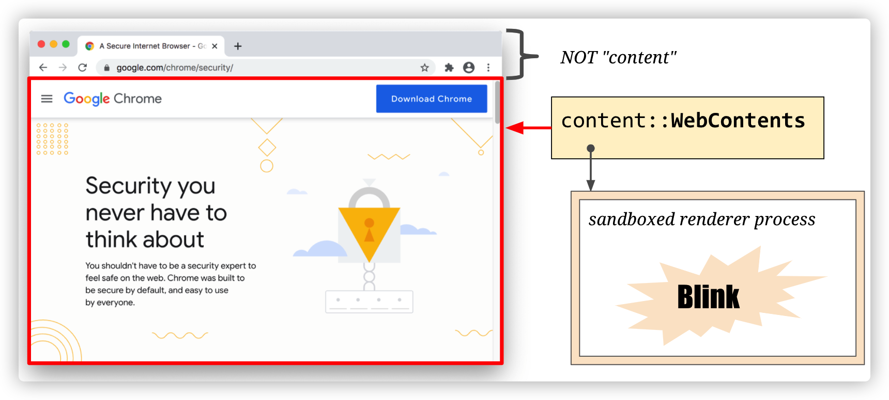

其中 Blink 是一个 Web 渲染引擎，主要功能如下：
- 实现了 HTML 标准规范
- 嵌入 V8 引擎去执行 JavaScript 代码
- 请求网络资源？TODO
- 构建 DOM 树
- 计算样式和布局
- 嵌入 [Chrome Compositor](https://chromium.googlesource.com/chromium/src/+/HEAD/cc/README.md) 去绘制图形

Blink 作为渲染引擎被嵌入到 Chromium、Opera，WebView 等浏览器客户端中并提供 [content public APIs](https://chromium.googlesource.com/chromium/src/+/HEAD/content/public/README.md) 使用。

Blink 就像是胶水一样，连接调用不同基础组件（V8、Skia等），处理 web 标准规范的 content。（PS：这也是 web 能够快速发展的原因，并不需要通过编译打包，只需要输入纯文本的HTML、JS、CSS，内部便帮我即时处理渲染）

**渲染引擎解析处理 web content 后转换成底层操作系统提供的图形库调用去显示页面像素**，在多平台的今天，有标准 API 图形库 OpenGL，但在 window 平台，还需要额外转换成 DirectX API 调用，未来还将实现更多图形库支持，如 vulkan

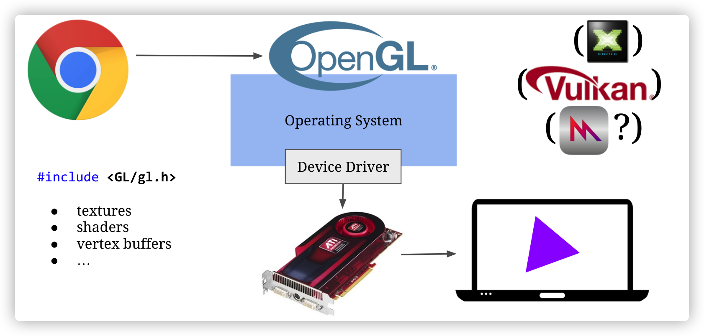

> [Blink 文档链接](https://www.chromium.org/blink)

## 页面渲染流程

> 注：由于 Chrome 对 Blank 引擎某些实现的修改，某些我们之前熟知的类名有了变化，比如 RenderObject 变成了 LayoutObject，RenderLayer 变成了 PaintLayer。感兴趣的看以参阅 [Slimming Paint](https://www.chromium.org/blink/slimming-paint?spm=taofed.bloginfo.blog.2.1d175ac8atKvCQ)

页面渲染有两种情况

- 首次渲染
- 更新事件
  - JavaScript
  - user input
  - asynchronous loading
  - animations
  - scrolling
  - zooming

为了提高渲染效率，渲染流程就像是一条流水线，分成多个渲染阶段，每个阶段会有不同产物，当发生更新时，就可以重其中某一阶段开始执行并复用之前的产物，并且分多阶段任务执行，可以提高系统任务调度灵活性

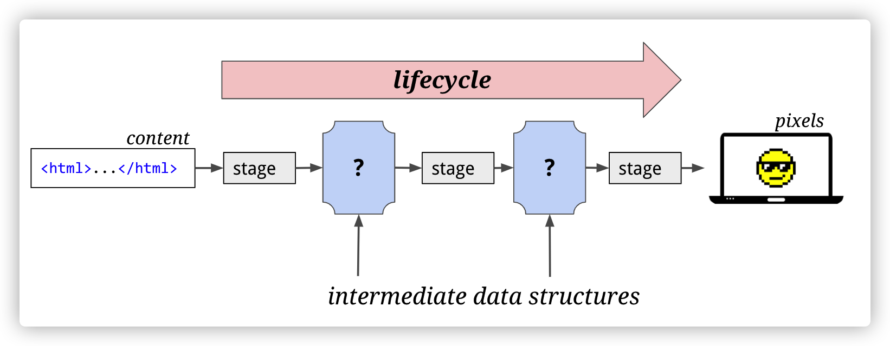

### 构建 DOM 树（Parse HTML）

浏览器无法直接理解和使用 HTML，所以需要将 HTML 转换为浏览器能够理解的、并且反映 HTML 结构的数据结构——DOM 树

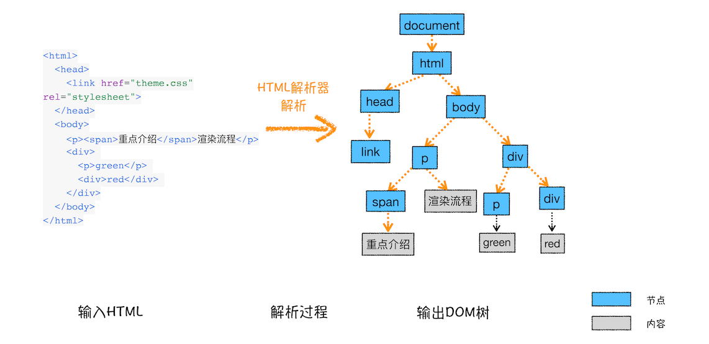

### 样式计算（Recalculate Style）

#### 解析 CSS 规则

和 HTML 文件一样，浏览器也是无法直接理解这些纯文本的 CSS 样式，所以当渲染引擎接收到 CSS 文本时，会执行一个转换操作，将 CSS 文本转换为浏览器可以理解的结构——styleSheets，在控制台中输入 document.styleSheets 查看

#### 转换样式表中的属性值，使其标准化

CSS 文本中有很多属性值，如 2em、blue、bold，这些类型数值不容易被渲染引擎理解，所以需要将所有值转换为渲染引擎容易理解的、标准化的计算值，这个过程就是属性值标准化

#### 计算出 DOM 树中每个节点的具体样式

会把解析后的样式规则和浏览器默认的样式规则，遍历 DOM 节点，为元素匹配样式规则并计算出最终样式，储存在 ComputedStyle 属性

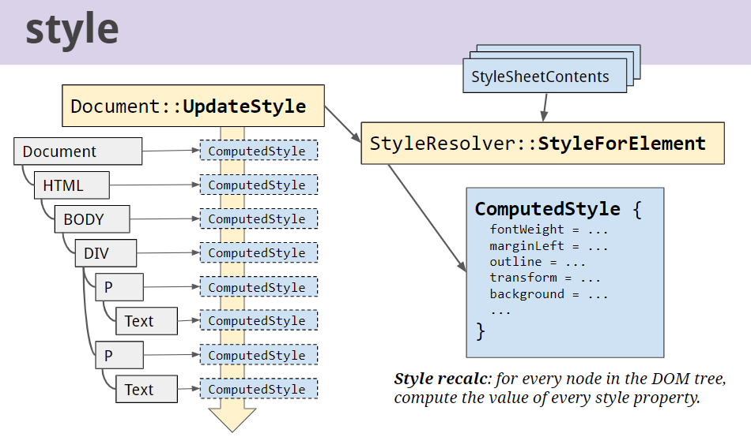
  
CSS 计算规则涉及以下两个规则

- 样式继承
  
- 样式覆盖
  

### 布局阶段（Layout）

#### 创建 Layout Tree

遍历 DOM tree 生成 layout tree，其中每个节点都是 LayoutObject 的子类，其实现相应的布局。

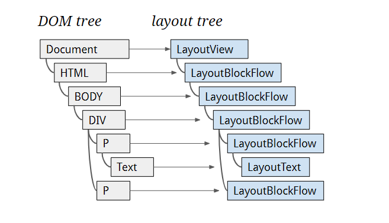

DOM Nodes 并不是跟 layout object 一对一对应关系，比如有些情况：

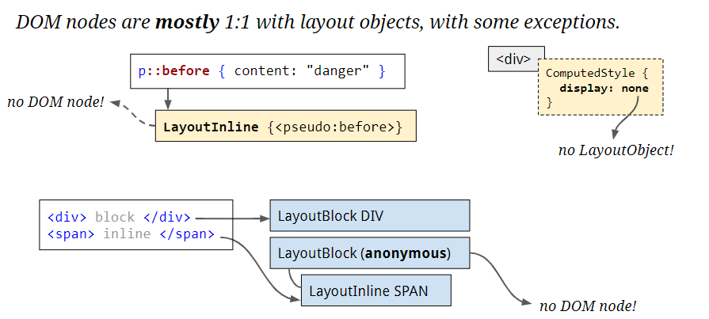

- display：none 的元素不会生成 layout object
- 伪元素 after 与 before 不会成 DOM Node
- 文本内联元素将会被隐式 block 包裹
- head 标签下面的全部内容

#### 布局计算

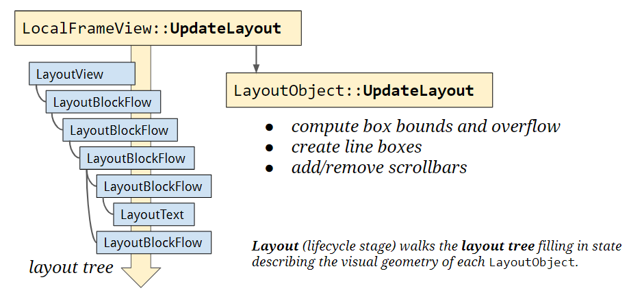

遍历 layout tree，计算每个节点的布局信息（比如，坐标及几何等信息）（布局的计算过程非常复杂，这里不详细展开）

在执行布局操作的时候，会把布局运算的结果重新写回保存布局树中，所以布局树既是输入内容也是输出内容，这是布局阶段一个不合理的地方，因为在布局阶段并没有清晰地将输入内容和输出内容区分开来。针对这个问题，Chrome 团队正在重构布局代码，下一代布局系统叫 LayoutNG，试图更清晰地分离输入和输出，从而让新设计的布局算法更加简单。

### 分层（Layers）

我们看到的页面实际是由多张图层合成的，打开 Chrome 的“开发者工具”，选择“Layers”标签，就可以可视化页面的分层情况，如下图所示：

通常页面的组成是非常复杂的，有的页面里要实现一些复杂的动画效果，比如点击菜单时弹出菜单的动画特效，滚动鼠标滚轮时页面滚动的动画效果，当然还有一些炫酷的 3D 动画特效。如果没有采用分层机制，从布局树直接生成目标图片的话，那么每次页面有很小的变化时，都会触发重排或者重绘机制，这种“牵一发而动全身”的绘制策略会严重影响页面的渲染效率

> 为了提升每帧的渲染效率，Chrome 引入了**分层和合成**的机制

DOM 中某些具有特定样式的 node 会被转换为单独的 Graphic Layer，并不是 DOM 中的每个节点都包含一个图层，如果一个节点没有对应的层，那么这个节点就从属于父节点的图层

Layout Object 在上面的 layout 阶段生成

#### PaintLayers

页面是个二维平面，但是层叠上下文能够让 HTML 元素具有三维概念。PaintLayer 是用来实现 stacking contest（层叠上下文），以此来保证页面元素以正确的显示顺序，这样才能正确的展示元素的重叠以及半透明元素等等

从图中可以看出，明确定位属性的元素、定义透明属性的元素、使用 CSS 滤镜的元素等，都拥有层叠上下文属性。

形成层叠上下文的属性条件如下：

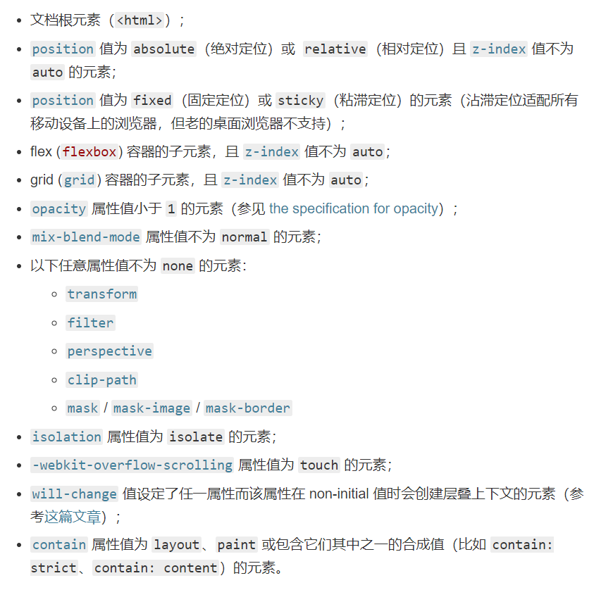

若你想要了解更多层叠上下文的知识，参考 [The_stacking_context](https://developer.mozilla.org/zh-CN/docs/Web/Guide/CSS/Understanding_z_index/The_stacking_context)

#### GraphicsLayers

要能成为图层的节点必须要有成为 PaintLayer 的层叠上下文属性条件。 但是并不是所有的 PaintLayer 都能成为 GraphicsLayer，**因为生成图层是会占用内存**，只有某些特殊的 PaintLayer 才会被提升为 GraphicsLayer。要形成单独图层的元素需要具有以下条件：

- 根元素
- 3D transform 或 perspective 的元素
- 硬件加速的 video
- 3D 或硬件加速的 2D 的canvas
- 对 opacity、transform、fliter、backdropfilter 应用了 animation 或者 transition（需要是 active 的 animation 或者 transition，当 animation 或者 transition 效果未开始或结束后，提升合成层也会失效）
- will-change 设置为 opacity、transform、top、left、bottom、right（其中 top、left 等需要设置明确的定位属性，如 relative 等）
- 裁剪滚动区域
- **overlaps a composited layer 的元素**

以上只列举常见情况，更多详情查看

- [无线性能优化：Composite（推荐）](https://fed.taobao.org/blog/taofed/do71ct/performance-composite/?spm=taofed.homepage.header.13.7eab5ac8Ut2aYd)
- [CompositingReasons.cpp](https://chromium.googlesource.com/chromium/blink/+/72fef91ac1ef679207f51def8133b336a6f6588f/Source/platform/graphics/CompositingReasons.cpp?autodive=0%2F%2F%2F)

> 目前 Layers 阶段发生 Paint（下文见）阶段前，未来将被转移 Paint 阶段后面 TODO

### Paint（绘制）

在完成图层树的构建之后，渲染引擎会对图层树中的每个图层进行绘制，但 Paint 阶段并不是真正的界面绘制，而是生成绘制指令列表，交给其他线程进行光栅任务，大大减低了主线程的负担，提高主线程效率。

可以打开“开发者工具”的“Layers”标签，选择“document”层，来实际体验下绘制列表，如下图所示：

每一个图层在 Paint 阶段会分为多个小阶段，并按照层叠顺序对 layout subTree 进行多次遍历

这就可能为什么导致下面案列 float 布局中，一个元素甚至有可能部分地位于另一个元素的前面和一部分之后，我们需要清除浮动

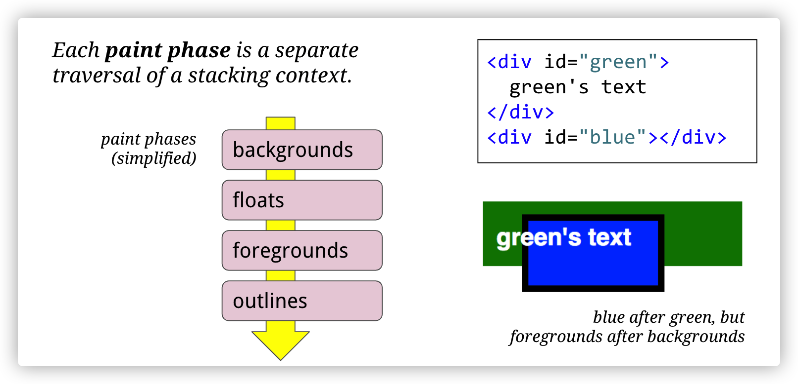

多次遍历产生 DisplayItem 即对应 Paint 多阶段产生的操作

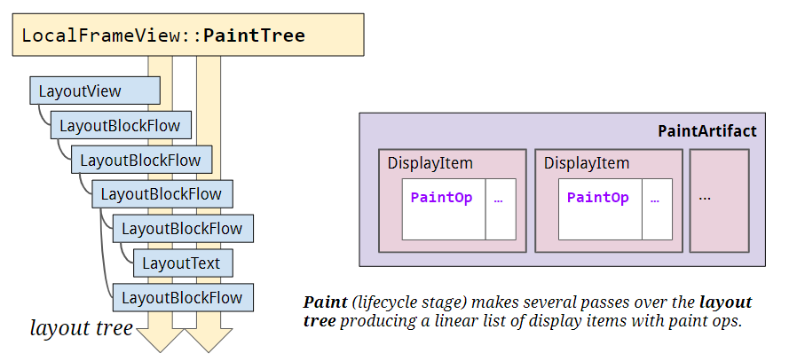

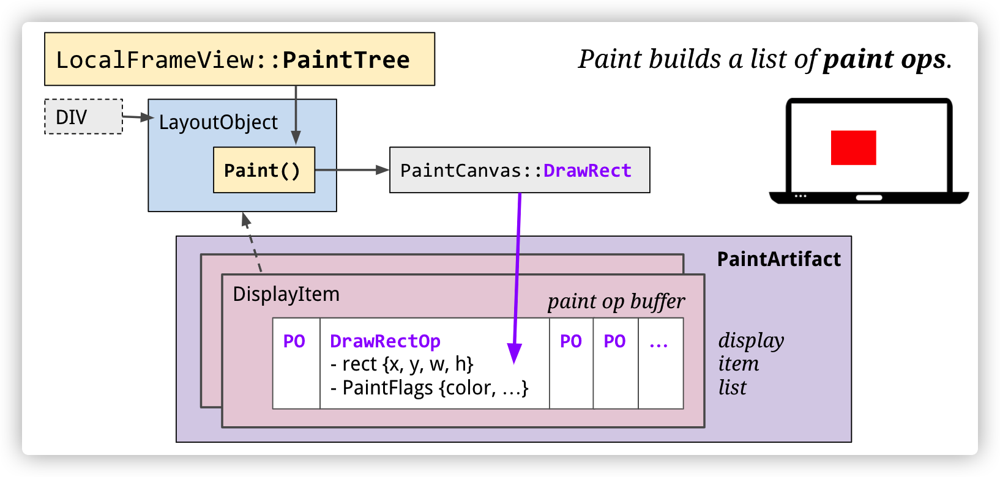

### Raster

绘制列表只是用来记录绘制顺序和绘制指令的列表，而实际上绘制操作是由渲染进场中的合成线程来完成的

#### bitmap（位图）

#### tile

Chromium 目前实际支持三种不同的光栅化和合成的组合方式：软件光栅化 + 软件合成，软件光栅化 + gpu 合成，gpu 光栅化 + gpu 合成。在移动平台上，大部分设备和移动版网页使用的都是 gpu 光栅化 + gpu 合成的渲染方式，理论上性能也最佳。
